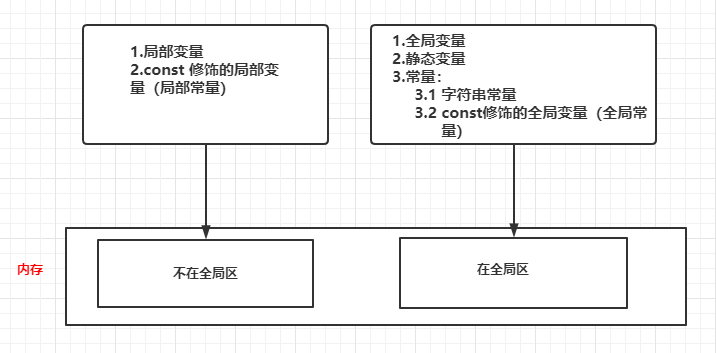
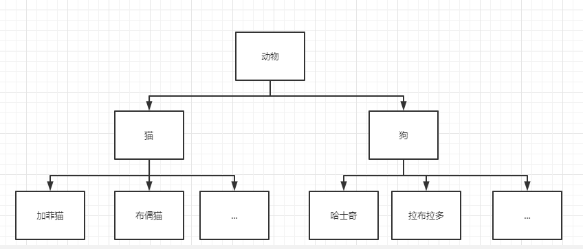
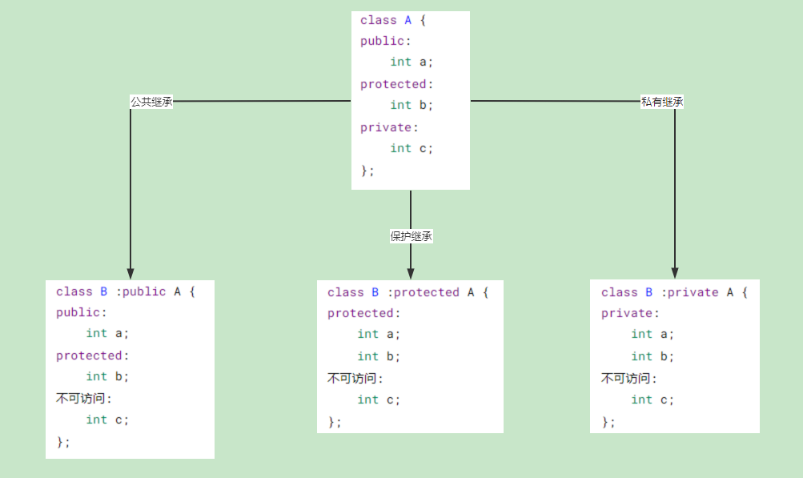
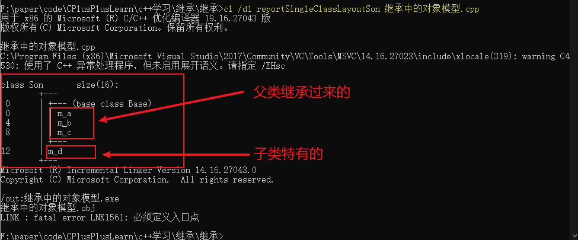

# C++核心编程

本阶段主要针对C++`面向对象`编程技术做记录

## 1.内存分区模型

C++程序在执行时，将内存大方向划分为`4个区域`

* **代码区：**存放函数体的二进制代码，由操作系统进行管理
* **全局区：**存放`全局变量，静态变量，常量`
* **栈区：**由编译器自动分配与释放，存放`函数的参数值，局部变量等`
* **堆区：**由程序员分配和释放，若不主动释放，程序结束时由操作系统回收，但是程序运行可能出现意想不到的问题


**内存四区意义：**

不同区域存放的数据被赋予不同的生命周期，编程更灵活，但对于程序员的要求也比较高。

### 1.1 程序运行前

在代码编译后，生成了exe可执行程序，`未执行该程序前`分为两个区域：

**代码区：**

* 存放CPU执行的机器指令
* 代码区是`共享`的，共享的目的是对于频繁被执行的程序，只需要在内存中有一份代码即可
* 代码区是`只读`的，使其只读的原因是防止程序意外地修改了它的指令

**全局区：**

* `全局变量和静态变量`存放于此

* 全局区还包含了`常量区`，`字符串常量和其它常量`也存放于此

* `该区域的数据在程序结束后由操作系统释放`

  


示例：

```c++
// 全局变量
int g_a = 10;
int g_b = 10;

// 全局常量
const int c_g_a = 10;
const int c_g_b = 10;

int main()
{
	// 局部变量
	int l_a = 10;
	int l_b = 10;
	cout << "局部变量 l_a 的地址为：" << &l_a << endl;
	cout << "局部变量 l_b 的地址为：" << &l_b << endl;

    // 全局变量
	cout << "全局变量 g_a 的地址为：" << &g_a << endl;
	cout << "全局变量 g_b 的地址为：" << &g_b << endl;

	// 静态变量
	static int s_a = 10;
	static int s_b = 10;
	cout << "静态变量 s_a 的地址为：" << &s_a << endl;
	cout << "静态变量 s_b 的地址为：" << &s_b << endl;


	/*
		常量：
			1.字符串常量
			2.const 修饰的变量：
				2.1 const 修饰的局部变量
				2.2 const 修饰的全部变量
	*/
	cout << "字符串常量的地址为：" << &"hello world" << endl;
	
	// const 修饰的全局变量
	cout << "全局常量 c_g_a 的地址为：" << &c_g_a << endl;
	cout << "全局常量 c_g_b 的地址为：" << &c_g_b << endl;

	// const 修饰的局部变量
	const int c_l_a = 10;
	const int c_l_b = 10;

	cout << "局部常量 c_l_a 的地址为：" << &c_l_a << endl;
	cout << "局部常量 c_l_b 的地址为：" << &c_l_b << endl;
	return 0;
}

结果：
局部变量 l_a 的地址为：00EFFDD8
局部变量 l_b 的地址为：00EFFDCC
全局变量 g_a 的地址为：00B9C000
全局变量 g_b 的地址为：00B9C004
静态变量 s_a 的地址为：00B9C008
静态变量 s_b 的地址为：00B9C00C
字符串常量的地址为：00B99C00
全局常量 c_g_a 的地址为：00B99B30
全局常量 c_g_b 的地址为：00B99B34
局部常量 c_l_a 的地址为：00EFFDC0
局部常量 c_l_b 的地址为：00EFFDB4
```

**总结：**

* C++程序在运行前分为全局区和代码区
* 代码区特点是共享和只读
* 全局区存放全局变量，静态变量，常量
* 常量区中存放`const修饰的全局常量和字符串常量`

### 1.2 程序运行后

#### 1.2.1 栈区

**栈区：**

* 由编译器自动分配和释放，存放函数的参数值，局部变量等
* 注意事项：`不要返回局部变量的地址`，栈区开辟的数据由编译器自动释放


示例：

```c++
// 测试返回局部变量地址（开发中禁止这么做）
int* func()
{
	int a = 10;  // 局部变量存放在栈区，栈区的数据在函数执行完成后自定释放
	return &a;   // 返回局部变量的地址
}

int main()
{
	// 接收func函数返回值
	int *p = func();

	cout << "*p = " << *p << endl; // 第一次可以打印正确值，是因为编译器做了保留
	cout << "*p = " << *p << endl; // 第二次这个数字就不保留了
	return 0;
}

结果：
*p = 10
*p = 2050276320
```

#### 1.2.2 堆区

**堆区：**

* 由程序员分配释放，若不主动释放，程序结束时由操作系统回收
* 在C++中主要利用关键字 `new` 在堆区开辟内存


示例：

```c++
// 在堆区分配内存，返回堆区数据地址
int* func2()
{
	// 利用new关键字，可以将数据开辟到堆区
	// 指针 本质也是局部变量，放在栈区，指针保存的数据是放在堆区
	int *p = new int(10);
	return p;
}

int main()
{
	// 接收func2函数返回值
	int *p1 = func2();
	
	cout << "*p1 = " << *p1 << endl;
	cout << "*p1 = " << *p1 << endl;
    
    delete p1;
	return 0;
}

结果：
*p1 = 10
*p1 = 10
```

**总结：**

* 堆区数据由程序员开辟和释放
* 堆区数据利用new关键字开辟内存

### 1.3 new 操作符

C++中利用 `new` 操作符在堆区开辟数据

堆区开辟的数据由程序员手动开辟，手动释放，利用 `delete` 操作符释放

语法：`new` 数据类型

利用 new 创建的时候，会返回该数据对应类型的指针


```c++
int main()
{
    // 基本语法
    int *p = new int(10);
    cout << *p << endl;
    
    // 开辟数组
    int *arr = new int[10];
    for(int i = 0; i < 10; i++)
    {
        arr[i] = i + 10;
    }
    for(int i = 0; i < 10; i++)
    {
        cout << arr[i] << endl;
    }
    
    // 利用delete释放堆区数据
    delete p;
    // 释放数组 delete[] 数组名
    delete[] arr;
    
    return 0;
}
```

## 2.引用

### 2.1 引用的基本使用

**作用：**给变量起别名

**语法：**`数据类型 &别名 = 原名`


示例：

```c++
int main()
{
    int a = 10;
    int &b = a;
    
    cout << "a = " << a << endl;
    cout << "b = " << b << endl;
    
    b = 100;
    
    cout << "a = " << a << endl;
    cout << "b = " << b << endl;
    
    return 0;
}

结果：
a = 10
b = 10
a = 100
b = 100
```

### 2.2 引用注意事项

* 引用必须初始化
* 引用在初始化后，不可以改变

示例：

```c++
// 引用注意事项
void test2()
{
    // 1.引用必须初始化
    int a = 10;
    int& b = a;

    // 2.引用在初始化后，不可以改变
    int c = 20; // 一旦初始化后就不可以更改
    b = c; // 赋值操作，而不是更改引用，可以

    cout << "a = " << a << endl;
    cout << "b = " << b << endl;
    cout << "c = " << c << endl;
}

结果：
a = 20
b = 20
c = 20
```

### 2.3 引用做函数参数

**作用：**函数传参时，可以利用引用的技术让形参修饰实参

**优点：**可以简化指针修改实参


示例：

```c++
// 引用做函数参数
// 值传递
void myswap1(int a, int b)
{
    int temp = a;
    a = b;
    b = temp;
}

// 地址传递
void myswap2(int* a, int* b)
{
    int temp = *a;
    *a = *b;
    *b = temp;
}

// 引用传递
void myswap3(int& a, int& b)
{
    int temp = a;
    a = b;
    b = temp;
}

// 打印结果
void printInfo(string func, int a, int b)
{
    cout << func << " after" << endl;
    cout << "a = " << a << endl;
    cout << "b = " << b << endl;
}

int main()
{
    int a = 10;
    int b = 20;

    myswap1(a, b); // 值传递，形参不会修饰实参
    printInfo("myswap1", a, b);

    myswap2(&a, &b); // 地址传递，形参会修饰实参
    printInfo("myswap2", a, b);

    myswap3(a, b); // 引用传递，形参会修饰实参
    printInfo("myswap3", a, b);
    return 0;
}

结果：
myswap1 after
a = 10
b = 20
myswap2 after
a = 20
b = 10
myswap3 after
a = 10
b = 20
```

### 2.4 引用做函数返回值

**作用：**引用是可以作为函数的返回值存在的

**用法：**函数调用作为左值

**注意：**`不要返回局部变量引用`

示例：

```c++
// 引用做函数返回值
// 1.不要返回局部变量引用
int& test01()
{
    int a = 10; // 局部变量存放在栈区
    return a;
}

// 2.函数的调用可以作为左值
int& test02()
{
    static int a = 10; // 静态变量存放在全局区，全局区上的数据在程序结束后由系统释放
    return a;
}

int main()
{
    int& ref = test01();
    cout << "ref = " << ref << endl; // 10 第一次运行结果正确，是因为编译器做了保留
    cout << "ref = " << ref << endl; // 2001115528 第二次运行结果错误，是因为a的内存已经释放
    cout << endl;

    int& ref2 = test02();
    cout << "ref2 = " << ref2 << endl; // 10
    cout << "ref2 = " << ref2 << endl; // 10

    test02() = 1000; // 如果函数的返回值是引用，这个函数的调用可以作为左值
    cout << "ref2 = " << ref2 << endl; // 1000
    cout << "ref2 = " << ref2 << endl; // 1000
    return 0;
}

结果：
ref = 10
ref = 2001115528

ref2 = 10
ref2 = 10
ref2 = 1000
ref2 = 1000
```

### 2.5 引用的本质

**本质：** 引用的本质在C++内部实现是一个`指针常量`

示例：

```c++
// 发现是引用，转换为 int* const ref = &a
void func(int& ref)
{
    ref = 100; // ref是引用，转换为*ref = 100;
}

int main()
{
    int a = 10;
    // 自动转换为 int* const ref = &a;指针常量是指针指向不可更改，指向的值可以更改，也说明为什么引用不可更改
    int& ref = a;
    ref = 20; // 内部发现ref是引用，自动帮我们转换为：*ref = 20;
    
    cout << "a = " << a << endl;     // a = 20
    cout << "ref = " << ref << endl; // ref = 20
    return 0;
}
```

**结论：**C++推荐使用引用技术，因为语法方便，引用本质是指针常量，但所有的指针操作编译器都帮我们做了。


### 2.6 常量引用

**作用：**常量引用主要用来修饰形参，防止误操作

在函数形参列表中，可以加 `const修饰形参`，防止形参改变实参


示例：

```c++
// 常量引用
void showValue(const int& val)
{
    //val = 1000; // 错误，不能更改
    cout << "val = " << val << endl;
}

int main()
{
    int& ref = 10; // 错误，不能如此初始化，引用必须引一块合法的内存空间
    // 加上const之后，编译器将代码修改为 int temp = 10; const int& ref = temp;
    const int& ref = 10; // 可以，引用必须引一块合法的内存空间
    ref = 10; // 错误，加上const之后变为只读，不可以修改

    int a = 100;
    showValue(a);
    return 0;
}
```

## 3.函数提高

### 3.1 函数默认参数

在C++中，函数的形参列表中的形参是可以有默认值的

**语法：**`返回值类型 函数名 (参数=默认值) {}`

**注意：**

1. 如果某个位置已有了默认参数，那么从这个位置往后，从左到右必须有默认值
2. 如果函数声明有默认参数，函数实现就不能有默认参数，声明和实现只能有一个有默认参数

示例：

```c++
// 默认参数函数
// 如果我们传入自己的数据，就用自己的数据，如果没有，那么就用默认值
int func(int a, int b = 20, int c = 30)
{
	return a + b + c;
}

// 如果某个位置已有了默认参数，那么从这个位置往后，从左到右必须有默认值
int func2(int a, int b = 10, int c) // 错误
{
}

// 如果函数声明有默认参数，函数实现就不能有默认参数
// 声明和实现只能有一个有默认参数
int func3(int a = 10, int b = 10);

int func3(int a = 10, int b = 10) // 错误
{
	return a + b;
}

int func3(int a, int b) // 正确
{
	return a + b;
}
```


### 3.2 函数占位参数

C++中函数的形参列表里可以有占位参数，用来做占位，调用函数时必须填补该位置

**语法：**`返回值类型 函数名 (数据类型) {}`


示例：

```c++
// 函数占位参数
void func01(int a, int)
{
	cout << "this is func" << endl;
}

// 占位参数也可以有默认参数
void func02(int a, int = 10)
{
	cout << "this is func1" << endl;
}

int main()
{
	func01(10, 20); // 占位参数必须填补
	func02(10); // 占位参数有默认参数
	return 0;
}
```


### 3.3 函数重载

#### 3.3.1 函数重载概述

**作用：**函数名可以相同，提高复用性

**函数重载要满足的条件：**

* 同一作用域下
* 函数名称相同
* 函数参数`类型不同`或者`个数不同`或者`顺序不同`

**注意：**函数的返回值不可以作为函数重载的条件

示例：

```c++
// 函数重载条件
// 1.同一作用域下
// 2.函数名称相同
// 3.函数参数`类型不同`或者`个数不同`或者`顺序不同`
void func_override()
{
	cout << "func调用" << endl;
}

void func_override(int  a)
{
	cout << "func(int a)调用" << endl;
}

void func_override(double a)
{
	cout << "func(double a)调用" << endl;
}

void func_override(int a, double b)
{
	cout << "func(int a, double b)调用" << endl;
}

void func_override(double a, int b)
{
	cout << "func(double a, int b)调用" << endl;
}

// 注意：函数的返回值不可以作为函数重载的条件
int func_override(double a, int b) // 错误
{
	cout << "func(double a, int b)调用" << endl;
}
```


#### 3.3.2 函数重载注意事项

1. 引用作为重载条件
2. 函数重载碰到函数默认参数，会出现二义性，会报错，要避免

示例：

```c++
// 函数重载注意事项
// 1.引用作为重载条件
void func_attention(int& a)
{
	cout << "func(int& a)调用" << endl;
}

void func_attention(const int& a)
{
	cout << "func(const int& a)调用" << endl;
}

// 2.函数重载碰到默认参数，会出现二义性，会报错，要避免
void func_attention2(int a, int b = 10)
{
	cout << "func_attention2(int a, int b = 10)调用" << endl;
}

void func_attention2(int a)
{
	cout << "func_attention2(int a)调用" << endl;
}

int main()
{
	int a = 10;
	func_attention(a); // 调用无const版本
	func_attention(10); // 调用有const版本

	//func_attention2(a); // 错误：函数重载碰到默认参数，会出现二义性，编译器不知道该找哪个函数了
	func_attention2(10, 20); // 可以运行
	return 0;
}

结果：
func(int& a)调用
func(const int& a)调用
func_attention2(int a, int b = 10)调用
```

## 4.类和对象

C++面向对象的三大特性为：`封装，继承，多态`

C++认为万事万物皆为对象，对象上有其属性和行为

**例如：**

人可以作为对象，属性有姓名，年龄，身高等，行为有走，跑，跳，吃饭等

车也可以作为对象，属性有轮胎，车壳，方向盘等，行为有载人，放音乐等

具有相同性质的`对象`，我们可以抽象称为`类`，人属于人类，车属于车类

### 4.1 封装

#### 4.1.1 封装的意义

封装是C++面向对象的三大特性之一

**封装的意义：**

* 将属性和行为作为一个整体，表现生活中的事物
* 将属性和行为加以权限控制

**封装意义一：**

在设计类的时候，属性和行为写在一起，表现事物

**语法：**class 类名 {访问权限：属性 / 行为};


示例：设计一个学生类

```c++
// 设计一个学生类,属性有姓名和学号
// 可以给姓名和学号赋值，可以显示学生的姓名和学号

class Student {
public: // 公共权限
	// 行为，显示姓名和学号
	void show()
	{
		cout << "学号\t姓名" << endl;
		cout << m_id << "\t" << m_name << endl;
	}

	// 设置姓名
	void set_name(const string& name)
	{
		m_name = name;
	}

	// 设置ID
	void set_id(const string& id)
	{
		m_id = id;
	}

private: // 私有权限
	// 属性
	string m_name; // 姓名
	string m_id;   // 学号
};

int main()
{
	// 创建一个学生实例对象
	Student s;
	// 设置信息
	s.set_name("张三");
	s.set_id("1001");
	// 显示信息
	s.show();

	return 0;
}

结果：
学号    姓名
1001    张三
```

**封装意义二：**

类在设计时，可以把属性和行为放在不同的权限之下，加以控制

访问权限有三种：

1. public 公共权限（类内可以访问，类外也可以访问）
2. protected 保护权限（类内可以访问，类外不可以访问，子类可以访问父类中的保护内容）
3. private 私有权限（类内可以访问，类外不可以访问，子类不可以访问父类中的私有内容）

示例：

```c++
class Person {
public:
	Person()
	{
		// 类内访问
		m_name = "张三";
		m_car = "奥迪";
		m_password = "123456";
	}
public:
	string m_name; // 姓名
protected:
	string m_car; // 车
private:
	string m_password; // 密码
};

int main()
{
	// 创建实例化对象
	Person p;
	p.m_name = "李四";
	p.m_car = "";      // 错误：保护权限内容，类外不可访问
	p.m_password = ""; // 错误：私有权限内容，类外不可访问

	return 0;
}
```


#### 4.1.2 struct和class的区别

在C++中引入struct是为了保持对C程序的兼容，在引入之后C++对其进行了扩充，现在struct可以拥有静态成员、成员数据可进行初始化、拥有函数、也可以继承、甚至多态也支持。从表面看起来两者之间像是没有区别，有时你把程序中的所有class改为struct，程序也照常运行。之所以说是看起来呢，两者之间肯定还是有差别的啦。


**区别：**

1. 内部成员变量及成员函数的默认防控属性，struct默认防控属性是public的，而class默认的防控属性是private的。
2. 继承关系中默认防控属性的区别，在继承关系中，struct默认是public的，而class是private。所以我们在写代码的时候，为了不引起歧义，最好指明继承的方式，而不要用默认的继承。
3. 模板中的使用，class这个关键字还可用于定义模板参数，就像typename。但是strcut不用于定义模板参数。

**总结：何时用struct，何时用class?**

**当你觉得你要做的更像是一种数据结构集合的话，那么用struct。如果你要做的更像是一种对象的话，那么用class**。

#### 4.1.3 成员属性设置为私有

**优点：**

1. 将成员属性设置为私有，可以自己控制读写权限
2. 对于写权限，我们可以检测数据的时效性

示例：

```c++
class PersonInfo {
public:
	PersonInfo():m_name("张三"), m_age(38),m_lover("")
	{
		
	}

	// 设置姓名
	void set_name(const string& name)
	{
		m_name = name;
	}

	// 获取姓名
	string get_name()
	{
		return m_name;
	}

	// 设置年龄
	void set_age(const int age)
	{
		// 验证数据有效性
		if (age < 0 || age > 150)
		{
			m_age = 0;
			cout << "输入的年龄不合法" << endl;
			return;
		}
		m_age = age;
	}

	// 获取年龄
	int get_age()
	{
		return m_age;
	}

	// 设置情人
	void set_lover(const string& lover)
	{
		m_lover = lover;
	}
private:
	// 姓名，可读可写
	string m_name;
	// 年龄，只读
	int m_age;
	// 情人，只写
	string m_lover;
};
```


### 4.2 对象的初始化和清理

C++中的面向对象来源于生活，每个对象也都会有初始化设置以及对象销毁前的数据清理。

#### 4.2.1 构造函数和析构函数

对象的`初始化`和`清理`也是两个非常重要的安全问题：

* 一个对象或变量没有初始状态，对其使用后果未知
* 使用完一个对象或变量，没有及时清理，也会造成一定的安全问题

C++利用`构造函数`和`析构函数`解决上述问题，这两个函数会被编译器自动调用，完成对象初始化和清理工作。对象的初始化和清理工作是编译器强制要求我们做的，如果我们不提供构造函数和析构函数，编译器会提供默认的构造函数和析构函数（空实现）。


**构造函数：**主要作用在于创建对象时为对象的成员属性赋值，构造函数由编译器自动调用，无需手动调用。

**析构函数：**主要作用在于对象销毁前执行一系列清理工作，由操作系统自动调用。

**构造函数语法：**`类名() {}`

1. 构造函数没有返回值，也不写void
2. 函数名与类名相同
3. 构造函数可以有参数，因此`可以发生重载`
4. 程序在调用对象时会自动调用构造，无需手动调用，而且只会调用一次

**析构函数语法：**`~类名() {}`

1. 析构函数没有返回值，也不写void
2. 函数名称与类名相同，在名称前加上~
3. 析构函数不可以有参数，因此`不可以发生重载`
4. 程序在对象销毁前会自动调用析构，无需手动调用，而且只会调用一次

示例：

```c++
class Person
{
 public:
    // 构造函数
    Person()
    {
        cout << "Person构造函数调用" << endl;
    }
    
    // 析构函数
    ~Person()
    {
        cout << "Person析构函数调用" << endl;
    }
};
```


#### 4.2.2 构造函数的分类及调用

两种分类方式：

* 按参数分为：有参构造和无参构造（默认构造）
* 按类型分为：普通构造和拷贝构造

三种调用方式：

* 括号法
* 显示法
* 隐式转换法

**注意事项：**

* 调用默认构造函数，不要加()，即不要写成People p()，否则编译器会认为这是一个函数声明，不会认为是在创建对象
* 不要利用拷贝构造函数初始化匿名对象，编译器会认为是对象声明，即： People(p3) == People p3;
  	People(p6);// 错误

示例：

```c++
class People
{
public:
	// 默认构造
	People()
	{
		cout << "People的无参构造函数调用" << endl;
	}
	// 有参构造
	People(int a)
	{
		m_age = a;
		cout << "People的有参构造函数调用" << endl;
	}

	// 拷贝构造函数
	People(const People& p)
	{
		m_age = p.m_age;
		cout << "People的拷贝构造函数调用" << endl;
	}
	~People();

private:
	int m_age;
};

// 三种调用方式
void test()
{
	// 1.括号法
	People p1;     // 调用默认构造函数，不要加()，否则编译器会认为这是一个函数声明，不会认为是在创建对象
	People p2(10); // 有参构造函数
	People p3(p1); // 调用拷贝构造函数

	// 2.显示法
	People p4; // 调用默认构造函数，不要加()，否则编译器会认为这是一个函数声明，不会认为是在创建对象
	People p5 = People(10); // 有参构造函数
	People p6 = People(2); // 调用拷贝构造函数
	People(10); // 匿名对象 特点：当前行执行结束后，系统会立即回收匿名对象
	// 注意事项：不要利用拷贝构造函数初始化匿名对象，编译器会认为是对象声明，即： People(p3) == People p3;
	People(p6);// 错误

	// 3.隐式转换法
	People p7 = 10; // 调用有参构造，相当于写了 People p7  = People(10)
	People p8 = p7; // 调用拷贝构造
}
```


#### 4.2.3 拷贝构造函数调用时机

C++中拷贝构造函数调用时机通常有3种情况：

1. 使用一个已经创建完毕的对象来初始化一个新对象
2. 值传递的方式给函数参数传值
3. 以值方式返回局部对象


示例：

```c++
class People
{
public:
	// 默认构造
	People()
	{
		cout << "People的无参构造函数调用" << endl;
	}
	// 有参构造
	People(int a)
	{
		m_age = a;
		cout << "People的有参构造函数调用" << endl;
	}

	// 拷贝构造函数
	People(const People& p)
	{
		m_age = p.m_age;
		cout << "People的拷贝构造函数调用" << endl;
	}
	~People();

private:
	int m_age;
};

// 值传递的方式给函数参数传值
void func1(People p)
{
    cout << "hello" << endl;
}

// 以值方式返回局部对象
People func2()
{
    People p;
    return P;
}

void test()
{
    // 1.使用一个已经创建完毕的对象来初始化一个新对象
    People p1;
    People p2(p1);
    // 2.值传递的方式给函数参数传值
    func1(p1);
    // 3.以值方式返回局部对象
    People p3 = func2();
}
```


#### 4.2.4 构造函数调用规则

默认情况下，C++的编译器至少给一个类添加3哥函数

1. 默认构造函数（无参，函数体为空）
2. 默认析构函数（无参，函数体为空）
3. 默认拷贝构造函数，对属性进行值拷贝

构造函数调用规则如下：

* 如果用户定义有参构造函数，C++不再提供默认无参构造函数，但是会提供默认拷贝构造
* 如果用户定义拷贝构造函数，C++不会再提供其它构造函数（默认的几个构造函数）

#### 4.2.5 深拷贝与浅拷贝

浅拷贝：简单的赋值拷贝操作

深拷贝：在堆区重新申请空间，进行拷贝操作

示例：

```c++
class People
{
public:
	// 默认构造
	People()
	{
		cout << "People的无参构造函数调用" << endl;
	}
	// 有参构造
	People(int a, int height)
	{
		m_age = a;
		m_height = new int(height);
		cout << "People的有参构造函数调用" << endl;
	}

	// 拷贝构造函数
	People(const People& p)
	{
		m_age = p.m_age;
		//m_height = p.m_height; // 浅拷贝，编译器默认实现就是这行代码
		m_height = new int(*p.m_height); // 深拷贝
		cout << "People的拷贝构造函数调用" << endl;
	}
	
	// 析构函数
	~People()
	{
		if (m_height != nullptr)
		{
			delete m_height;
			m_height = nullptr;
		}
		cout << "People的析构函数调用" << endl;
	}

public:
	int m_age;
	int *m_height;
};

void test01()
{
	People p(18, 180);
	People p1(p);
}
```


#### 4.2.6 初始化列表

**作用：**

C++提供了初始化列表语法，用来初始化属性

**语法：** `构造函数()：属性1(值1)，属性2(值2)...{}`


示例：

```c++
class Person
{
 public:
    // 列表初始化
    Person(int a, int b):m_a(a),m_b(b)
    {
        
    }
    
 private:
    int m_a;
    int m_b;
};
```


#### 4.2.7 类对象作为类成员

C++类中的成员可以是另一个的对象，称该成员为 `对象成员`

**注意：**当其它类对象作为本类的成员，构造时先构造类对象，再构造自生。析构相反。

示例：

```c++
class Phone {
public:
	Phone(string name):m_phoneName(name)
	{
		cout << "Phone 构造哈数调用" << endl;
	}

public:
	string m_phoneName;
};

class Person
{
public:
	// Phone m_phone = phone 隐式转换法
	Person(string name, string phone):m_name(name), m_phone(phone)
	{
		cout << "Person 构造函数调用" << endl;
	}

public:
	string m_name;
	Phone m_phone; // 当其它类对象作为本类的成员，构造时先构造类对象，再构造自生。析构相反。
};
```


#### 4.2.8 静态成员

静态成员就是在成员变量和成员函数前加上`static`关键字，称为静态成员

静态成员分为：

**1. 静态成员变量**

* 所有对象共享同一份数据
* 在编译阶段分配内存
* 类内声明，类外初始化

**2. 静态成员函数**

特点：

* 所有对象共享同一个函数
* `静态成员函数只能访问静态成员变量`

调用方式：

* 通过对象调用（例如：Person p; p.test();）
* 通过类名调用（例如：Person::test();）


**示例：**

```c++
class A {
public:
	// 静态成员函数
	static void func()
	{
		m_A = 100; // 正确 静态成员函数可以访问 静态成员变量
		//m_B = 10;  // 错误 静态成员函数不可以访问 非静态成员变量，因为编译器无法区分m_B到底是哪个对象的属性
		cout << "static void func 调用" << endl;
	}

private:
	// 私有静态成员函数
	static void func2()
	{
		cout << "static void func2 调用" << endl;
	}

public:
	static int m_A; // 静态成员变量
	int m_B; // 非静态成员变量
};

int A::m_A = 0; // 静态成员变量类外初始化
int A::m_C = 0; // 静态成员变量类外初始化

void test2()
{
	// 1. 通过对象访问
	A a;
	a.func();
	// 2. 通过类名访问
	A::func();
    
	//a.m_C;   // 错误 类外访问不到私有静态成员
	//A::m_C;  // 错误 类外访问不到私有静态成员
	//a.func2();  // 错误 类外访问不到私有静态成员函数
	//A::func2(); // 错误 类外访问不到私有静态成员函数
}
```


### 4.3 C++对象模型和this指针

#### 4.3.1 成员变量和成员函数分开存储

在C++中，类内的成员变量和成员函数分开存储

只有`非静态成员变量`才属于类的对象上，即`非静态成员函数，静态成员变量，静态成员函数`都不属于类的对象


**注意：**

`空对象占用内存空间为1`，C++编译器会给每个空对象也分配一个字节空间，是为了区分空对象占内存的位置，每个空对象也应该有一个独一无二的内存地址


示例：

```c++
class B {
};

void test3()
{
	B b;
	/*
	空对象占用内存空间为1
	C++编译器会给每个空对象也分配一个字节空间，是为了区分空对象占内存的位置
	每个空对象也应该有一个独一无二的内存地址
	*/
	cout << "sizeof b = " << sizeof(b) << endl;
}

class B {
public:
	int m_a;        // 非静态成员变量 属于类的对象
};

void test4()
{
	B b;
	cout << "sizeof b = " << sizeof(b) << endl;
}

class B {
public:
	void func() // 非静态成员函数 不属于类的对象
	{
	}
    
    static void func2() // 静态成员函数 不属于类的对象
	{
	}

public:
	int m_a;        // 非静态成员变量 属于类的对象
	static int m_b; // 静态成员变量 不属于类的对象
};

void test5()
{
	B b;
	cout << "sizeof b = " << sizeof(b) << endl;
}

结果：
sizeof b = 1
sizeof b = 4
sizeof b = 4
```


#### 4.3.2 this指针概念

因为C++中成员变量和成员函数是分开存储的，每一个非静态成员函数只会产生一份函数实例，也就是多个同类型的对象共用一块代码。

**this 指针的本质是 指针常量（类型名 * const this） 指针的指向是不可以修改的**

那么问题是：这一块代码是如何区分哪个对象调用自己的呢？

C++通过提供特殊的对象指针，this指针，解决上述问题，`this指针指向被调用的成员函数所属的对象`。

* this指针是隐含于每一个非静态成员函数内的一种指针
* this指针不需要定义，直接使用即可

**this指针的用途：**

* 当形参和成员变量同名时，可以用this指针来区分
* 在类的非静态成员函数中返回对象本身，可以使用 return *this


示例：

```c++
class Person {
public:
	Person(int age)
	{
		// this指针指向 被调用的成员函数所属的对象
		// 当形参和成员变量同名时，可以用this指针来区分，解决名称冲突
		this->age = age;
	}

	// 要实现链式调用，要返回对象引用，不能返回值
	Person& addAge(const Person& p)
	{
		this->age += p.age;
		// this指向p2的指针，而*this指向的就是p2这个对象本体
		return *this;
	}

public:
	int age;
};

void test()
{
	Person p1(20);
	Person p2(20);

	// 链式编程思想
	p2.addAge(p1).addAge(p1).addAge(p1);

	cout << "p2的年龄为：" << p2.age << endl; // p2的年龄为：40
}
```


#### 4.3.3 空指针访问成员函数

C++中空指针也是可以调用成员函数的，但是也要注意有没有用到this指针，如果用到this指针，需要加以判断保证代码的健壮性。


示例：

```c++
class Person {
public:
	void showClassName()
	{
		cout << "this is Person class" << endl;
	}

	void showAge()
	{
		// 属性前面都默认加了一个this->调用，传入的指针为空，访问属性时会报错
		if (this == nullptr) // 判断this指针是否为空，增加代码健壮性
			return;
		cout << "age = " << m_age << endl;
	}

public:
	int m_age;
};

void test()
{
	Person *p = nullptr;
	p->showClassName(); // 正确
	p->showAge();       // 错误 传入空指针时要做指针合法性判断，否则会报错
}
```


#### 4.3.4 const修饰成员函数

**常函数：**

* 成员函数后加`const`后我们称这个函数为`常函数`
* 常函数内不可以修改成员属性
* 成员属性声明时加关键字`mutable`后，在常函数中依然可以修改

**常对象：**

* 声明对象前加`const`修饰，则称该对象为常对象
* 常对象只能调用常函数


```c++
class Person {
public:
	// this 指针的本质是 指针常量 指针的指向是不可以修改的
	// const Person * const this;
	// 在成员函数后面加const，修饰的是this指向，让指针指向的值也不可以修改
	void showPerson() const
	{
		//this->m_A = 100; // 错误 常函数中this指针指向的值不可以改变
		//this = nullptr; // 错误 this指针不可以修改指针的指向
	}
	void func()
	{
	}

public:
	int m_A;
	mutable int m_B; // 特殊变量，即使在常函数和常对象中，也可以修改这个值
};

void test()
{
	const Person p; // 常对象
	//p.m_A = 10; // 错误
	p.m_B = 10; // 正确 m_B是特殊值，在常对象下也可以修改

	// 常对象只能调用常函数
	//p.func(); // 错误 常对象不可以调用普通的成员函数，因为普通成员函数可以修改成员属性
	p.showPerson(); // 正确
}
```


### 4.4 友元

生活中家里有客厅（public），也有你的卧室（private），客厅所有人都可以进去，但是卧室是私密的，不允许别人进去，但是呢，可以允许自己的好闺蜜好朋友进去。

在程序里，有些私有属性也想让类外特殊的一些函数或者类进行访问，就需要用到友元技术。

友元的目的是让一个函数或者类 访问另一个类中的私有的成员

友元关键字为`friend`


友元的三种实现

1. 全局函数做友元
2. 类做友元
3. 成员函数做友元


#### 4.4.1 全局函数做友元

```c++
// 全局函数做友元
class Building {
	// 告诉编译器，此全局函数是Building的好朋友，可以访问Building私有成员
	friend void goodFriend(const Building& build);
public:
	Building()
	{
		m_SettingRoom = "客厅";
		m_BedRoom = "卧室";
	}
public:
	string m_SettingRoom;
private:
	string m_BedRoom;
};

void goodFriend(const Building& build)
{
	cout << "全局函数正在访问: " << build.m_SettingRoom << endl;
	cout << "全局函数正在访问: " << build.m_BedRoom << endl;
}

void test01()
{
	Building build;
	goodFriend(build);
}
```


#### 4.4.2 类做友元

```c++
// 类做友元
class Building1;

class GoodFriend {
public:
	GoodFriend();

	// 参观函数，访问Building中的属性
	void visit();
public:
	Building1 *build;
};

class Building1 {
	// GoodFriend类是Building类的好朋友，可以访问Building类的属性
	friend class GoodFriend;
public:
	Building1();
public:
	string m_SittingRoom;
private:
	string m_BedRoom;
};

Building1::Building1()
{
	this->m_SittingRoom = "客厅";
	this->m_BedRoom = "卧室";
}

GoodFriend::GoodFriend()
{
	build = new Building1();
}

void GoodFriend::visit() // 参观函数，访问Building中的属性
{
	cout << "好朋友正在访问：" << build->m_SittingRoom << endl;
	cout << "好朋友正在访问：" << build->m_BedRoom << endl;
}

void test0()
{
	GoodFriend gf;
	gf.visit();
}
```


#### 4.4.3 成员函数做友元

```c++
class Building2;

class GoodGay {
public:
	GoodGay();

	// 让visit可以访问Building2中的私有成员
	void visit();
	// 让visit2不可以访问Building2中的私有成员
	void visit2();
private:
	Building2* build;
};

class Building2 {
	// 告诉编译器，GoodGay类下的visit成员函数作为本类好朋友，可以访问私有成员
	friend void GoodGay::visit();
public:
	Building2();

public:
	string m_SittingRoom;

private:
	string m_BedRoom;
};

GoodGay::GoodGay()
{
	build = new Building2();
}

Building2::Building2():m_SittingRoom("客厅"),m_BedRoom("卧室")
{
}

void GoodGay::visit()
{
	cout << "visit 好朋友正在访问：" << build->m_SittingRoom << endl;
	cout << "visit 好朋友正在访问：" << build->m_BedRoom << endl;
}

void GoodGay::visit2()
{
	cout << "visit2 好朋友正在访问：" << build->m_SittingRoom << endl;
	//cout << "visit2 好朋友正在访问：" << build->m_BedRoom << endl;
}

void test()
{
	GoodGay gg;
	gg.visit();
	gg.visit2();
}
```


### 4.5 运算符重载

#### 4.5.1 加号运算符重载

**作用：**实现两个自定义数据类型相加运算


示例：

```c++
class Person {
public:
	// 成员函数重载+号运算符
	Person operator+(Person& p)
	{
		Person temp;
		temp.m_A = this->m_A + p.m_A;
		temp.m_B = this->m_B + p.m_B;
		return temp;
	}
public:
	int m_A;
	int m_B;
};

// 全局函数重载+号运算符
Person operator+(Person& p1, Person& p2)
{
	Person temp;
	temp.m_A = p1.m_A + p2.m_A;
	temp.m_B = p1.m_B + p2.m_B;
	return temp;
}

// 函数重载（运算符重载也可以发生函数重载）
Person operator+(Person& p, int num)
{
	Person temp;
	temp.m_A = p.m_A + num;
	temp.m_B = p.m_B + num;
	return temp;
}

void test()
{
	Person p1;
	p1.m_A = 10;
	p1.m_B = 10;
	Person p2;
	p2.m_A = 10;
	p2.m_B = 10;

	// 成员函数重载本质调用
	Person p3 = p1.operator+(p2);

	// 全局函数重载本质调用
	Person p4 = p1.operator+(p2);

	// 简化写法
	Person p5 = p1 + p2;

	Person p6 = p1 + 10;
}
```

**总结：**

* 对于内置数据类型的表达式的运算符是不能改变的
* 不要滥用运算符重载

#### 4.5.2 左移运算符重载

**作用：**可以输出自定义数据类型

**注意：**

* 不会利用成员函数重载 << 运算符，因为无法实现 cout 在左侧，即（p << cout）
* 只能利用全局函数重载左移运算符

示例：

```c++
class Person {
	friend ostream& operator << (ostream& out, Person& p);
public:
	Person(int a, int b):m_A(a),m_B(b)
	{
	}

private:
	int m_A;
	int m_B;
};

// 只能用全局函数来重载左移运算符，ostream对象只能有一个，所以只能用引用调用
// 返回引用，支持链式调用
ostream& operator << (ostream& out, Person& p)
{
	out << "m_A = " << p.m_A << " m_B = " << p.m_B;
	return out;
}

int main()
{
	Person p(10, 10);
	cout << p << " hello world" << endl; // 链式调用
}

结果：
m_A = 10 m_B = 10 hello world
```

**总结：**

重载左移运算符配合友元可以实现输出自定义数据类型

#### 4.5.3 递增运算符重载

**作用：**通过重载递增运算符，实现自己的整型数据

**前置++**：`MyInteger& operator++()`

**后置++**：`MyInteger operator++(int)` // int代表占位参数，可以用于区分前置和后置递增

前置和后置--的实现与++一致，改符号即可

示例：

```c++
class MyInteger {
	friend ostream& operator<<(ostream& out, MyInteger mi);
public:
	MyInteger()
	{
		m_num = 0;
	}

	// 重载前置++运算符，前置递增返回引用
	// 返回引用是为了一直对一个数据进行递增操作
	MyInteger& operator++()
	{
		// 先进行++运算
		m_num++;
		// 再将自身做返回
		return *this;
	}

	// 重载后置++运算符，后置递增返回值
	// void operator++(int) int代表占位参数，可以用于区分前置和后置递增
	MyInteger operator++(int)
	{
		// 先记录当时结果
		MyInteger temp = *this;
		//后递增
		m_num++;
		// 最后将记录结果返回
		return temp;
	}
private:
	int m_num;
};

// 重载<<运算符
ostream& operator<<(ostream& out, MyInteger mi)
{
	out << mi.m_num;
	return out;
}

// 测试前置++
void test01()
{
	MyInteger mi;
	cout << "前置++" << endl;
	cout << ++(++mi) << endl;
	cout << mi << endl;
}

// 测试后置++
void test02()
{
	MyInteger mi;
	cout << "后置++" << endl;
	cout << mi++ << endl;
	cout << mi << endl;
}

int main()
{
	test01();
	test02();

	return 0;
}
结果：
前置++
2
2
后置++
0
1

```

**总结：**

* 前置递增返回引用
* 后置递增返回值

#### 4.5.4 赋值运算符重载

C++编译器至少给一个类添加4个函数

1. 默认构造函数（无参，函数体为空）
2. 默认析构函数（无参，函数体为空）
3. 默认拷贝构造函数，对属性进行值拷贝
4. 赋值运算符 operator= 对属性进行值拷贝

如果类中有属性指向堆区，做赋值操作时也会出现深浅拷贝的问题


示例：

```c++
class Person {
public:
	Person(int age)
	{
		m_age = new int(age);
	}

	~Person()
	{
		if (m_age != nullptr)
		{
			delete m_age;
			m_age = nullptr;
		}
	}

	// 重载赋值运算符
	Person& operator=(Person& p)
	{
		// 编译器是提供浅拷贝
		//m_age = p.m_age;

		// 应该先判断是否有属性在堆区，如果有先释放干净，然后再深拷贝
		if (m_age != nullptr)
		{
			delete m_age;
			m_age = nullptr;
		}

		// 深拷贝
		m_age = new int(*p.m_age);

		// 返回对象本身
		return *this;
	}

public:
	int* m_age;
};

int main()
{
	Person p1(18);
	Person p2(20);
	Person p3(25);

	p3 = p2 = p1; // 赋值操作，链式调用

	cout << "p1的年龄为：" << *p1.m_age << endl;
	cout << "p2的年龄为：" << *p2.m_age << endl;
	cout << "p3的年龄为：" << *p3.m_age << endl;

	return 0;
}

结果：
p1的年龄为：18
p2的年龄为：18
p3的年龄为：18
```


#### 4.5.5 关系运算符重载

**作用：**重载关系运算符，可以让两个自定义类型对象进行对比操作

这里演示 == 和 != 运算符，其它的实现类似

示例：

```c++
class Person {
public:
	Person(string name, int age):m_name(name),m_age(age)
	{}

	// 重载 == 运算符
	bool operator==(Person& p)
	{
		if (this->m_name == p.m_name && this->m_age == p.m_age)
		{
			return true;
		}
		return false;
	}

	// 重载 != 运算符
	bool operator!=(Person& p)
	{
		if (this->m_name == p.m_name && this->m_age == p.m_age)
		{
			return false;
		}
		return true;
	}

public:
	string m_name;
	int m_age;
};

int main()
{
	Person p1("Tom", 18);
	Person p2("Tom", 18);

	if (p1 == p2)
	{
		cout << "p1 和 p2是相等的!" << endl;
	}

	Person p3("Jack", 18);
	if (p1 != p3)
	{
		cout << "p1 和 p3不相等!" << endl;
	}

	return 0;
}

结果：
p1 和 p2是相等的!
p1 和 p3不相等!
```


#### 4.5.6 函数调用运算符重载

* 函数调用运算符（）也可以重载
* 由于重载后使用的方式非常像函数的调用，因此称为`仿函数`
* 仿函数没有固定写法，非常灵活

示例：

```c++
// 打印类
class MyPrint {
public:
	// 重载函数调用运算符，也称仿函数
	void operator()(string text)
	{
		cout << text << endl;
	}
};

// 仿函数非常灵活，没有固定写法
// 加法类
class MyAdd {
public:
	int operator()(int num1, int num2)
	{
		return num1 + num2;
	}
};

int main()
{
	MyPrint mp;
	mp("hello world!");

	MyAdd md;
	int ret = md(100, 100);
	cout << "MyAdd result: " << ret << endl;

	// 匿名函数对象
	cout << "MyAdd()(100,100): " << MyAdd()(100, 100) << endl;

	return 0;
}

结果：
hello world!
MyAdd result: 200
MyAdd()(100,100): 200
```


### 4.6 继承

**继承是面向对象三大特性之一**

有些类与类之间存在特殊关系，例如下图中：



可以发现，定义这些类时，下级别的成员除了拥有上一级的共性，还有自己的特性。

这个时候就可以利用继承的技术，减少重复的代码。


#### 4.6.1 继承的基本语法

```c++
// 公共页面类
class BasePage {
public:
	void header()
	{
		cout << "首页，公开课，登录，注册...(公共头部)" << endl;
	}

	void footer()
	{
		cout << "帮助中心，交流合作，站内地图...(公共底部)" << endl;
	}

	void left()
	{
		cout << "Java，Python，C++，...(公共分类列表)" << endl;
	}
};

// Java页面
class Java :public BasePage {
public:
	void center()
	{
		cout << "Java学科视频" << endl;
	}
};

// Python页面
class Python :public BasePage {
public:
	void center()
	{
		cout << "Python学科视频" << endl;
	}
};

// c++页面
class Cpp :public BasePage {
public:
	void center()
	{
		cout << "C++学科视频" << endl;
	}
};

int main()
{
	cout << "java页面" << endl;
	Java ja;
	ja.header();
	ja.left();
	ja.center();
	ja.footer();

	cout << "Python页面" << endl;
	Python py;
	py.header();
	py.left();
	py.center();
	py.footer();

	cout << "C++页面" << endl;
	Cpp cp;
	cp.header();
	cp.left();
	cp.center();
	cp.footer();

	return 0;
}
```


**总结：**

继承的好处：`可以减少重复的代码`

class A : public B;

A类称为子类或派生类

B类称为父类或基类

**派生类中的成员，包含两大部分：**

* 一类是从基类继承过来的
* 一类是自己增加的成员

从基类继承过来的表现其共性，而新增的成员体现其个性。

#### 4.6.2 继承方式

继承的语法：`class 子类 : 继承方式 父类`

**继承方式一共有三种：**

* 公共继承（public）
* 保护继承（protected）
* 私有继承（private）

示图：



示例：

```c++
class Base {
public:
	int m_a;
protected:
	int m_b;
private:
	int m_c;
};

// 公共继承
class Son1 :public Base {
public:
	void func()
	{
		m_a = 10; // 父类中的公共权限成员，到子类中依然是 公共权限
		m_b = 10; // 父类中的保护权限成员，到子类中依然是 保护权限
		//m_c = 10; // 父类中的私有权限成员，子类中访问不到
	}
};

void test01()
{
	Son1 s;
	s.m_a = 100;
	//s.m_b = 100; // 到Son1中，m_b是保护权限，类外访问不到
}

// 保护继承
class Son2 :protected Base {
public:
	void func()
	{
		m_a = 10; // 父类中的公共权限成员，到子类中变为 保护权限
		m_b = 10; // 父类中的保护权限成员，到子类中变为 保护权限
		//m_c = 10; // 父类中的私有权限成员，子类中访问不到
	}
};

void test02()
{
	Son2 s;
	//s.m_a = 100; // 在Son2中，m_a变为保护权限，类外不可访问
	//s.m_b = 100; // 在Son2中，m_b变为保护权限，类外不可访问
}

// 私有继承
class Son3 :private Base {
public:
	void func()
	{
		m_a = 100; // 父类中公共成员，到子类中变为 私有成员
		m_b = 100; // 父类中保护成员，到子类中变为 私有成员
		//m_c = 100; // 父类中的私有权限成员，子类中访问不到
	}
};

// Son3的儿子类
class GrandSon :public Son3 {
public:
	void func()
	{
		//m_a = 1000; // 到了Son3中，m_a变为私有，即使是儿子，也访问不到
		//m_b = 1000; // 到了Son3中，m_b变为私有，即使是儿子，也访问不到
	}
};

void test03()
{
	Son3 s;
	//s.m_a = 1000; // 在Son3中，m_a变为私有成员，类外访问不到
	//s.m_b = 1000; // 在Son3中，m_B变为私有成员，类外访问不到
	//s.m_c = 1000; // 父类中的私有权限成员，子类中访问不到
}
```


#### 4.6.3 继承中的对象模型

**问题：**从父类继承过来的成员，哪些属于子类对象？


示例：

```c++
// 继承中的对象模型
class Base {
public:
	int m_a;
protected:
	int m_b;
private:
	int m_c; // 私有成员只是被编译器隐藏了，但是会被继承下去
};

// 公共继承
class Son :public Base {
public:
	int m_d;
};

// 利用开发人员命令提示工具查看对象模型
// 跳转盘符 F：
// 跳转文件路径 cd 具体路径
// 查看命名
// cl /d1 reportSingleClassLayout类名 文件名

void test()
{
	// 父类中所有非静态成员属性都会被子类继承下去
	// 父类中私有成员属性 是被编译器给隐藏了，因此是访问不到的，但是确实被继承下来了
	cout << "size of Son = " << sizeof(Son) << endl;
}

 结果：
 size of Son = 16
```


利用工具查看：


打开工具窗口后，定位到当前cpp文件所在的盘符

然后输入：`cl /d1 reportSingleClassLayout类名 文件名.cpp`

效果图如下：



> 结论：父类中私有成员也是被子类继承下去了，只是由编译器给隐藏后访问不到

#### 4.6.4 继承中构造和析构顺序

子类继承父类后，当创建子类对象，也会调用父类的构造函数

问题：父类和子类的构造和析构顺序谁先谁后？

示例：

```c++
class Base {
public:
	Base()
	{
		cout << "Base构造函数！" << endl;
	}

	~Base()
	{
		cout << "Base析构函数！" << endl;
	}
};

class Son :public Base {
public:
	Son()
	{
		cout << "Son构造函数！" << endl;
	}

	~Son()
	{
		cout << "Son析构函数！" << endl;
	}
};

void test()
{
	// 继承中的构造和析构顺序如下：
	// 先构造父类，再构造子类，析构的顺序和构造的顺序相反
	Son s;
}

int main()
{
	test();
	return 0;
}

结果：
Base构造函数！
Son构造函数！
Son析构函数！
Base析构函数！
    
```

> 总结：继承中，先调用父类构造函数，再调用子类构造函数，析构则相反

#### 4.6.5 继承同名成员处理方式


#### 4.6.6 继承同名静态成员处理方式


#### 4.6.7 多继承语法


#### 4.6.8 菱形继承


### 4.7 多态
