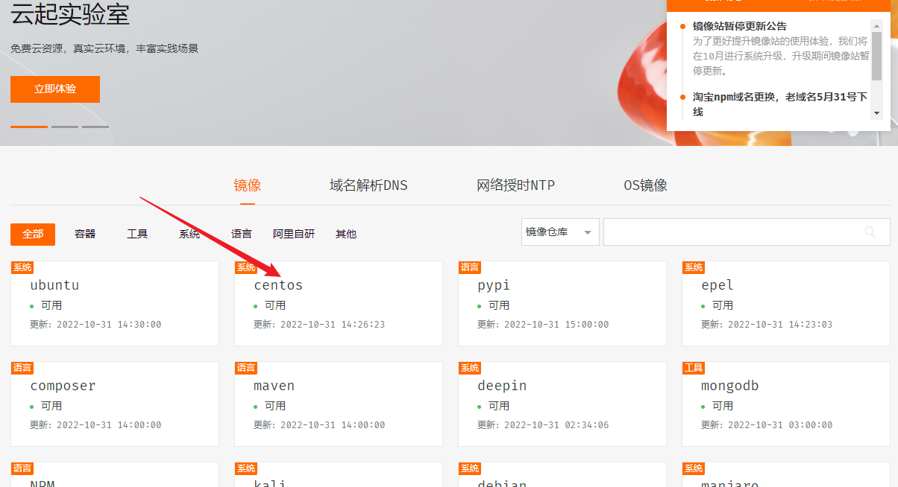
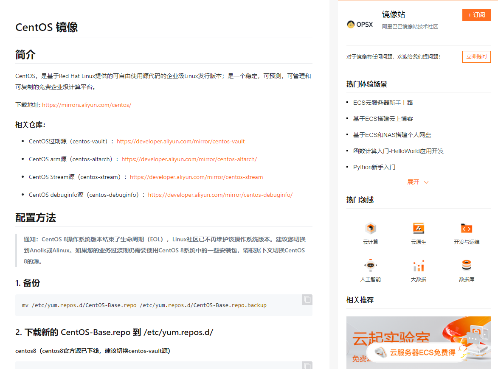
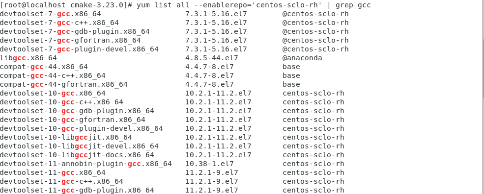
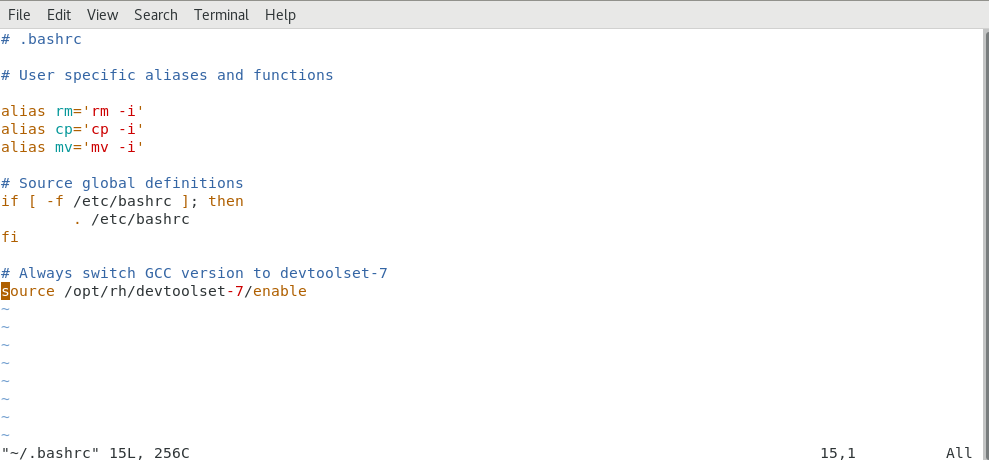
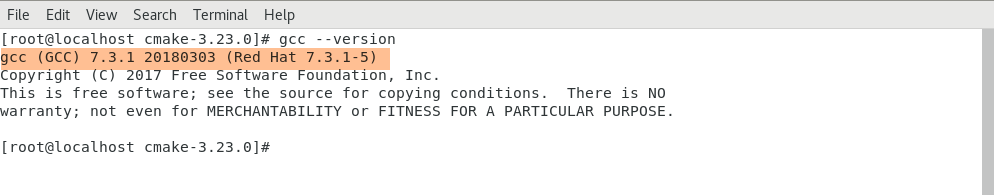
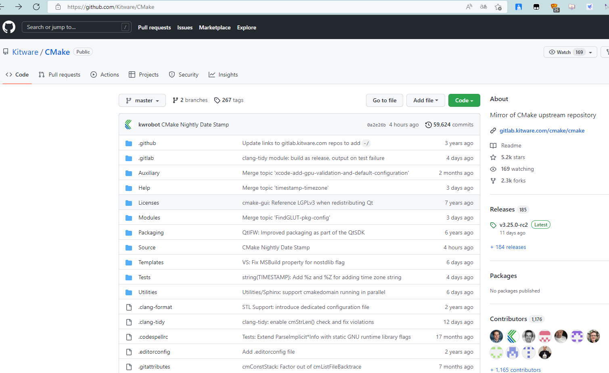
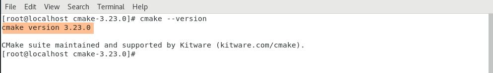
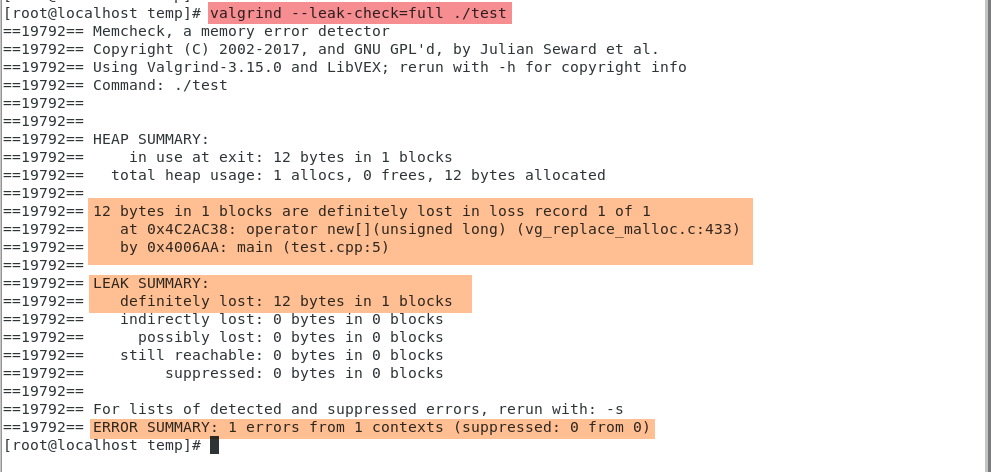

# CentOS开发环境搭建

## 一、简介

本文主要记录一下自己在CentOS下进行C++开发前的开发环境搭建过程，其中涉及到一些环境依赖以及在环境搭建过程中遇到的问题和解决方法，主要内容如下：

* CentOS换国内镜像源

* 安装SCL包管理工具

* 安装GCC/G++编译器
* 安装CMake
* 安装Valgrind内存泄漏检测工具
* VSCode远程开发环境搭建
* ...


## 二、环境搭建

> 此节详细描述环境搭建的各个环节，以及遇到的问题和解决方法。


### 1.1、CentOS换国内镜像源

由于CentOS的yum默认镜像源因服务器不在国内，下载速度这些要慢一些，所以我们可以将镜像源替换为国内镜像源，比如阿里云镜像，清华镜像等。阿里云的镜像源文档较为清晰，所以这里替换为阿里云镜像源。

阿里镜像源：[阿里巴巴开源镜像站-OPSX镜像站-阿里云开发者社区 (aliyun.com)](https://developer.aliyun.com/mirror/)





具体操作如下：

1. 备份

   ```bash
   # 备份老的镜像源（以防万一）
   mv /etc/yum.repos.d/CentOS-Base.repo /etc/yum.repos.d/CentOS-Base.repo.backup
   ```

2. 下载新的 CentOS-Base.repo 到 /etc/yum.repos.d/

   ```bash
   wget -O /etc/yum.repos.d/CentOS-Base.repo https://mirrors.aliyun.com/repo/Centos-7.repo
   # 或者
   curl -o /etc/yum.repos.d/CentOS-Base.repo https://mirrors.aliyun.com/repo/Centos-7.repo
   ```

3. 更新镜像源，运行 yum makecache 生成缓存

   ```bash
   # 清除缓存
   yum clean all
   
   # 生成缓存
   yum makecache
   ```


注意：如果出现失败，重新试一遍


### 1.2、SCL包管理工具安装

**Software Collections（SCL）**可以帮助解决 RHEL/CentOS 下的软件安装、软件依赖、多版本并存等问题，因为SCL
的创建就是为了给 RHEL/CentOS用户提供一种以方便、安全地安装和使用应用程序和运行时环境的多个（而且可能是更新的）版本的方式，同时避免把系统搞乱。与之相对的是第三方源，它们可能会在已安装的包之间引起冲突。


流程如下：

1. 安装SCL

   ```bash
   # 执行命令前先切换到root用户
   yum install centos-release-scl scl-utils-build scl-utils
   ```

2. 查看SCL支持的GCC/G++版本

   ```bash
   yum list all --enablerepo='centos-sclo-rh' | grep gcc
   ```

   

3. 查看SCL已安装软件版本

   ```bash
   scl --list
   ```

   

   

### 1.3、GCC/G++安装

CentOS是自带了一个GCC/G++编译器，但是由于CentOS7自带的GCC/G++4.8版本过于老旧，在这里升级成版本7，以便适配新的标准，同时一些包的编译也依赖于高版本的GCC/G++编译器才能完成，所以必须要升级一下，配置成版本可切换。

过程如下：

1. 安装GCC/G++/GDB

   ```bash
   # 根据SCL查看到的可支持版本列表，选择特定版本
   yum install devtoolset-7-gcc-c++.x86_64
   
   # 或者可以模糊指定，会下载此版本最新分支
   yum install devtoolset-7-gcc*
   yum install devtoolset-7-gdb*
   ```

2. 临时切换窗口，关闭shell窗口就会失效，下面的devtoolset-7是自己选择安装的版本（测试时可以用）

   ```bash
   scl enable devtoolset-7 bash
   ```

3. 临时切换比较麻烦，如果一直要用新编译的版本，可以配置成永久切换：

   * 打开~/.bashrc文件，同时查看GCC版本号：

   ```bash
   # 切换到临时窗口后，通过which gcc 命令查看目前所使用的版本
   which gcc # 我的查到为/opt/rh/devtoolset-7
   
   # 打开 ~/.bashrc文件
   vim ~/.bashrc
   ```

   * 在~/.bashrc文件末尾添加如下内容：

   ```bash
   # 在文件末尾加上以下内容,/opt/rh/devtoolset-7路径可以通过<which gcc>命令查到
   source /opt/rh/devtoolset-7/enable
   ```

   

   * 保存退出，生效配置文件

   ```bash
   # 保存退出后，生效配置文件
   source ~/.bashrc
   ```

   

4. 查看安装的GCC/G++版本

   ```bash
   gcc --version
   ```

   


### 1.4、CMake安装

CMake是一个开源、跨平台的编译、测试和打包工具，它使用比较简单的语言描述编译、安装的过程，输出Makefile或者project文件，再去执行构建。

在CentOS7中，用默认的安装方式安装的CMake可能版本比较老，可以选择下载特定版本CMake源码编译新版本，本文采用编译源码方式来安装。采用此法安装前，要保证已经安装了GCC等必备程序包。我选择安装的CMake版本为cmake version 3.23.0。

这里采用的是Github上的一个CMake开源仓库，里面有编译安装的文档简介。

Github Cmake：[Releases · Kitware/CMake (github.com)](https://github.com/Kitware/CMake)



过程如下：

1. 安装wget（已安装则略过）

   ```bash
   yum install -y wget
   ```

2. 获取CMake源码包

   ```bash
   wget https://github.com/Kitware/CMake/releases/download/v3.23.0/cmake-3.23.0.tar.gz
   ```

3. 解压CMake源码包

   ```bash
   tar -zxvf cmake-3.23.0.tar.gz
   ```

4. 进入解压后目录

   ```bash
   cd cmake-3.23.0
   ```

5. 编译安装，时间可能较长

   ```bash
   ./bootstrap && make && make install
   ```

6. 如果编译过程中出现"Could NOT find OpenSSL..."错误，请按以下操作，没有则略过

   ```bash
   # openssl安装完成后请重新编译CMake
   yum install  -y openssl  openssl-devel
   ```

7. 安装完成后查看版本号

   ```bash
   cmake --version
   ```

   


### 1.5、Valgrind内存泄漏检测工具安装

C/C++程序因为没有自动垃圾回收机制，需要开发者自己管理内存的分配和回收，为了避免失误，需要检测是否有内存泄漏，Linux下最常用的一个工具是Valgrind。

1. 安装如下：

   ```bash
   yum install -y valgrind
   ```

2. 验证

   编写一段有内存泄漏的代码 test.cpp：

   ```c++
   #include <iostream>
   
   int main(int argc, char* argv[])
   {
       int *pa = new int[3];
       for(int i = 0; i < 3; i++)
       {
           pa[i] = i;
       }
       // 程序结束后并没有释放分配在堆区的内存，造成泄露
       // delete[] pa; // 正确做法
       return 0;
   }
   ```

   编译代码：（注意要使用 -g -Og 选项来帮助Valgrind调试）

   ```bash
   g++ -g -Og test.cpp -o test
   ```

   使用Valgrind 命令来检测内存泄漏：

   ```bash
   valgrind --leak-check=full ./test
   ```

   得到如下结果,可以看出有明显的内存泄漏，并且是有test.cpp中第五行代码引起的

   


### 1.6、VSCode远程开发环境搭建

这里网上有比较多的教程，也比较简单，就只说一下免密登录远程主机，否则在开发过程中需要经常输入密码，比较麻烦。

教程：[基于VSCode的C++远程开发环境搭建教程（Win10) - 时间的风景 - 博客园 (cnblogs.com)](https://www.cnblogs.com/create-serenditipy/p/16191732.html)

**免密登录**：需要先在本机生成公钥，然后将本机公钥拷贝到远程主机，拷贝的过程，既可以手动（在远程主机主目录下创建.ssh目录，然后将公钥存入该目录下authorized_keys文件中即可），也可以使用命令`scp`或`ssh-copy-id`操作。操作完成后即可免密登录远程主机。

**提示**：最好提前在主机上安装Git，用Git的bash终端来操作，减少不必要的麻烦。

**命令**：`ssh-keygen`和`ssh-copy-id`

**步骤**：

1. 通过`ssh-keygen`命令在本机用户目录的.ssh目录下生成公钥，一路默认即可，如果安装了Git的话会自动生成公钥，可以省略这一步（如果没有再执行这步）

   ```bash
   ssh-keygen
   ```

   

2. 通过`ssh-copy-id`命令将本机公钥复制到远程服务主机

   ```bash
   # 首先cd进入到你本机的id_rsa.pub目录，然后执行以下命令
   # remoteusername：远程主机名，自行更改
   # server_ip_address：远程主机IP地址，自行更改
   ssh-copy-id <remoteusername>@<server_ip_address>
   # 或者
   # ssh-copy-id -i C:\Users\sky\.ssh\id_rsa.pub（主机公钥文件路径） 用户名@服务器IP
   ssh-copy-id -i <主机公钥文件路径> <远程主机用户名>@<远程主机IP>
   ```

   


## 三、总结

此文档只是暂时记录了这些，后续还会持续更新......
