# Unreal Engine

## 1、蓝图基础

> 主要介绍蓝图的概念和使用，事件和变量的知识略过


### 1.1、什么是蓝图[Blueprint]？

> 介绍蓝图概念

* 可以把蓝图看作是内容的**容器**
  * 它可以容纳组件（Components）
  * 它可以保存脚本
  * 它可以保存数据
* 编译的**面向对象**可视化脚本语言
  * 绑定到UE4现有的框架类层次结构中
* 完全**嵌入**UE4中
* 通过将**节点和连接**串在一起并立即查看结果来工作，迭代开发很快
* 蓝图类型
  * <font color=red>关卡蓝图</font> - 每个关卡只有一个，不利于复用
  * <font color=red>蓝图类</font> - 多个（模块化）
* 蓝图与C++
  * 蓝图是基于C++代码构建的
  * 可以在C++中打开/编辑蓝图
  * 蓝图和C++可以一起配合使用


### 1.2 、流程控制

> 主要介绍几个比较常用的流程控制节点


* **Branch（分支）**

  * 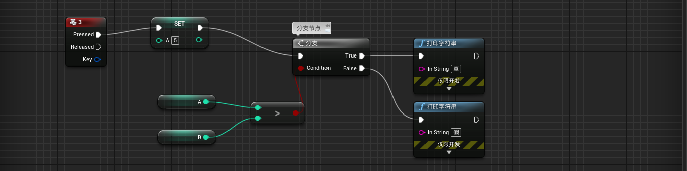

    

* **Delay（延迟，可用于计时）**

  * 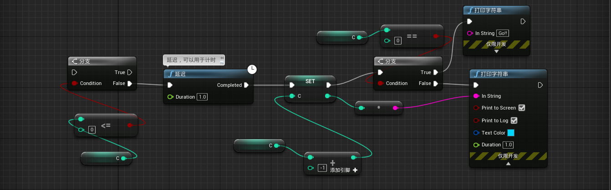

    

* **Retriggerable Delay（可触发延迟）**

  * 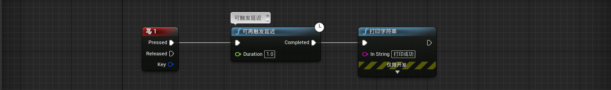

    

* **Do Once（执行一次）**

  * 

    

* **Do N（执行多次）**

  * 

    

* **DoOnce MultiInput（一次执行多个输入/输出）**

  * 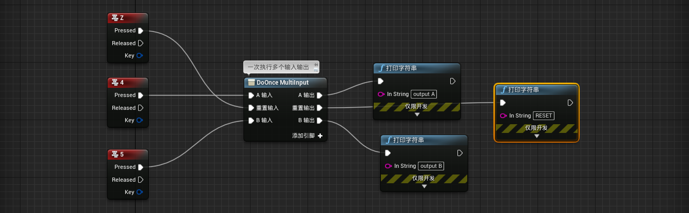

    

* **Flip Flop（翻转，动作1和2交替）**

  * 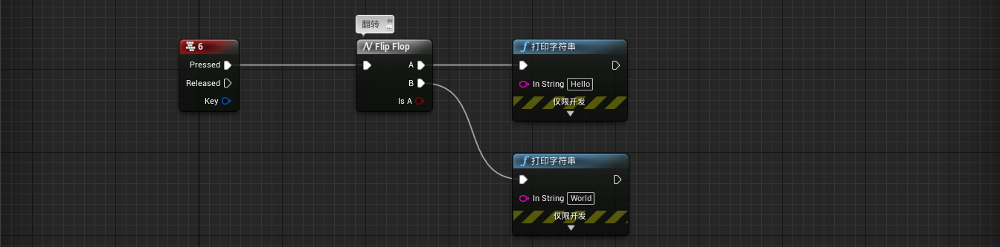

    

* **Gate（门，开关）**

  * 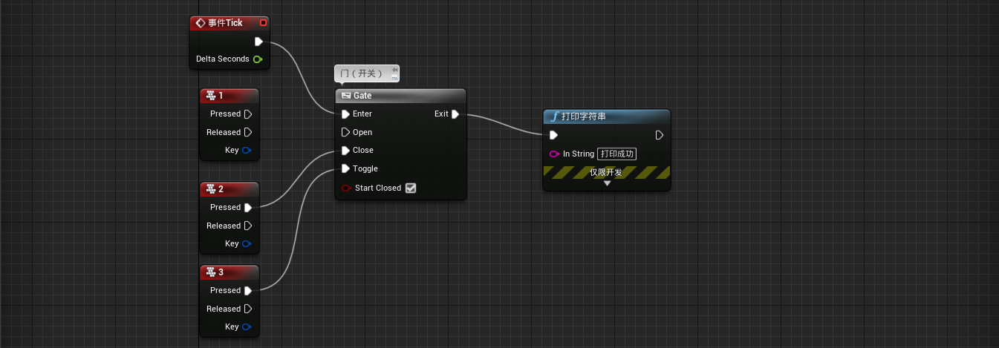

    

* **MultiGate（多门，一个动作触发不同内容）**

  * 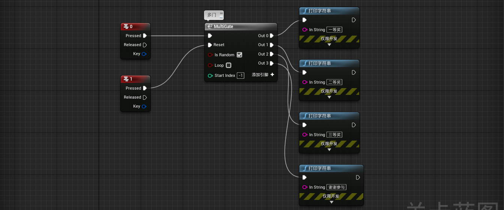

    

* **Sequence（序列，多个动作可以同时执行）**

  * 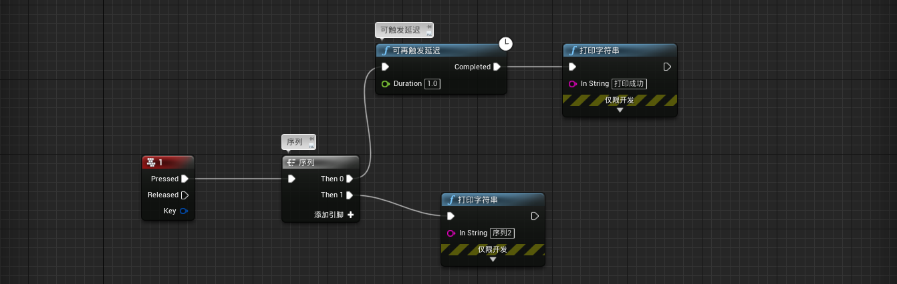


### 1.3、坐标系

> 主要了解UE4世界坐标系和局部坐标系


#### 1.3.1、游戏开发中的坐标系

在3D游戏开发中，用的是笛卡尔三维坐标系，由于历史原因（没有统一标准）包含两种三维的坐标系：***左手坐标系***和***右手坐标系***。

如何理解左手坐标系和右手坐标系呢？

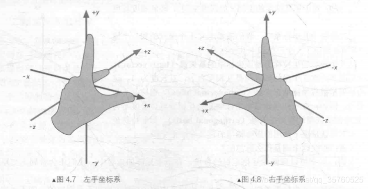


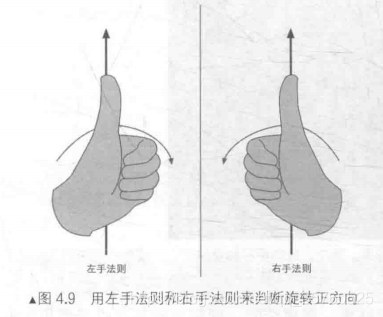


#### 1.3.2、UE4的坐标系

在UE4中的所用的坐标系（世界坐标系和局部坐标系）都为***左手坐标系***。 而OpenGL和建模软件3DsMax用的是右手坐标系，需要转换。

**UE4坐标轴旋转轴（Rotation）说明：**

* Pitch是围绕Y轴旋转，也叫做俯仰角
* Yaw是围绕Z轴旋转，也叫偏航角
* Roll是围绕X轴旋转，也叫翻滚角

图示如下：

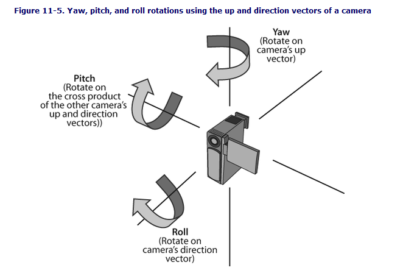


UE4蓝图中的Rotation顺序三个依次为：roll、pitch、yaw。

* 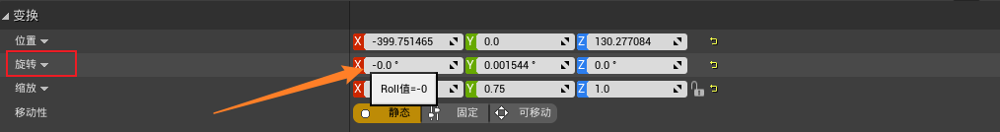
* 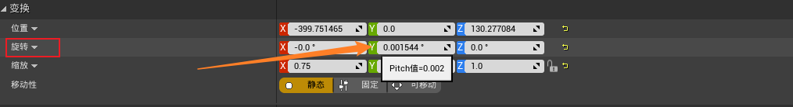
* 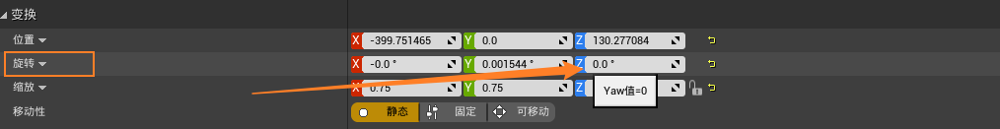


UE4的C++接口中，FRotator的顺序则依次为：pitch、yaw、roll，这点需要注意。

* 

* 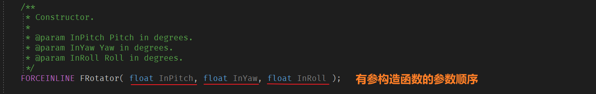


#### 1.3.3、UE4中坐标系之间的关系

在UE4中，要了解ActorLocation和Mesh的WorldLocation以及RelativeLocation这三种设置的区别。

首先必须了解两个概念，一个是坐标系概念，一个是层级关系。

* 坐标系

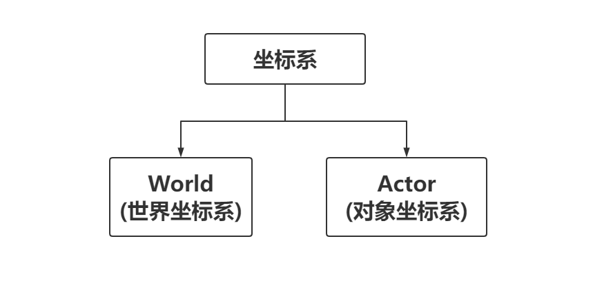

* 层级关系

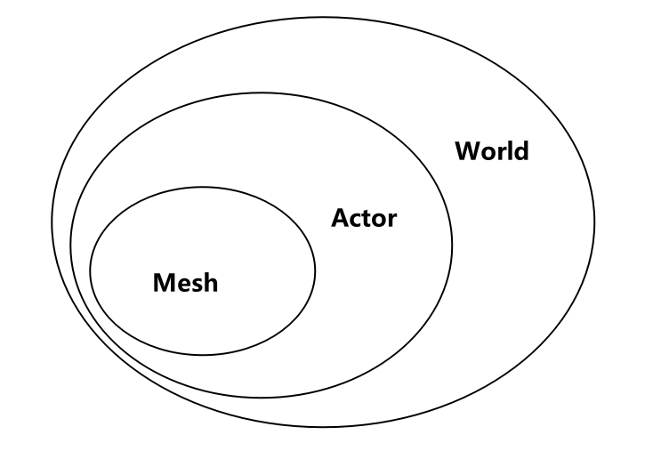


## 2、UE4的C++编程基础

> 主要记录UE4在C++编程中的比较常用的几个点。

### 2.1、UE4反射用到的宏

主要介绍两个反射宏：***UPROPERTY*** 和 ***UFUNCTION***。具体的使用和参数之类的参考官方文档：[UE4官方文档]([属性 | 虚幻引擎文档 (unrealengine.com)](https://docs.unrealengine.com/4.27/zh-CN/ProgrammingAndScripting/GameplayArchitecture/Properties/))，在宏中可以加入**属性说明符**、**元数据说明符（meta=(...)）**、**分类说明符（Category="AAA"）**等。

* **UPROPERTY**属性宏参数：
  * EditAnywhere：在编辑中可见，且可编辑；
  * EditDefaultsOnly：只在类默认设置中可见；
  * EditInstanceOnly：可通过属性窗口进行编辑，但只能在实例上进行，不能在原型上进行；
  * VisibleAnywhere：在编辑中可见，但不能编辑；
  * BlueprintReadOnly：蓝图只读；
  * BlueprintReadWrite：蓝图可读可写。
* **UFUNTION**函数宏参数:
  * BlueprintCallable：此函数可在蓝图或关卡蓝图图表中执行；
  * BlueprintPure：此函数不对拥有它的对象产生任何影响，可在蓝图或关卡蓝图图表中执行；
  * BlueprintImplementableEvent：需要在蓝图里面重载；
  * BlueprintNativeEvent：此函数旨在被蓝图覆盖掉，但是也具有默认原生实现。用于声明名称与主函数相同的附加函数，单数末尾添加了Implementation，是写入代码的位置，如果未找到任何蓝图覆盖，该自动生成的代码将调用Implementation方法。
  * CallInEditor：可通过细节（Details）面板中的按钮在编辑器中的选定实例上调用此函数。

代码示例：

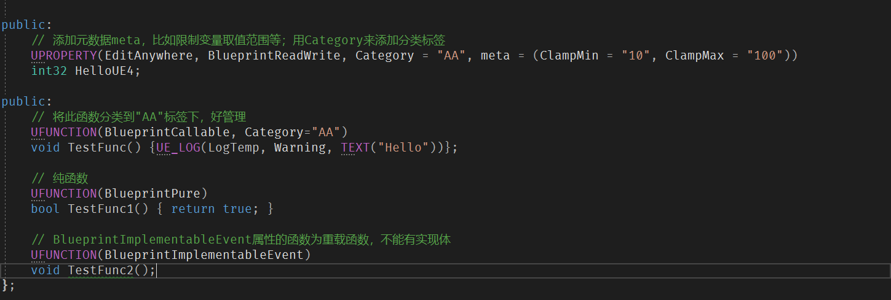


### 2.2、UE4如何定义枚举和结构体

UE4中定义枚举和结构体大体上和C++是一样的，只是要和蓝图交互的话有些不一样，要增加额外的关键字。


命名规则：

* Axxx：继承自AActor
* Uxxx：继承自UObject
* Fxxx：原生C++
* Exxx：枚举
* Ixxx：接口
* Sxxx：slate


代码示例：

```c++
// 定义枚举类，此写法是C++11的写法
UENUM(BlueprintType)  // 暴露给蓝图
enum class UColorType: uint8
{
	RED,
	GREEN,
	BLUE
};

// 定义结构体
USTRUCT(BlueprintType)  // 暴露给蓝图
struct FTestStruct  
{
	GENERATED_USTRUCT_BODY()  // 增加反射宏
public:
	UPROPERTY(EditAnywhere, BlueprintReadWrite)
	int32 num;
};
```


### 2.3、浅析什么是UObject

UObject，它是所有引擎层面、游戏层面对象的基类，为序列化，网络同步，反射，蓝图，等提供了广泛的支持。

重要的功能介绍：

* **反射**：所谓反射，抽象的来说就是程序在运行时动态获取对象信息以及调用对象方法的能力，原生C++不支持反射，  UE4中，UE4反射的功能意义之一就是支持蓝图和C++的交互功能。如UCLASS()、UPROPERTY()、UFUNCTION()等就是应用体现；
* **垃圾回收**（GC）：对对象生命周期的管理，对内存堆中已经死亡的或者长时间没有使用的对象进行清除和回收，有很多垃圾回收算法。原生C++不支持垃圾回收，需要开发人员自行管理；
* **序列化**：将对象的状态信息转换为可以存储或传输的形式的过程；
  * 序列化：把对象转换为字节序列的过程称为对象的序列化
  * 反序列化：把字节序列恢复为对象的过程称为对象的反序列化
* **CDO**（class default object）类默认对象 ：
  * 主要作用就是用于为类提供默认值，例如我们在编辑器中编辑的蓝图类的属性就是保存在该蓝图类的 CDO 中，且在构造此蓝图类的实例时会以其 CDO 作为默认的模板对象来初始化蓝图类实例的属性；
  * CDO 对象是具有稳定的网络路径的，可由网络同步其引用，这使得我们在同步一个 UObject 对象的属性时，仅需同步和 CDO 中不同的属性即可。同样的道理在序列化时也只需保存和 CDO 中不同的差异属性即可。


### 2.4、UE4代理（委托）与std::bind

#### 2.4.1、概念和特性

委托是一种**观察者模式**，也被称为**代理**，用于**降低不同对象之间的耦合度**，同时提供一种消息机制，两个有关联的对象不对彼此的行为进行监听，而是通过委托来间接的建立联系，监听者将需要响应的函数绑定到委托对象上，使得委托在触发时调用所绑定的函数。在UE4的实现中, 委托可绑定到任何的c++可调用对象, 全局函数(静态成员函数), 类的非静态成员函数,Lambda 以及 按Name 绑定到UFunction.尔后可在恰当的时机调用它。

在UE4的实现中，委托本质上是**通过宏定义实现的一个自定义的类**，它是一个特殊的类，内部可以存储**函数指针**，用以实现委托的执行，**委托执行类似函数指针**，但是**更安全**，因为**支持编译期的类型检查**，且委托更**易于使用**。

**代理的三个主要特性：**绑定、呼叫、接触绑定

简单来说,由于不同的可调用对象的调用方式差别巨大,所以我们需要把这些可调用对象统一成一个东西, 即`Delegate`, 不同的`Delegate`之间仅仅是所代表的可调用对象的参数和返回值类型不同。而具体的调用方式, 则根据你绑定的可调用对象的形式而定。在头文件 **DelegateCombinations.h** 中提供了多种宏用于宏定义不同的委托，在该头文件中委托的参数数量最多支持到9个参数，但**不意味着UE4的委托只能是9个参数**，用于定义委托的宏，最终会进入到头文件 **Delegate.h** 中处理，查看该头文件源码可知委托定义时函数参数为可变类型，并没有限制为9个，不过9个参数也足够使用了。


#### 2.4.2、UE4代理（委托）类型

按照绑定委托函数的个数分为**单播**和**多播**委托，按照是否可以暴露给蓝图分为**静态委托**和**动态委托**，故可以分为四种类型。

**四种类型**：

* <font color=red>**静态单播**</font>：最常用的委托，**只能绑定一个委托函数**，绑定的委托函数可以**有返回值**，可接受**不同数量的参数**，**委托实例必须绑定在其声明时所定义的同返回类型和参数列表的函数**，静态委托执行前最好**检查是否绑定**，否则会导致程序崩溃，如果**重复进行绑定**，会**覆盖上一次的绑定**；

  * ```c++
    // 单播代理：无参数，无返回值
    DECLARE_DELEGATE(DelegateName_1);
    DelegateName_1 DGate1;
    
    // 单播代理：无参数，有返回值
    DECLARE_DELEGATE_RetVal(int, DelegateName_2);
    DelegateName_2 DGate2;
    
    // 单播代理：有俩参数，无返回值
    DECLARE_DELEGATE_TwoParams(DelegateName_3, int, int);
    DelegateName_3 DGate3;
    
    // 单播代理：有一个参数，有返回值
    DECLARE_DELEGATE_RetVal_OneParam(int, DelegateName_4, int);
    DelegateName_4 DGate4;
    
    // 绑定委托函数
    // 绑定委托函数，这里以绑定lambda函数为例
    DGate1.BindLambda([]() {"Lambda1"; });
    
    // 重复绑定时，会覆盖上一次的绑定，执行新绑定的函数 
    DGate1.BindLambda([]() {"Lambda2"; });
    
    // 执行委托函数，如果定义的委托函数有参数或返回值，在此时传入和获取
    // 直接执行未绑定的单播会导致奔溃，执行前最好检查一下 
    if (DGate1.IsBound())
    {
    	DGate1.Execute();
    }
    
    // 也可以直接使用UE4提供的接口一步到位 
    // 特别注意的是：有返回值的委托函数，不能用这个接口！
    // 这个接口需要返回bool类型标识是否成功执行，可能这个原因使得在语法上不支持用于有返回的委托函数 
    DGate1.ExecuteIfBound();
    
    // 解除绑定
    DGate1.Unbind();
    ```
    
  * 

* <font color=red>**静态多播**</font>：**可以绑定多个委托函数**，但**委托函数不能有返回值**，委托函数参数和静态单播类似，**多播委托在广播执行时不一定是按照绑定顺序来的**，在广播执行时，不需要判断是否绑定了委托函数，直接广播执行即可；

  * ```c++
    // 静态多播
    DECLARE_MULTICAST_DELEGATE(DelegateName);
    DelegateName DelegateInst;
    
    // 逐一添加委托函数
    DelegateInst.AddLambda([]() {"Lambda1"; });  // 绑定1
    DelegateInst.AddLambda([]() {"Lambda2"; });  // 绑定2
    
    // 额外保存委托handle对象
    FDelegateHandle handleOb = DelegateInst.AddLambda([]() {"Lambda3"; });  // 绑定3
    
    // 绑定UFUNCTION时需要this指针
    DelegateInst.AddUFunction(this, TEXT("FunctionName"));  // 绑定4
    
    // 通过广播执行，不需要判断是否绑定了委托函数
    DelegateInst.Broadcast();
    
    // 解除单个绑定，需要保存绑定时的 handle 对象
    DelegateInst.Remove(FDelegateHandle);
    
    // 如果想解除所有绑定，可能会想到使用RemoveAll()，但该函数只会解绑指定指针所绑定的委托，
    // 如下调用会清除当前类所绑定的委托，当前类绑定委托指的是绑定的时候用到了 this 指针，
    // 所以执行后只会清除上述的绑定4，因为用到了this指针，其余3个绑定仍然可以被广播执行
    DelegateInst.RemoveAll(this);
    
    // 可以使用Clear接口清除所有绑定，其底层实现利用的是Unbind()
    DelegateInst.Clear();
    ```

  * 

* <font color=red>**动态单播**</font>：动态即支持**蓝图序列化**，可以用**宏 UPROPERTY 标记动态单播实例**，在添加元数据 BlueprintReadWrite 后即可在蓝图获取到其实例引用，**动态委托的类型名称必须以 “F” 开头**，虽然可以暴漏给蓝图使用，但**动态委托只能绑定UFUNCTION宏标记的函数**，还有一点就是动态委托的委托函数参数，需要**同时写出参数类型名称和参数变量名称**；

  * ```c++
    // 动态单播
    // 动态委托需要同时写出函数参数类型名称和参数变量名称，且自定义委托名称以‘F’开头
    DECLARE_DYNAMIC_DELEGATE_OneParam(FDelegateName, int, num);
    
    // 动态委托可以使用宏标记暴露给蓝图，但动态单播不能在蓝图定义委托实例和绑定委托函数
    UPROPERTY(BlueprintReadWrite)
    FDelegateName DelegateInst;
    
    // 类似静态单播的绑定，但只能绑定被UFUNCTION标记的函数
    DelegateInst.BindUFunction(this, TEXT("UFunctionName"));
    // 官方文档建议用下面的宏来绑定，建议按官方文档的方式来
    DelegateInst.BindDynamic(this, &MyClassName::UFunctionName);
    
    // 执行委托 
    if (DelegateInst.IsBound())
    {
    	DelegateInst.Execute(10);
    }
    
    // 解除委托
    DelegateInst.Unbind();
    ```

  * 

* <font color=red>**动态多播**</font>：动态即支持**蓝图序列化**，即**可在蓝图中绑定事件**，但蓝图获取不到在C++中定义的动态多播的实例引用，即使用元数据 BlueprintReadWrite 标记也不行，但可以通过 【**Assign 实例名称】** 的蓝图节点为在C++中定义的动态多播对象绑定新的委托函数；

  * ```c++
    // 动态多播
    // 动态委托需要同时写出函数参数类型名称和参数变量名称，且自定义委托名称以‘F’开头
    DECLARE_DYNAMIC_MULTICAST_DELEGATE(FDelegateName, int, num);
    
    // 动态多播委托通过宏标记中 BlueprintAssignable 元数据使其可在蓝图中定义委托实例和绑定委托函数 
    UPROPERTY(BlueprintAssignable)
    FDelegateName Delegateinst;
    
    // 绑定多个动态委托，委托函数必须是被UFUNCTION标记的函数 
    DelegateInst.AddDynamic(this, &MyClassName::UFunctionName_1);
    DelegateInst.AddDynamic(this, &MyClassName::UFunctionName_2);
    DelegateInst.AddDynamic(this, &MyClassName::UFunctionName_3);
    
    // 广播执行动态多播委托 
    DelegateInst.Broadcast();
    
    // 解除单个委托，动态单播解绑就不需要保存FDelegateHandle对象了，和绑定时参数一致 
    DelegateInst.RemoveDynamic(this, &MyClassName::UFunctionName_3);
    // 解除所有绑定的委托 
    DelegateInst.Clear();
    ```

  * 在C++代码中定义好动态多播实例 DelegateInst 后，可以在蓝图中通过 **Assign 实例名称 (即 Assign DelegateInst) 节点来绑定委托函数**，新建了一个事件调度器（EventDispatcher）为指定的动态多播对象绑定（Bind Event to Delegate Inst）指定的委托函数（Print String）：

  * 


#### 2.4.3、代理（委托）注意事项 

**需要特别注意的是：**

① 委托的声明，书写格式遵循：DECLARE_[DYNAMIC]_[MULTICAST]_DELEGATE_[RetVal]_[XXXParam(s)]，单词是有顺序的；

② 单播委托在执行前务必判断是否有绑定委托函数，建议使用 ExecuteIfBound，多播委托的广播执行是安全的，不论是否绑定了委托函数；

③ 多播委托所绑定的委托函数不能有返回值；

④ 动态委托性能比静态委托更低，运行更慢，这是动态委托支持蓝图序列化的代价；

⑤ 动态委托的宏辅助声明，委托函数参数类型名称和参数变量名称都要写出来，静态委托只需要写参数类型名称即可；

⑥ 动态委托的宏声明之后必须有分号，否则有编译错误，而静态委托不需要，为了使得编码统一，用宏来声明委托时，都在后面加分号处理；

⑦ 在 DelegateCombinations.h 头文件中也有一种对事件的宏定义：DECLARE_EVENT_[XXXParam(s)]，按照源码中的注释，本质上就是一个多播委托，但事件在定义的时候需要传入一个拥有者对象，事件只有在该拥有者内部绑定委托才生效，源码注释中建议不要使用此类事件，建议就用普通的多播委托即可。
