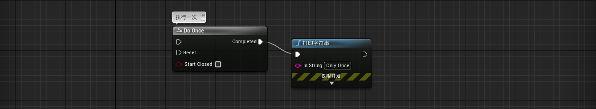
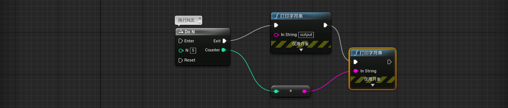
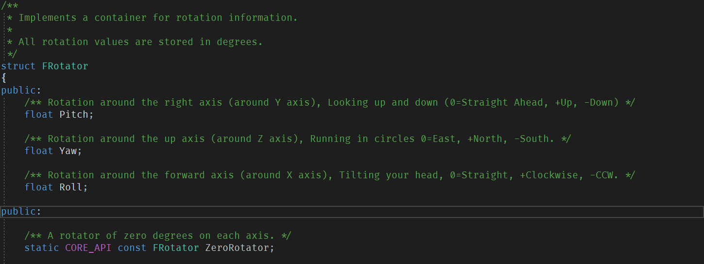

# Unreal Engine

## 1、蓝图基础

> 主要介绍蓝图的概念和使用，事件和变量的知识略过

### 1.1、什么是蓝图[Blueprint]？

> 介绍蓝图概念

* 可以把蓝图看作是内容的**容器**
  * 它可以容纳组件（Components）
  * 它可以保存脚本
  * 它可以保存数据
* 编译的**面向对象**可视化脚本语言
  * 绑定到UE4现有的框架类层次结构中
* 完全**嵌入**UE4中
* 通过将**节点和连接**串在一起并立即查看结果来工作，迭代开发很快
* 蓝图类型
  * 关卡蓝图 - 每个关卡只有一个，不利于复用
  * 蓝图类 - 多个（模块化）
* 蓝图与C++
  * 蓝图是基于C++代码构建的
  * 可以在C++中打开/编辑蓝图
  * 蓝图和C++可以一起配合使用

### 1.2 、流程控制

> 主要介绍几个比较常用的流程控制节点

* **Branch（分支）**

  * 

    

* **Delay（延迟，可用于计时）**

  * 

    

* **Retriggerable Delay（可触发延迟）**

  * 

    

* **Do Once（执行一次）**

  * 

    

* **Do N（执行多次）**

  * 

    

* **DoOnce MultiInput（一次执行多个输入/输出）**

  * 

    

* **Flip Flop（翻转，动作1和2交替）**

  * 

    

* **Gate（门，开关）**

  * 

    

* **MultiGate（多门，一个动作触发不同内容）**

  * 

    

* **Sequence（序列，多个动作可以同时执行）**

  * 

### 1.3、坐标系

> 主要了解UE4世界坐标系和局部坐标系

#### 1.3.1、游戏开发中的坐标系

在3D游戏开发中，用的是笛卡尔三维坐标系，由于历史原因（没有统一标准）包含两种三维的坐标系：***左手坐标系***和***右手坐标系***。

如何理解左手坐标系和右手坐标系呢？

#### 1.3.2、UE4的坐标系

在UE4中的所用的坐标系（世界坐标系和局部坐标系）都为***左手坐标系***。 而OpenGL和建模软件3DsMax用的是右手坐标系，需要转换。

**UE4坐标轴旋转轴（Rotation）说明：**

* Pitch是围绕Y轴旋转，也叫做俯仰角
* Yaw是围绕Z轴旋转，也叫偏航角
* Roll是围绕X轴旋转，也叫翻滚角

图示如下：

UE4蓝图中的Rotation顺序三个依次为：roll、pitch、yaw。

* 
* 
* 

UE4的C++接口中，FRotator的顺序则依次为：pitch、yaw、roll，这点需要注意。

* 

* 

#### 1.3.3、UE4中坐标系之间的关系

在UE4中，要了解ActorLocation和Mesh的WorldLocation以及RelativeLocation这三种设置的区别。

首先必须了解两个概念，一个是坐标系概念，一个是层级关系。

* 坐标系

* 层级关系

