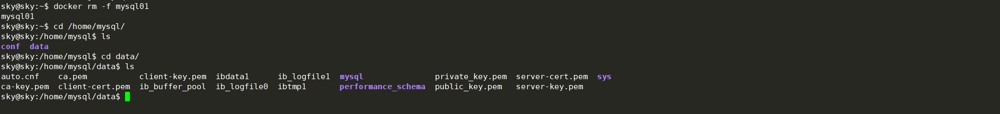
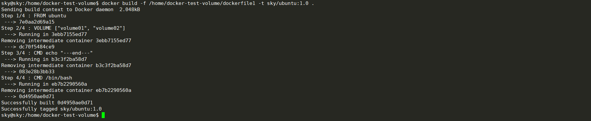
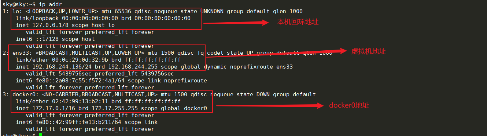

# Docker概述


## Docker的基本组成


**镜像**（image）:

docker镜像就好比一个模板，可以通过这个模板来创建容器服务，tomcat镜像-->run-->tomcat01容器（提供服务器），通过这个镜像可以创建多个容器（最终服务运行或者项目运行就在容器中）。

**容器（container）:**

Docker利用容器技术，独立运行一个或是一组应用，通过镜像来创建。

启动，停止，删除，基本命令！

目前可以把容器理解为一个简易的Linux系统

**仓库（respository）:**

仓库就是存放镜像的地方；

仓库分为公有仓库和私有仓库；

Docker Hub（默认是国外的）；

阿里云等都有容器服务器（配置镜像加速）；


## 安装Docker

> 安装环境为Ubuntu18.04

帮助文档：

**1.设置依赖包和仓库：**

```bash
# 1.卸载旧的版本
$ sudo apt-get remove docker docker-engine docker.io containerd runc

# 2.选择用仓库来安装
# 2.1 更新apt索引包
$ sudo apt-get update
# 2.2 安装apt依赖包，用于通过HTTPS来获取仓库
$ sudo apt-get install \
    apt-transport-https \
    ca-certificates \
    curl \
    gnupg \
    lsb-release
   
# 3. 添加Docker的官方GPG密钥
$ curl -fsSL https://download.docker.com/linux/ubuntu/gpg | sudo gpg --dearmor -o /usr/share/keyrings/docker-archive-keyring.gpg

# 4. 设置稳定版仓库
$ echo \
  "deb [arch=amd64 signed-by=/usr/share/keyrings/docker-archive-keyring.gpg] https://download.docker.com/linux/ubuntu \
  $(lsb_release -cs) stable" | sudo tee /etc/apt/sources.list.d/docker.list > /dev/null
```

**2.安装Docker Engine:**

```bash
# 更新包索引
$ sudo apt-get update

# 安装最新版本的 Docker Engine-Community 和 containerd ，或者转到下一步安装特定版本:
$ sudo apt-get install docker-ce docker-ce-cli containerd.io

# 要安装特定版本的 Docker Engine-Community，请在仓库中列出可用版本，然后选择一种安装。列出您的仓库中可用的版本：
$ apt-cache madison docker-ce
docker-ce | 5:18.09.1~3-0~ubuntu-xenial | https://mirrors.ustc.edu.cn/docker-ce/linux/ubuntu  xenial/stable amd64 Packages
  docker-ce | 5:18.09.0~3-0~ubuntu-xenial | https://mirrors.ustc.edu.cn/docker-ce/linux/ubuntu  xenial/stable amd64 Packages
  docker-ce | 18.06.1~ce~3-0~ubuntu       | https://mirrors.ustc.edu.cn/docker-ce/linux/ubuntu  xenial/stable amd64 Packages
  docker-ce | 18.06.0~ce~3-0~ubuntu       | https://mirrors.ustc.edu.cn/docker-ce/linux/ubuntu  xenial/stable amd64 Packages
  ...

# 使用第二列中的版本字符串安装特定版本，例如 5:18.09.1~3-0~ubuntu-xenial。
$ sudo apt-get install docker-ce=<VERSION_STRING> docker-ce-cli=<VERSION_STRING> containerd.io

# 测试 Docker 是否安装成功，输入以下指令，打印出以下信息则安装成功:
$ sudo docker run hello-world
```

**3.卸载Docker:**

```bash
# 删除安装包
$ sudo apt-get purge docker-ce docker-ce-cli containerd.io

# 删除镜像，容器，配置文件等
$ sudo rm -rf /var/lib/docker
$ sudo rm -rf /var/lib/containerd
```

**4.添加国内镜像源**

添加阿里云镜像加速，自行百度。

创建或修改 /etc/docker/daemon.json 文件，修改为如下形式:

```BASH
# daemon.json没有则自行创建
# vim /etc/docker/daemon.json
{
    "registry-mirrors": ["http://hub-mirror.c.163.com"]
}

# 重新加载daemon.json文件
sudo systemctl daemon-reload
# 重启docker
sudo systemctl restart docker
```

国内加速地址有：

Docker中国区官方镜像
https://registry.docker-cn.com

网易
http://hub-mirror.c.163.com

ustc 
https://docker.mirrors.ustc.edu.cn

中国科技大学
https://docker.mirrors.ustc.edu.cn

阿里云容器 服务
https://cr.console.aliyun.com/
首页点击“创建我的容器镜像” 得到一个专属的镜像加速地址，类似于“https://1234abcd.mirror.aliyuncs.com”


**5.Docker运行时的一个问题：**

> "Got permission denied while trying to connect to the Docker daemon socket at unix..."

产生原因：

Docker进程使用Unix Socket而不是TCP端口。默认情况下，UNIX Scoket属于root用户，因此需要root权限才能访问。

解决办法：

```bash
sudo groupadd docker          #添加docker用户组
sudo gpasswd -a $XXX docker   #检测当前用户是否已经在docker用户组中，其中XXX为用户名，例如我的，liangll
sudo gpasswd -a $USER docker  #将当前用户添加至docker用户组
newgrp docker                 #更新docker用户组

docker version                # 检查是否更新成功
```


## 底层原理

**run命令的流程：**


**Docker是如何工作的？**

Docker是一个Client-Server结构的系统，Docker的守护进程运行在主机上，通过Socket从客户端访问；

DockerServer接收到Docker-Client的指令，就会执行这个命令！


**Docker为什么比虚拟机快？**

1. Docker有着比虚拟机更少的抽象层
2. Docker利用的时宿主机的内核，VM需要是Guest OS


所以说，新建一个容器的时候，docker不需要像虚拟机一样重新加载一个操作系统内核，避免引导。虚拟机是加载Guest OS，分钟级别的，而Docker是利用宿主机的操作系统，省略这个复杂的过程，秒级。


## Docker常用命令


### 帮助命令

```bash
docker version     # 显示docker的版本信息
docker info        # 显示docker的系统信息，包括镜像和容器的数量
docker 命令 --help  # 帮助命令
```

帮助文档地址：https://docs.docker.com/reference/

### 镜像命令

* **docker images** 查看所有本地的主机上的镜像

```bash
sky@sky:~$ docker images
REPOSITORY    TAG       IMAGE ID       CREATED        SIZE
hello-world   latest    d1165f221234   2 months ago   13.3kB

# 解释
REPOSITORY # 镜像的仓库源
TAG        # 镜像的标签
IMAGE ID   # 镜像的ID
CREATED    # 境相的创建时间
SIZE       # 镜像的大小

# 可选项
  -a, --all             # 列出所有镜像
  -q, --quiet           # 只显示镜像ID
```

* **docker search 搜索镜像**

```bash
sky@sky:~$ docker search mysql
NAME                              DESCRIPTION                                     STARS     OFFICIAL   AUTOMATED
mysql                             MySQL is a widely used, open-source relation…   10881     [OK]       
mariadb                           MariaDB Server is a high performing open sou…   4104      [OK]   

# 可选项
  -f, --filter filter   # 搜索过滤
  --filter=STARS=3000   # 搜索出来的镜像就是STARS大于3000的
 
sky@sky:~$ docker search mysql --filter=STARS=3000
NAME      DESCRIPTION                                     STARS     OFFICIAL   AUTOMATED
mysql     MySQL is a widely used, open-source relation…   10881     [OK]       
mariadb   MariaDB Server is a high performing open sou…   4104      [OK]   
```

* **docker pull [name:tag]下载镜像**

```bash
# 下载镜像 docker pull 镜像名[:tag]
sky@sky:~$ docker pull mysql
Using default tag: latest          # 如果不写tag，默认就是latest
latest: Pulling from library/mysql
69692152171a: Pull complete        # 分层下载，docker image的核心 联合文件系统
1651b0be3df3: Pull complete 
951da7386bc8: Pull complete 
0f86c95aa242: Pull complete 
37ba2d8bd4fe: Pull complete 
6d278bb05e94: Pull complete 
497efbd93a3e: Pull complete 
f7fddf10c2c2: Pull complete 
16415d159dfb: Pull complete 
0e530ffc6b73: Pull complete 
b0a4a1a77178: Pull complete 
cd90f92aa9ef: Pull complete 
Digest: sha256:d50098d7fcb25b1fcb24e2d3247cae3fc55815d64fec640dc395840f8fa80969 # 签名
Status: Downloaded newer image for mysql:latest
docker.io/library/mysql:latest  # 真实地址

# 指定版本下载
sky@sky:~$ docker pull mysql:5.7
5.7: Pulling from library/mysql
69692152171a: Already exists # 已经存在的部分不会再次下载
1651b0be3df3: Already exists 
951da7386bc8: Already exists 
0f86c95aa242: Already exists 
37ba2d8bd4fe: Already exists 
6d278bb05e94: Already exists 
497efbd93a3e: Already exists 
a023ae82eef5: Pull complete 
e76c35f20ee7: Pull complete 
e887524d2ef9: Pull complete 
ccb65627e1c3: Pull complete 
Digest: sha256:a682e3c78fc5bd941e9db080b4796c75f69a28a8cad65677c23f7a9f18ba21fa
Status: Downloaded newer image for mysql:5.7
docker.io/library/mysql:5.7

```

* **docker rmi  删除镜像**

```bash
sky@sky:~$ docker rmi -f 容器ID                 # 删除指定的镜像
sky@sky:~$ docker rmi -f 容器ID 容器ID 容器ID    # 删除多个镜像
sky@sky:~$ docker rmi -f $(docker images -aq)  # 删除所有镜像
```

### 容器命令

**说明：有了镜像才可以创建容器，linux，下载一个centos镜像来测试学习**

```bash
# 下载镜像
sky@sky:~$ docker pull centos
```

**新建容器并启动**

> docker run [可选参数] image

*docker run [可选参数] image*

```bash
sky@sky:~$ docker run [可选参数] image

# 参数说明
	--name="name" 容器名字 tomcat01 tomcat02，用来区分容器
	-d            后台方式运行
	-it           交互方式运行，进入容器查看内容
	-p            指定容器的端口(小p) -p 8080:8080
		-p ip:主机端口:容器端口
		-p 主机端口:容器端口（常用）
		-p 容器端口
		容器端口
	-P            随机指定端口(大p)


# 测试，启动并进入容器
sky@sky:~$ docker run -it ubuntu /bin/bash
root@9bf23b7587d1:/# ls  # 查看容器内的ubutu，基础版本，很多命令不完善
bin  boot  dev  etc  home  lib  lib32  lib64  libx32  media  mnt  opt  proc  root  run  sbin  srv  sys  tmp  usr  var

# 从容器中退回主机,用exit命令
root@9bf23b7587d1:/# exit
exit
sky@sky:~$ ls
demo  demo2  Desktop  Documents  Downloads  environment  examples.desktop  Music  Pictures  Public  Templates  Videos
sky@sky:~$ 

```

**列出所有的运行的容器**

> docker ps 命令

```bash
# docker ps 命令
	# 列出当前正在运行的容器
-a  # 列出当前正在运行的容器+带出历史运行过的容器
-n=? # 显示最近创建的容器
-q # 只显示容器的编号


sky@sky:~$ docker ps
CONTAINER ID   IMAGE     COMMAND   CREATED   STATUS    PORTS     NAMES
sky@sky:~$ docker ps -a
CONTAINER ID   IMAGE          COMMAND       CREATED             STATUS                           PORTS     NAMES
9bf23b7587d1   ubuntu         "/bin/bash"   53 minutes ago      Exited (0) 50 minutes ago                  quirky_elgamal
15f127878e63   4eb8f7c43909   "/bin/bash"   55 minutes ago      Exited (0) 55 minutes ago                  nervous_mclean
3838d1586475   ubuntu         "/bin/bash"   57 minutes ago      Exited (0) 57 minutes ago                  agitated_shirley
7bf213e1af07   ubuntu         "/bin/bash"   About an hour ago   Exited (127) About an hour ago             tender_zhukovsky
676bb29c01d6   hello-world    "/hello"      3 hours ago         Exited (0) 3 hours ago                     inspiring_mendeleev

```

**退出容器**

```bash	
exit # 直接容器停止并退出
Ctrl + P + Q # 容器不停止，只退出
```

**删除容器**

```bash
docker rm 容器ID               # 删除指定的容器，不能删除正在运行的容器，如果要强制删除 rm -f
docker rm -f $(docker ps -aq) # 删除所有容器
docker ps -a -q | xargs docker rm # 删除所有容器
```

**启动和停止容器**

```bash	
docker start 容器ID    # 启动容器
docker restart 容器ID  # 重启容器
docker stop 容器ID     # 停止当前正在运行的容器
docker kill 容器ID     # 强制停止当前容器
```


### 常用其它命令


**后台启容器**

> docker run -d 镜像名

```bash
# 命令 docker run -d 镜像名
sky@sky:~$ docker run -d ubuntu

# 问题docker ps,发现ubuntu停止了

# 常见的坑，docker容器使用后台运行，就必须要有一个前台进程，docker发现没有应用，就会自动停止
# nginx，容器启动后，发现自己没有提供服务，就会立即停止，就是没有程序了
```


**查看日志**

>dokcer logs -f -t --tail 条数 容器ID

```bash
dokcer logs -f -t --tail 条数 容器ID，没有日志

# 显示日志
-tf           # 显示日志
--tail number # 要显示的日志条数
sky@sky:~$ docker logs -tf --tail 10 dce7b86171bf
```


**查看容器中的进程信息**

> docker top 容器ID

 ```bash
 # 命令 docker top 容器ID
 sky@sky:~$ docker top 7bf213e1af07
 ```


**查看容器的元数据**

> docker inspect 容器ID

```shell
# 命令
	docker inspect 容器ID

# 测试
sky@sky:~$ docker inspect 7bf213e1af07
[
    {
        "Id": "7bf213e1af0762bf7df2e25f16589d1fcff6ae4604fd1b153165ca995fa2776b",
        "Created": "2021-05-17T09:27:08.083840097Z",
        "Path": "/bin/bash",
        "Args": [],
        "State": {
            "Status": "exited",
            "Running": false,
            "Paused": false,
            "Restarting": false,
            "OOMKilled": false,
            "Dead": false,
            "Pid": 0,
            "ExitCode": 127,
            "Error": "",
            "StartedAt": "2021-05-17T09:27:08.506932339Z",
            "FinishedAt": "2021-05-17T09:28:16.64296473Z"
        },
        "Image": "sha256:7e0aa2d69a153215c790488ed1fcec162015e973e49962d438e18249d16fa9bd",
        "ResolvConfPath": "/var/lib/docker/containers/7bf213e1af0762bf7df2e25f16589d1fcff6ae4604fd1b153165ca995fa2776b/resolv.conf",
        "HostnamePath": "/var/lib/docker/containers/7bf213e1af0762bf7df2e25f16589d1fcff6ae4604fd1b153165ca995fa2776b/hostname",
        "HostsPath": "/var/lib/docker/containers/7bf213e1af0762bf7df2e25f16589d1fcff6ae4604fd1b153165ca995fa2776b/hosts",
        "LogPath": "/var/lib/docker/containers/7bf213e1af0762bf7df2e25f16589d1fcff6ae4604fd1b153165ca995fa2776b/7bf213e1af0762bf7df2e25f16589d1fcff6ae4604fd1b153165ca995fa2776b-json.log",
        "Name": "/tender_zhukovsky",
        "RestartCount": 0,
        "Driver": "overlay2",
        "Platform": "linux",
        "MountLabel": "",
        "ProcessLabel": "",
        "AppArmorProfile": "docker-default",
        "ExecIDs": null,
        "HostConfig": {
            "Binds": null,
            "ContainerIDFile": "",
            "LogConfig": {
                "Type": "json-file",
                "Config": {}
            },
            "NetworkMode": "default",
            "PortBindings": {},
            "RestartPolicy": {
                "Name": "no",
                "MaximumRetryCount": 0
            },
            "AutoRemove": false,
            "VolumeDriver": "",
            "VolumesFrom": null,
            "CapAdd": null,
            "CapDrop": null,
            "CgroupnsMode": "host",
            "Dns": [],
            "DnsOptions": [],
            "DnsSearch": [],
            "ExtraHosts": null,
            "GroupAdd": null,
            "IpcMode": "private",
            "Cgroup": "",
            "Links": null,
            "OomScoreAdj": 0,
            "PidMode": "",
            "Privileged": false,
            "PublishAllPorts": false,
            "ReadonlyRootfs": false,
            "SecurityOpt": null,
            "UTSMode": "",
            "UsernsMode": "",
            "ShmSize": 67108864,
            "Runtime": "runc",
            "ConsoleSize": [
                0,
                0
            ],
            "Isolation": "",
            "CpuShares": 0,
            "Memory": 0,
            "NanoCpus": 0,
            "CgroupParent": "",
            "BlkioWeight": 0,
            "BlkioWeightDevice": [],
            "BlkioDeviceReadBps": null,
            "BlkioDeviceWriteBps": null,
            "BlkioDeviceReadIOps": null,
            "BlkioDeviceWriteIOps": null,
            "CpuPeriod": 0,
            "CpuQuota": 0,
            "CpuRealtimePeriod": 0,
            "CpuRealtimeRuntime": 0,
            "CpusetCpus": "",
            "CpusetMems": "",
            "Devices": [],
            "DeviceCgroupRules": null,
            "DeviceRequests": null,
            "KernelMemory": 0,
            "KernelMemoryTCP": 0,
            "MemoryReservation": 0,
            "MemorySwap": 0,
            "MemorySwappiness": null,
            "OomKillDisable": false,
            "PidsLimit": null,
            "Ulimits": null,
            "CpuCount": 0,
            "CpuPercent": 0,
            "IOMaximumIOps": 0,
            "IOMaximumBandwidth": 0,
            "MaskedPaths": [
                "/proc/asound",
                "/proc/acpi",
                "/proc/kcore",
                "/proc/keys",
                "/proc/latency_stats",
                "/proc/timer_list",
                "/proc/timer_stats",
                "/proc/sched_debug",
                "/proc/scsi",
                "/sys/firmware"
            ],
            "ReadonlyPaths": [
                "/proc/bus",
                "/proc/fs",
                "/proc/irq",
                "/proc/sys",
                "/proc/sysrq-trigger"
            ]
        },
        "GraphDriver": {
            "Data": {
                "LowerDir": "/var/lib/docker/overlay2/e975c02f90ee141e4885bbb93369fd8618017b604ee56ca97c4f83b88214cf91-init/diff:/var/lib/docker/overlay2/8d7853878333aa7b32ad7ea093fb04119492acfa133065739505e9dbb89b9e85/diff:/var/lib/docker/overlay2/885d04e2187eb4fd8ac3b6deb3862ef6a6592733bb895d84e7aad93e074b0037/diff:/var/lib/docker/overlay2/740ebdee67376867351bf2b91c695077337c6e48c37494f91b832af01a17f1dc/diff",
                "MergedDir": "/var/lib/docker/overlay2/e975c02f90ee141e4885bbb93369fd8618017b604ee56ca97c4f83b88214cf91/merged",
                "UpperDir": "/var/lib/docker/overlay2/e975c02f90ee141e4885bbb93369fd8618017b604ee56ca97c4f83b88214cf91/diff",
                "WorkDir": "/var/lib/docker/overlay2/e975c02f90ee141e4885bbb93369fd8618017b604ee56ca97c4f83b88214cf91/work"
            },
            "Name": "overlay2"
        },
        "Mounts": [],
        "Config": {
            "Hostname": "7bf213e1af07",
            "Domainname": "",
            "User": "",
            "AttachStdin": true,
            "AttachStdout": true,
            "AttachStderr": true,
            "Tty": true,
            "OpenStdin": true,
            "StdinOnce": true,
            "Env": [
                "PATH=/usr/local/sbin:/usr/local/bin:/usr/sbin:/usr/bin:/sbin:/bin"
            ],
            "Cmd": [
                "/bin/bash"
            ],
            "Image": "ubuntu",
            "Volumes": null,
            "WorkingDir": "",
            "Entrypoint": null,
            "OnBuild": null,
            "Labels": {}
        },
        "NetworkSettings": {
            "Bridge": "",
            "SandboxID": "866798acc69bc1c05557b5de7b8eaf3f12029dbaa3e4897be83774257d1014c0",
            "HairpinMode": false,
            "LinkLocalIPv6Address": "",
            "LinkLocalIPv6PrefixLen": 0,
            "Ports": {},
            "SandboxKey": "/var/run/docker/netns/866798acc69b",
            "SecondaryIPAddresses": null,
            "SecondaryIPv6Addresses": null,
            "EndpointID": "",
            "Gateway": "",
            "GlobalIPv6Address": "",
            "GlobalIPv6PrefixLen": 0,
            "IPAddress": "",
            "IPPrefixLen": 0,
            "IPv6Gateway": "",
            "MacAddress": "",
            "Networks": {
                "bridge": {
                    "IPAMConfig": null,
                    "Links": null,
                    "Aliases": null,
                    "NetworkID": "bc161f17a1391c2e4f46c83e3ba711c0eddf0c5d1c15f6c76b336d46127c8637",
                    "EndpointID": "",
                    "Gateway": "",
                    "IPAddress": "",
                    "IPPrefixLen": 0,
                    "IPv6Gateway": "",
                    "GlobalIPv6Address": "",
                    "GlobalIPv6PrefixLen": 0,
                    "MacAddress": "",
                    "DriverOpts": null
                }
            }
        }
    }
]
```


**进入当前正在运行的容器**

> 通常容器都是使用后台方式运行，需要进入容器，修改一些配置
>
> 命令：
>
> 1. docker exec -it 容器ID bashShell
> 2. docker attach 容器ID
>
> 区别：
>
> docker exec :    进入容器后开启一个新的终端，可以在里面操作（常用）
>
> docker attach:   进入容器正在执行的终端，不会启动新的进程

```shell
# 命令1
	docker exec -it 容器ID bashshell
	
# 测试
sky@sky:~$ docker exec -it 42703a34eae5 /bin/bash
root@42703a34eae5:/# ls
bin  boot  dev  etc  home  lib  lib32  lib64  libx32  media  mnt  opt  proc  root  run  sbin  srv  sys  tmp  usr  var
root@42703a34eae5:/# ps -ef
UID         PID   PPID  C STIME TTY          TIME CMD
root          1      0  0 11:05 pts/0    00:00:00 /bin/bash
root          9      0  0 11:06 pts/1    00:00:00 /bin/bash
root         19      9  0 11:06 pts/1    00:00:00 ps -ef

# 命令2
	docker attach 容器ID
	
# 测试
sky@sky:~$ docker attach 42703a34eae5
root@42703a34eae5:/# ls
bin  boot  dev  etc  home  lib  lib32  lib64  libx32  media  mnt  opt  proc  root  run  sbin  srv  sys  tmp  usr  var

# docker exec   # 进入容器后开启一个新的终端，可以在里面操作（常用）
# docker attach # 进入容器正在执行的终端，不会启动新的进程
```


**从容器内拷贝文件到主机上**

> docker cp 容器ID:容器内路径     目的的主机路径

```bash
# 进入目标容器内部
sky@sky:~$ docker attach 42703a34eae5
root@42703a34eae5:/# ls
bin  boot  dev  etc  home  lib  lib32  lib64  libx32  media  mnt  opt  proc  root  run  sbin  srv  sys  tmp  usr  var
# 在容器内新建一个hello.py文件，同时退出容器，无论容器在运行还是不运行，只要有数据就能拷贝
root@42703a34eae5:/# ls
bin  boot  dev  etc  home  lib  lib32  lib64  libx32  media  mnt  opt  proc  root  run  sbin  srv  sys  tmp  usr  var
root@42703a34eae5:/# touch home/hello.py
root@42703a34eae5:/# exit

# 将文件拷贝到主机上
sky@sky:~$ docker cp 42703a34eae5:/home/hello.py /home/sky/Desktop
sky@sky:~$ ls
demo  demo2  Desktop  Documents  Downloads  environment  examples.desktop  Music  Pictures  Public  Templates  Videos
sky@sky:~$ cd Desktop/
sky@sky:~/Desktop$ ls
hello.py

# 拷贝是一个手动过程，未来我们会使用 -v 卷的技术，可以实现自动同步
```


**查看docker CPU资源**

> docker stats

```bash
sky@sky:~$ docker stats
CONTAINER ID   NAME      CPU %     MEM USAGE / LIMIT     MEM %     NET I/O           BLOCK I/O         PIDS
b4c89a6dd616   nginx01   0.00%     8.652MiB / 3.816GiB   0.22%     4.76kB / 1.27kB   4.98MB / 8.19kB   2
```


**小结:**


### 实战

> docker 安装Nginx

```bash
# 1.搜索镜像 search 建议去dockerhub搜索，可以看到版本信息
# 2.下载镜像 pill
# 3.运行测试

# 测试
# -d 后台运行
# --name 给容器命名
# -p 宿主机端口:容器内端口 (端口映射)
sky@sky:~/Desktop$ docker images
REPOSITORY    TAG       IMAGE ID       CREATED        SIZE
nginx         latest    f0b8a9a54136   5 days ago     133MB
mysql         latest    c0cdc95609f1   5 days ago     556MB
ubuntu        latest    7e0aa2d69a15   3 weeks ago    72.7MB
hello-world   latest    d1165f221234   2 months ago   13.3kB
sky@sky:~/Desktop$ docker run -d --name nginx01 -p 3344:80 nginx
b4c89a6dd616a18eefecec1fd79d07b6e50d5590d11e1e48045d7dea2de029d5
sky@sky:~/Desktop$ docker ps
CONTAINER ID   IMAGE     COMMAND                  CREATED         STATUS         PORTS                                   NAMES
b4c89a6dd616   nginx     "/docker-entrypoint.…"   5 seconds ago   Up 3 seconds   0.0.0.0:3344->80/tcp, :::3344->80/tcp   nginx01
sky@sky:~/Desktop$ curl localhost:3344

```

**端口暴露的概念**


思考：每次改动Nginx配置文件都要进入容器内部，十分麻烦，我们可以在容器外提供一个映射的路径，达到在容器修改文件名，容器内部就自动修改，用 -v 数据卷。


## 可视化

**图像化界面**

* portainer（先用这个）

```bash
docker run -d -p 8088:9000 \
--restart=always -v /var/run/docker.sock:/var/run/docker.sock --privileged=true portainer/portainer
```

* Rancher（CI/CD）持续集成或持续部署的时候用

**什么是portainer?**

Docker图形化界面管理工具，提供一个后台操作面板

安装命令:

```bash
docker run -d -p 8088:9000 \
--restart=always -v /var/run/docker.sock:/var/run/docker.sock --privileged=true portainer/portainer
```

访问测试：[http://ip:8088](http://ip:8088)

通过它来访问：


选择本地数据:


进入控制面板:


可视化面板平时很少使用，测试玩一下。


## Docker镜像讲解


### 镜像是什么

镜像是一种轻量级，可执行的独立软件包，用来打包软件运行环境和基于运行环境开发的软件，它包含运行某个软件所需的所有内容，包括代码，运行时，库，环境变量和配置文件。

所有的应用，直接打包成docker镜像，就可以直接运行跑起来！

**如何得到镜像？**

* 从远程仓库下载
* 朋友拷贝
* 自己制作一个镜像DockerFile


### Docker镜像加载原理

> UnionFS（联合文件系统）

UnionFS（联合文件系统）：UnionFS（联合文件系统）是一种分层，轻量级并且高性能的文件系统，它支持对文件系统的修改作为一次提交来一层层叠加，同时可以将不同目录挂载到同一个虚拟文件系统下。Union文件系统是Docker镜像的基础。镜像可以通过分层来进行继承，基于基础镜像（没有父镜像），可以制作各种具体的应用镜像。


特性：一次同时加载多个文件系统，但从外面开起来，只能看到一个文件系统，联合加载会把各层文件系统叠加起来，这样最终的文件系统会包含所有底层的文件和目录。


> Docker镜像加载原理

docker的镜像实际上由一层一层的文件系统组成，这种层级的文件系统UnionFS。

**bootfs(boot file system)**主要包含bootloader和kernel，bootloader主要是引导加载kernel，Linux刚启动时会加载bootfs文件系统，在Docker镜像的最底层是bootfs。这一层与我们典型的Linux/Unix系统是一样的, 包含boot加载器和内核。当boot加载完成之后整个内核就都在内存中了，此时内存的使用权已由bootfs转交给内核，此时系统也会卸载bootfs。

rootfs(root file system), 在bootfs之上。包含的就是典型Linux系统中的/dev, /proc, /bin, /etc等标准目录和文件。rootfs就是各种不同的操作系统发行版，比如Ubuntu，Centos等等。


平时我们安装虚拟机的Ubuntu都是好几个G，为什么docker这里才200M？


对于一个精简的OS，rootfs可以很小，只需要包括最基本的命令、工具和程序库就可以了，因为底层直接用Host的kernel，自己只需要提供rootfs就行了。由此可见对于不同的linux发行版，bootfs基本是一致的，rootfs会有差别，因此不同的发行版可以共用bootfs。

所以虚拟机启动是分钟级别，容器时秒级


### 分层理解

> 分层镜像

我们可以下载一个镜像，可以在日志输出中看到是一层一层在下载。


思考：为什么Docker镜像要用这种分层的结构呢？

最大的好处，应该是资源共享，比如多个镜像都从相同的Base镜像构建而来，那么宿主机器只需在磁盘保留一份base镜像，同时内存中也只需要加载一份base镜像，这样就可以为所有的容器服务，而且镜像的每一层都可以被共享。

查看镜像分层的方式可以通过：docker iamge inspect 命令:

```bash
sky@sky:~$ docker image inspect nginx:latest
[
    // ......
        "RootFS": {
            "Type": "layers",
            "Layers": [
                "sha256:02c055ef67f5904019f43a41ea5f099996d8e7633749b6e606c400526b2c4b33",
                "sha256:431f409d4c5a8f79640000705665407ff22d73e043472cb1521faa6d83afc5e8",
                "sha256:4b8db2d7f35aa38ac283036f2c7a453ebfdcc8d7e83a2bf3b55bf8847f8fafaf",
                "sha256:c9732df61184e9e8d08f96c6966190c59f507d8f57ea057a4610f145c59e9bc4",
                "sha256:eeb14ff930d4c2c04ece429112c16a536985f0cba6b13fdb52b00853107ab9c4",
                "sha256:f0f30197ccf95e395bbf4efd65ec94b9219516ae5cafe989df4cf220eb1d6dfa"
            ]
        },
        "Metadata": {
            "LastTagTime": "0001-01-01T00:00:00Z"
        }
    }
]
```


**理解：**

所有的Docker镜像都起始于一个基础镜像层，当进行修改或增加新的内容时，就会在当前镜像层之上，创建新的镜像层。分层时有文件更新直接替换，基础镜像一样时直接拿过来复用。

举一个简单的例子，假如基于 Ubuntu16.04创建一个新的镜像，这就是新镜像的第一层。如果在该镜像中添加Python包，就会在基础镜像层之上创建第二个镜像层。如果继续添加一个安全补丁，就会创健第三个镜像层该像当前已经包含3个镜像层，如下图所示（这只是一个用于演示的很简单的例子）。


在添加额外的镜像层的同时，镜像始终保持是**当前所有镜像的组合**。一个简单的例子，每个镜像层包含3个文件，而镜像包含了来自两个镜像层的6个文件。


上图中的镜像层跟之前图中的略有区别，主要目的是为了便于展示

下图中展示了一个稍微复杂的三层镜像，在外部看来整个镜像只有6个文件，这是因为最上层中的文件7是文件5的一个更新版。


上层镜像层中的文件覆盖了底层镜像层中的文件。这样就使得文件的更新版本作为一个新镜像层添加到镜像当中。

Docker通过存储引擎（新版本采用快照机制）的方式来实现镜像层堆栈，并保证多镜像层对外展示为统一的文件系统。

Linux上可用的存储引擎有AUFS，Overlay2，Device Mapper，Btrfs以及ZFS。顾名思义，每种存储引擎都基于Linux中对应的文件系统或者块设备技术，并且每种存储引擎都有其独有的性能特点。

Docker在windows上仅支持windowsfiler一种存储引擎，该引擎基于NTFS文件系统之上实现了分层和CoW;

下图展示了与系统显示相同的三层镜像，所有镜像层堆并合井，对外提供统一的视图。


> 特点

Docker镜像都是只读的，当容器启动时，一个新的可写层加载到镜像的顶部。这一层就是我们通常说的**容器层**，容器之下的都叫镜像层。

示例：


### 提交镜像

> docker commit 提交容器成为一个新的副本
>
> docker commit -m="提交的描述信息"   -a="作者"   容器ID   目标镜像名:[TAG]

```bash
docker commit 提交容器成为一个新的副本

docker commit -m="提交的描述信息" -a="作者" 容器ID 目标镜像名:[TAG]
```

实战测试：

```bash
# 1. 启动一个默认的tomcat
sky@sky:~$ docker run -it -p 8080:8080 tomcat
Using CATALINA_BASE:   /usr/local/tomcat
Using CATALINA_HOME:   /usr/local/tomcat
Using CATALINA_TMPDIR: /usr/local/tomcat/temp
Using JRE_HOME:        /usr/local/openjdk-11
Using CLASSPATH:       /usr/local/tomcat/bin/bootstrap.jar:/usr/local/tomcat/bin/tomcat-juli.jar
Using CATALINA_OPTS:   

# 2. 发现这个默认的tomcat是没有wedapps应用，镜像的原因，官方的默认镜像webapps下是没有文件的
root@ddb45cf73119:/usr/local/tomcat# cd webapps
root@ddb45cf73119:/usr/local/tomcat/webapps# ls
root@ddb45cf73119:/usr/local/tomcat/webapps#

# 3.我自己拷贝进去基本文件
root@ddb45cf73119:/usr/local/tomcat# cp -r webapps.dist/* webapps
root@ddb45cf73119:/usr/local/tomcat# cd webapps
root@ddb45cf73119:/usr/local/tomcat/webapps# ls
ROOT  docs  examples  host-manager  manager

# 4. 将我们操作过的容器通过commit提交为一个镜像，我们以后使用我们修改过的镜像，这就是我们自己的一个修改镜像
sky@sky:~$ docker commit -a="xh" -m="add webapps app" ddb45cf73119 tomcat01:1.0
sha256:476093b8aa814c6305606f37a60993b0be542dcc5d365e1891077c3989cc6fe7
sky@sky:~$ docker images
REPOSITORY            TAG       IMAGE ID       CREATED          SIZE
tomcat01              1.0       476093b8aa81   11 seconds ago   672MB # 新生成的tomcat版本
tomcat                latest    c43a65faae57   4 days ago       667MB
nginx                 latest    f0b8a9a54136   5 days ago       133MB
mysql                 latest    c0cdc95609f1   5 days ago       556MB
ubuntu                latest    7e0aa2d69a15   3 weeks ago      72.7MB
portainer/portainer   latest    580c0e4e98b0   2 months ago     79.1MB
hello-world           latest    d1165f221234   2 months ago     13.3kB
```

如果你想要保存当前容器的状态，就可以通过commit来提交，获得一个镜像，就好比VM中的快照。


## 容器数据卷


### 什么是容器数据卷

**Docker理念回顾**

将应用和环境打包成一个镜像！

数据？如果数据在容器中，那么我们删除容器，数据就会丢失！`需求：数据可以持久化`

MySQL，容器删了，数据丢了，删库跑路了！`需求：MySQL数据可以存储在本地`

容器之间可以有一个数据共享的技术，Docker容器中产生的数据，同步到本地！

这就是卷技术！说白了就是目录的挂载，将我们容器内的目录挂载到Linux上面。

**总结一句话：容器的持久化和同步操作！容器间也是可以数据共享**


### 使用数据卷

> 方式一：直接使用命令挂载 -v
>
> docker run -it -v 主机目录:容器内部目录   容器名/ID /bin/bash

```bash
# docker run -it -v 主机目录:容器内部目录 容器ID /bin/bash

# 测试
sky@sky:~$ docker run -it -v /home/ceshi:/home/ ubuntu /bin/bash
root@696a4c5c0d6e:/# ls
bin  boot  dev  etc  home  lib  lib32  lib64  libx32  media  mnt  opt  proc  root  run  sbin  srv  sys  tmp  usr  var

# 启动以后我们可以通过 docker inspect 容器ID来查看挂载状态
sky@sky:/home/ceshi$ docker inspect 696a4c5c0d6e
[
	// ......
    {
        "Mounts": [  # 挂载 -v 卷
            {
                "Type": "bind",
                "Source": "/home/ceshi",  # 主机地址
                "Destination": "/home",   # docker容器内的地址
                "Mode": "",
                "RW": true,
                "Propagation": "rprivate"
            }
        ]
    }
    // ......
]
```

测试文件的同步:


再次测试：

1. 停止容器
2. 宿主机上修改文件
3. 启动容器
4. 容器内的数据依旧是同步的


**好处：** 以后我们修改只需在本地修改即可，容器内会自动同步！


#### 实战：安装MySQL

思考：MySQL数据持久化的问题!

```bash
# 获取镜像
sky@sky:~$ docker pull mysql:5.7

# 运行容器，需要做数据挂载，安装启动mysql，需要配置密码，这是要注意的点,可以去DockerHub上的Mysql页面查找
# 官方测试：docker run --name some-mysql -e MYSQL_ROOT_PASSWORD=my-secret-pw -d mysql:tag

# 启动我们的mysql
-d 后台运行
-p 端口映射
-v 卷挂载
-e 环境配置
--name 容器别名

sky@sky:~$ docker run -d -p 3310:3306 -v /home/mysql/conf:/etc/mysql/conf.d -v /home/mysql/data:/var/lib/mysql -e MYSQL_ROOT_PASSWORD=123456 --name mysql01 mysql:5.7

4291b5a654071e992dbc4c1b0f1e8850237c1c39b000eb0a5860e90c4e21d74b
sky@sky:~$ 

# 启动成功后，我们在本地使用数据库连接工具测试一下
# 在本地测试创建一个数据库，查看一下我们映射的路径是否OK！
```

假如我们把容器删除



发现我们本地的数据卷依旧存在，这就实现了容器数据持久化功能!


### 具名，匿名挂载，指定路径挂载

查看所有卷的命令：**docker volume ls**

**匿名挂载**

> -v  容器内路径

```bash
# 匿名挂载
docker run -d -P --name nginx02 -v /etc/nginx nginx

# 测试
sky@sky:/home$ docker run -d -P --name nginx01 -v /etc/nginx nginx
9a855ad947a90a55797bcaa14175d0551ef070e8c8af9c585f6d6ada383da328
sky@sky:/home$ docker volume ls
DRIVER    VOLUME NAME
local     1a7cb3cfb810cbb4b318c8abeaa321706369e37212609ee48d0f5cc2a80f5ff0

```

**具名挂载**

> -v 卷名:容器内路径

```bash
# 具名挂载
sky@sky:/home$ docker run -d -P --name nginx02 -v juming-nginx:/etc/nginx nginx
9a855ad947a90a55797bcaa14175d0551ef070e8c8af9c585f6d6ada383da328
sky@sky:/home$ docker volume ls
DRIVER    VOLUME NAME
local     juming-nginx
```

**查看卷的具体情况**

> docker volume inspect 卷名


所有的docker容器内的卷，没有指定目录的情况下都是在 "/var/lib/docker/volumes/xxxx/_data"下。

我们通过具名挂载可以方便的找到我们的一个卷，大多数情况使用`具名挂载`。

### 如何区分

```bash
-v 容器内路径            # 匿名挂载
-v 卷名:容器内路径        # 具名挂载
-v /宿主机路径:容器内路径  # 指定路径挂载
```

**扩展：**

```bash
# 通过 -v 容器内路径，ro  rw 改变读写权限
ro	readonly # 只读
rw  readwrite # 可读可写

# 一旦设置了容器权限，容器对我们挂载出来的内容就有限定了
docker run -d -P --name nginx02 -v juming-nginx:/etc/nginx:ro nginx
docker run -d -P --name nginx02 -v juming-nginx:/etc/nginx:rw nginx

# ro 只要看到ro就说明这个路径只能通过宿主机来操作，容器内是无法操作的！
```


### 初识Dockerfile

Dockerfile就是用来构建docker镜像的构建文件！命令脚本，先体验一下。

通过脚本可以生成镜像，镜像是一层一层的，脚本一个个的命令，每个命令是一层！

> 方式二：

```bash
# 创建一个dockerfile文件，名字可以随机，建议Dockerfile
# 文件中的内容 指令(要大写) 参数
FROM ubuntu

VOLUME ["volume01", "volume02"] # 匿名挂载

CMD echo "---end---"
CMD /bin/bash

# 执行脚本
sky@sky:/home/docker-test-volume$ docker build -f /home/docker-test-volume/dockerfile1 -t sky/ubuntu:1.0 .

# 这里的每个命令，就是镜像的一层！
```



启动自己写的容器：


这个卷和外部宿主机一定有一个同步的目录！

查看一下卷挂载的路径：


测试一下刚才的文件是否同步出去：

```bash
sky@sky:~$ cd /var/lib/docker/volumes/5f260c119850b0dc95b3bcbcd0208346e07d20b0d56f18d9ead2c70d50f64920/_data
sky@sky:/var/lib/docker/volumes/5f260c119850b0dc95b3bcbcd0208346e07d20b0d56f18d9ead2c70d50f64920/_data$ ls
container.txt
sky@sky:/var/lib/docker/volumes/5f260c119850b0dc95b3bcbcd0208346e07d20b0d56f18d9ead2c70d50f64920/_data$ 
```

这种方式我们未来使用的十分多，因为我们通常构建自己的镜像！

假设构建镜像的时候没有挂载卷，要手动镜像挂载 -v 卷名：容器内路径!


### 数据卷容器(容器间的数据同步)

> 命令:  --volumes-from 容器ID


多个MySQL同步数据!


```bash
# 启动3个容器，通过刚才我们自己写的镜像启动
--volumes-from # 继承命令

# 测试：
sky@sky:/home$ docker run -it --name docker02 --volumes-from docker01 0d4950ae0d71
```


删除其中一个容器，其它的依旧可以访问这个卷文件


 多个MySQL实现数据共享：

```bash
sky@sky:~$ docker run -d -p 3310:3306 -v /etc/mysql/conf.d -v /var/lib/mysql -e MYSQL_ROOT_PASSWORD=123456 --name mysql01 mysql:5.7

sky@sky:~$ docker run -d -p 3310:3306 -v /etc/mysql/conf.d -v /var/lib/mysql -e MYSQL_ROOT_PASSWORD=123456 --name mysql02 --volumes-from mysql:5.7

# 这时候实现容器数据的同步!

```

**结论：**

容器之间配置信息的传递，数据卷容器的生命周期一直持续到没有容器使用为止！

一旦把数据持久化到宿主机器，这个时候，本地的数据是不会删除的！


## DockerFile

dockerfile是用来构建docker镜像的文件！命令参数脚本！


### DockerFile介绍

**构建步骤：**

1. 编写一个dockerfile文件
2. docker build 构建成为一个镜像
3. docker run 运行镜像
4. docker push 发布镜像（DockerHub, 阿里云镜像仓库）


查看一下官方是怎么做的：


很多官方的镜像都是基础包，很多功能都没有，我们通常会搭建自己的镜像！


### DockerFile构建过程

**基础知识：**

1. 每个保留关键字（指令）都必须是大写
2. 执行顺序从上到下
3. #表示注释
4. 每一个指令都会创建提交一个新的镜像层


Dockerfile是面向开发的，以后要发布项目，做镜像。就需要编写dockerfile文件，这个文件十分简单！

Dockerfile镜像逐渐成为企业交付的标准，必须掌握！

步骤：开发，部署，运维.....缺一不可

Dockerfile：构建文件，定义了一切的步骤，源代码；

Dockerimages：通过dockerfile构建生成的镜像，最终发布和运行产品；

Docker容器：容器就是镜像运行起来提供的服务器


### DockerFile命令

```bash
FROM         # 基础镜像，一切从这开始构建
MAINTAINER   # 镜像是谁写的，姓名+邮箱
RUN          # 镜像构建的时候需要运行的命令
ADD          # 步骤：tomcat镜像，这个tomcat压缩包！添加内容
WORKDIR      # 镜像的工作目录
VOLUME       # 挂载的目录
EXPOSE       # 暴露端口配置
CMD          # 指定这个容器启动的时候要运行的命令，只有最后一个会生效，可被替代
ENTRYPOINT   # 指定这个容器启动的时候要运行的命令，可以追加命令
ONBUILD      # 当构建一个被继承Dockerfile，这时候就会运行 ONBUILD 指令。触发指令.
COPY         # 类似ADD，将我们文件拷贝到镜像中
ENV          # 构建的时候设置环境变量
```


### 实战


#### 构建自己的centos

> 构建一个自己的centos

```bash
# 编写dockerfile的文件
sky@sky:/home/dockerfile$ cat dockerfile 
FROM centos
MAINTAINER sky<2123456@qq.com>

ENV MYPATH /usr/local
WORKDIR $MYPATH

RUN yum -y install vim
RUN yum -y install net-tools

EXPOSE 80

CMD echo $MYPATH
CMD echo "--end--"
CMD /bin/bash 

# 通过文件构建镜像
sky@sky:/home/dockerfile$ docker build -f dockerfile -t mycentos:1.0 .

```

对比之前的原生centos:


我们增加之后的镜像:


我们可以列出本地进行的变更历史：

> 命令: docker history 容器ID


#### CMD 和 ENTRYPOINT 区别

> CMD 和 ENTRYPOINT 区别

```bash
CMD          # 指定这个容器启动的时候要运行的命令，只有最后一个会生效，可被替代
ENTRYPOINT   # 指定这个容器启动的时候要运行的命令，可以追加命令
```

测试CMD:

```BASH
# 编写dockerfile
sky@sky:/home/dockerfile$ sudo vim cmddockerfile
FROM ubuntu
CMD ["ls", "-a"]

# 构建镜像
sky@sky:/home/dockerfile$ docker build -f cmddockerfile -t cmdtest .
Sending build context to Docker daemon  3.072kB
Step 1/2 : FROM ubuntu
 ---> 7e0aa2d69a15
Step 2/2 : CMD ["ls", "-a"]
 ---> Running in 9c7265c07c97
Removing intermediate container 9c7265c07c97
 ---> c7e607bdda40
Successfully built c7e607bdda40
Successfully tagged cmdtest:latest

# run运行，发现 ls -a命令生效
sky@sky:/home/dockerfile$ docker run c7e607bdda40
.
..
.dockerenv
bin
boot
dev
etc
home
lib
lib32
lib64
libx32
media
mnt
opt
proc
root
run
sbin
srv
sys
tmp
usr
var

# 想追加一个命令 -l  ls -al
sky@sky:/home/dockerfile$ docker run c7e607bdda40 -l
docker: Error response from daemon: OCI runtime create failed: container_linux.go:367: starting container process caused: exec: "-l": executable file not found in $PATH: unknown.
ERRO[0000] error waiting for container: context canceled 
# cmd的清理下， -l 替换了CMD ["ls", "-a"]命令，-l 不是命令，所以报错

```

测试ENTRYPOINT:

```bash
# 编写dockerfile
sky@sky:/home/dockerfile$ sudo vim entrypointdockerfile
FROM ubuntu
ENTRYPOINT ["ls", "-a"]

# 构建镜像
sky@sky:/home/dockerfile$ docker build -f entrypointdockerfile -t entorypoint-test .
Sending build context to Docker daemon  4.096kB
Step 1/2 : FROM ubuntu
 ---> 7e0aa2d69a15
Step 2/2 : ENTRYPOINT ["ls","-a"]
 ---> Running in fd81c653687c
Removing intermediate container fd81c653687c
 ---> 1a056984bce2
Successfully built 1a056984bce2
Successfully tagged entorypoint-test:latest

# run运行，发现 ls -a命令生效
sky@sky:/home/dockerfile$ docker run 1a056984bce2
.
..
.dockerenv
bin
boot
dev
etc
home
lib
lib32
lib64
libx32
media
mnt
opt
proc
root
run
sbin
srv
sys
tmp
usr
var

# 我们的追加命令，直接拼接在我们的ENTRYPOINT命令后面
sky@sky:/home/dockerfile$ docker run 1a056984bce2 -l
total 56
drwxr-xr-x   1 root root 4096 May 19 10:47 .
drwxr-xr-x   1 root root 4096 May 19 10:47 ..
-rwxr-xr-x   1 root root    0 May 19 10:47 .dockerenv
lrwxrwxrwx   1 root root    7 Apr 16 05:11 bin -> usr/bin
drwxr-xr-x   2 root root 4096 Apr 15  2020 boot
drwxr-xr-x   5 root root  340 May 19 10:47 dev
drwxr-xr-x   1 root root 4096 May 19 10:47 etc
drwxr-xr-x   2 root root 4096 Apr 15  2020 home
lrwxrwxrwx   1 root root    7 Apr 16 05:11 lib -> usr/lib
lrwxrwxrwx   1 root root    9 Apr 16 05:11 lib32 -> usr/lib32
lrwxrwxrwx   1 root root    9 Apr 16 05:11 lib64 -> usr/lib64
lrwxrwxrwx   1 root root   10 Apr 16 05:11 libx32 -> usr/libx32
drwxr-xr-x   2 root root 4096 Apr 16 05:11 media
drwxr-xr-x   2 root root 4096 Apr 16 05:11 mnt
drwxr-xr-x   2 root root 4096 Apr 16 05:11 opt
dr-xr-xr-x 470 root root    0 May 19 10:47 proc
drwx------   2 root root 4096 Apr 16 05:32 root
drwxr-xr-x   1 root root 4096 Apr 23 22:21 run
lrwxrwxrwx   1 root root    8 Apr 16 05:11 sbin -> usr/sbin
drwxr-xr-x   2 root root 4096 Apr 16 05:11 srv
dr-xr-xr-x  13 root root    0 May 19 10:47 sys
drwxrwxrwt   2 root root 4096 Apr 16 05:33 tmp
drwxr-xr-x   1 root root 4096 Apr 16 05:11 usr
drwxr-xr-x   1 root root 4096 Apr 16 05:32 var

```

Dockerfile中很多命令都很相似，要了解他们的区别。


#### 构建自己的Tomcat镜像

编写dockerfile，官方名字Dockerfile，build会自动寻找这个文件，就不需要-f指定了。


构建镜像:

```bash
# docker build -t diytomcat
```


启动镜像：


访问测试

发布项目（因为做了卷挂载，我们直接在本地编写项目就可以发布了）


### 发布镜像


#### 发布到DockerHub

> DockerHub

1. 地址https://hub.docker.com注册自己的账号
2. 确定可以登录
3. 在我们服务器上提交自己的镜像

```bash
sky@sky:/home/dockerfile$ docker login --help

Usage:  docker login [OPTIONS] [SERVER]

Log in to a Docker registry.
If no server is specified, the default is defined by the daemon.

Options:
  -p, --password string   Password
      --password-stdin    Take the password from stdin
  -u, --username string   Username

# 测试
sky@sky:/home/dockerfile$ docker login -u sky
Password: 
```

4. 登录成功后就可以提交镜像了，就是一步 docker push 用户名/镜像:TAG

> docker push 用户名/镜像:TAG

```bash
# push自己的镜像到服务器
sky@sky:/home/dockerfile$ docker push sky/diytomcat:1.0
```


#### 发布到阿里云镜像服务器

> 发布到阿里云镜像服务器上

参考阿里云容器镜像官方地址


### 小结

**总结一些概念：**

docker的整个生命周期有三部分组成：镜像（image）+容器（container）+仓库（repository）。

下面我们就来看一下docker的镜像与容器之间的区别：

docker的镜像概念类似虚拟机的镜像。是一个只读的模板，一个独立的文件系统，包括运行容器所需的数据，可以用来创建新的容器。

docker镜像实际上是由一层一层的系统文件组成，这种层级的文件系统被称为UnionFS( Union file system 统一文件系统)，镜像可以基于dockerfile构建，dockerfile是一个描述文件，里面包含了若干条密令，每条命令都会对基础文件系统创建新的层次结构。

docker利用容器来运行应用：docker容器是由docker镜像创建的运行实例。docker容器类似虚拟机，可以执行包含启动，停止，删除等。

每个容器间是相互隔离的。容器中会运行特定的运用，包含特定应用的代码及所需的依赖文件。可以把容器看作一个简易版的linux环境（包含root用户权限，进程空间，用户空间和网络空间等）和运行在其中的应用程序。


**Docker流程：**


## Docker网络详解

### 测试

清空所有环境

> 测试



有三个网络：

```bash
# 启动一个tomcat
# sky@sky:~$ docker run -d -P --name tomcat01 tomcat

# 查看容器内的网络地址 ip addr，发现容器启动的时候会得到一个 eth0@if7 ip地址，docker分配的
sky@sky:~$ docker exec -it tomcat01 ip addr
1: lo: <LOOPBACK,UP,LOWER_UP> mtu 65536 qdisc noqueue state UNKNOWN group default qlen 1000
    link/loopback 00:00:00:00:00:00 brd 00:00:00:00:00:00
    inet 127.0.0.1/8 scope host lo
       valid_lft forever preferred_lft forever
6: eth0@if7: <BROADCAST,MULTICAST,UP,LOWER_UP> mtu 1500 qdisc noqueue state UP group default 
    link/ether 02:42:ac:11:00:02 brd ff:ff:ff:ff:ff:ff link-netnsid 0
    inet 172.17.0.2/16 brd 172.17.255.255 scope global eth0
       valid_lft forever preferred_lft forever

# 思考，Linux能不能ping通容器内部！
sky@sky:~$ ping 172.17.0.2
PING 172.17.0.2 (172.17.0.2) 56(84) bytes of data.
64 bytes from 172.17.0.2: icmp_seq=1 ttl=64 time=0.219 ms
64 bytes from 172.17.0.2: icmp_seq=2 ttl=64 time=0.126 ms
--- 172.17.0.2 ping statistics ---
5 packets transmitted, 5 received, 0% packet loss, time 4072ms
rtt min/avg/max/mdev = 0.124/0.146/0.219/0.038 ms

# linux 可以ping 通docker容器内部

```


### 原理

#### 查看网络

1. 我们每启动一个docker容器，docker就会给容器分配一个ip，我们只要安装了docker，就会有一个网卡docker0，桥接模式，使用的是evth-pair技术！

再次测试ip addr


2. 再启动一个容器测试，发现有多了一对网卡~


我们发现这个容器带来网卡，都是一对一对的，evtn-pair就是一对的虚拟设备接口，都是成对出现的，一段连着协议，一段彼此相连。

正因为这个特性，evth-pair 充当一个桥梁，连接各种虚拟网络设备，Openstac, Docker容器之间的连接，都是使用的evth-pair技术。


3. 我们来测试下tomcat01和tomcat02之间是否可以ping通

   ```bash
   sky@sky:~$ docker exec -it tomcat02 ping 172.17.0.2
   PING 172.17.0.2 (172.17.0.2) 56(84) bytes of data.
   64 bytes from 172.17.0.2: icmp_seq=1 ttl=64 time=0.217 ms
   64 bytes from 172.17.0.2: icmp_seq=2 ttl=64 time=0.144 ms
   64 bytes from 172.17.0.2: icmp_seq=3 ttl=64 time=0.161 ms
   
   # 结论：容器和容器之间是可以互相ping通的
   ```

#### 绘制一个网络模型图


#### 结论：

tomcat01和tomcat02是共用一个路由器：docker0。所有的容器不指定网络的情况下，都是由docker0路由的，docker会给我们的容器分配一个默认的可用IP。


> 小结

Docker使用的是Linux的桥接，宿主机中是一个Docker容器的网桥 docker0。


Docker中所有的网络接口都是虚拟的，虚拟的转发效率高（内网传递文件）。

只要容器删除，对应网桥就没了。


#### --link

> 思考一个场景，我们编写一个微服务，database url=ip:，项目不重启，数据库ip换掉了，我们希望可以处理这个问题，可以名字来进行访问容器？

 ```bash
 sky@sky:~$ docker exec -it tomcat02 ping tomcat01
 ping: tomcat01: Name or service not known
 
 # 如何解决呢？
 # 通过--link既可以解决网络联通问题
 sky@sky:~$ docker run -d -P --name tomcat03 --link tomcat02 tomcat
 b181ceacb9d02397b3b91acf890d3b8f6e74aa945c57bb7f51bab9916ce13f3e
 sky@sky:~$ docker exec -it tomcat03 ping tomcat02
 PING tomcat02 (172.17.0.3) 56(84) bytes of data.
 64 bytes from tomcat02 (172.17.0.3): icmp_seq=1 ttl=64 time=0.096 ms
 64 bytes from tomcat02 (172.17.0.3): icmp_seq=2 ttl=64 time=0.097 ms
 
 # 反向可以ping通吗？
 sky@sky:~$ docker exec -it tomcat02 ping tomcat03
 ping: tomcat03: Name or service not known
 
 ```

这个tomcat03就是在本地配置了tomcat02的配置？

```bash
# 查看 hosts 配置，在这里看细节
sky@sky:~$ docker exec -it tomcat03 cat /etc/hosts
127.0.0.1	localhost
::1	localhost ip6-localhost ip6-loopback
fe00::0	ip6-localnet
ff00::0	ip6-mcastprefix
ff02::1	ip6-allnodes
ff02::2	ip6-allrouters
172.17.0.3	tomcat02 6d1bb30e91c5
172.17.0.4	b181ceacb9d0

```

本质探究：--link 就是在我们的hosts配置中增加了一个172.17.0.3	tomcat02 6d1bb30e91c5，现在Docker已经不建议使用--link了；

自定义网络不适用docker0！

docker0问题：不支持容器名连接访问！


### 自定义网络

> 查看所有的docker网络

```bash
sky@sky:~$ docker network ls
NETWORK ID     NAME      DRIVER    SCOPE
fc09aafbb65c   bridge    bridge    local
157830345ad2   host      host      local
9aab47a344bb   none      null      local
```

**网络模式**

1. bridge：桥接 docker
2. none：不配置网络
3. host：和宿主机共享网络
4. container：容器网络连同（用的少！局限大）

**测试**

```bash
# 我们直接启动的命令 --net bridge，而这个就是我们的docker0
docker run -d -P --name tomcat01 tomcat
docker run -d -P --name tomcat01 --net bridge tomcat

# docker0特点：默认，域名不可访问，--link可以打通连接，但是不方便

# 我们可以自己定义一个网络
# --driver bridge
# --subnet 192.168.0.0/16
# --gateway 192.168.0.1
sky@sky:~$ docker network create --driver bridge --subnet 192.168.0.0/16 --gateway 192.168.0.1 mynet
8c3bcc8b07b850acc1d031f4a991963b44cebcc346541d34f0ae739d0fa25d4b

sky@sky:~$ docker network ls
NETWORK ID     NAME      DRIVER    SCOPE
fc09aafbb65c   bridge    bridge    local
157830345ad2   host      host      local
8c3bcc8b07b8   mynet     bridge    local
9aab47a344bb   none      null      local

```

我们自己的网络就创建好了:

```bash
sky@sky:~$ docker network inspect mynet
[
    {
        "Name": "mynet",
        "Id": "8c3bcc8b07b850acc1d031f4a991963b44cebcc346541d34f0ae739d0fa25d4b",
        "Created": "2021-05-20T14:59:40.395215009+08:00",
        "Scope": "local",
        "Driver": "bridge",
        "EnableIPv6": false,
        "IPAM": {
            "Driver": "default",
            "Options": {},
            "Config": [
                {
                    "Subnet": "192.168.0.0/16",
                    "Gateway": "192.168.0.1"
                }
            ]
        },
        "Internal": false,
        "Attachable": false,
        "Ingress": false,
        "ConfigFrom": {
            "Network": ""
        },
        "ConfigOnly": false,
        "Containers": {},
        "Options": {},
        "Labels": {}
    }
]
```

```bash
sky@sky:~$ docker run -d -P --name tomcat-net-01 --net mynet tomcat
b6af2bd026c602419ddcbd1923553f55a539daf6a88f7191898d40576558ff6f
sky@sky:~$ docker run -d -P --name tomcat-net-02 --net mynet tomcat
8e287640f7be8b82b3ecf3daa761049b84c678258bc300f724e7e67aaa29a923
sky@sky:~$ docker network inspect mynet
[
    {
        "Name": "mynet",
        "Id": "8c3bcc8b07b850acc1d031f4a991963b44cebcc346541d34f0ae739d0fa25d4b",
        "Created": "2021-05-20T14:59:40.395215009+08:00",
        "Scope": "local",
        "Driver": "bridge",
        "EnableIPv6": false,
        "IPAM": {
            "Driver": "default",
            "Options": {},
            "Config": [
                {
                    "Subnet": "192.168.0.0/16",
                    "Gateway": "192.168.0.1"
                }
            ]
        },
        "Internal": false,
        "Attachable": false,
        "Ingress": false,
        "ConfigFrom": {
            "Network": ""
        },
        "ConfigOnly": false,
        "Containers": {
            "8e287640f7be8b82b3ecf3daa761049b84c678258bc300f724e7e67aaa29a923": {
                "Name": "tomcat-net-02",
                "EndpointID": "7fa3e3c65a4a4b8e8b320e559abe3d345366320f64db5bd0c236d00f719e7a34",
                "MacAddress": "02:42:c0:a8:00:03",
                "IPv4Address": "192.168.0.3/16",
                "IPv6Address": ""
            },
            "b6af2bd026c602419ddcbd1923553f55a539daf6a88f7191898d40576558ff6f": {
                "Name": "tomcat-net-01",
                "EndpointID": "ea3d59076c5420e89921b5cd8c763375dd40eea8e0631b378c1cab4c252ae3f2",
                "MacAddress": "02:42:c0:a8:00:02",
                "IPv4Address": "192.168.0.2/16",
                "IPv6Address": ""
            }
        },
        "Options": {},
        "Labels": {}
    }
]

# 再次测试ping连接
sky@sky:~$ docker exec -it tomcat-net-01 ping 192.168.0.3
PING 192.168.0.3 (192.168.0.3) 56(84) bytes of data.
64 bytes from 192.168.0.3: icmp_seq=1 ttl=64 time=0.186 ms
64 bytes from 192.168.0.3: icmp_seq=2 ttl=64 time=0.124 ms
--- 192.168.0.3 ping statistics ---
2 packets transmitted, 2 received, 0% packet loss, time 26ms
rtt min/avg/max/mdev = 0.124/0.155/0.186/0.031 ms

# 现在不使用 --link也可以ping名字
sky@sky:~$ docker exec -it tomcat-net-01 ping tomcat-net-02 
PING tomcat-net-02 (192.168.0.3) 56(84) bytes of data.
64 bytes from tomcat-net-02.mynet (192.168.0.3): icmp_seq=1 ttl=64 time=0.098 ms
64 bytes from tomcat-net-02.mynet (192.168.0.3): icmp_seq=2 ttl=64 time=0.153 ms
64 bytes from tomcat-net-02.mynet (192.168.0.3): icmp_seq=3 ttl=64 time=0.113 ms
```

我们自定义的网络docker都已经帮我们维护好了对应关系，推荐平时我们这样使用网络！


**好处：**

redis- 不同的集群使用不同的网络，保证集群是安全和健康的

mysql- 不同的集群使用不同的网络，保证集群是安全和健康的


### 网络联通

> 思考：如何打通两个不同网段的容器？


查看`network`帮助命令


```bash
# 测试打通 tomcat01 - mynet
sky@sky:~$ docker network connect mynet tomcat01

# 连通后就是将 tomcat01 放到了 mynet 网络下
# 一个容器两个IP地址
阿里云服务：公网IP  私网IP
```


```bash
# tomcat01能ping通
sky@sky:~$ docker exec -it tomcat01 ping tomcat-net-01 
PING tomcat-net-01 (192.168.0.2) 56(84) bytes of data.
64 bytes from tomcat-net-01.mynet (192.168.0.2): icmp_seq=1 ttl=64 time=0.269 ms
64 bytes from tomcat-net-01.mynet (192.168.0.2): icmp_seq=2 ttl=64 time=0.125 ms
^C
--- tomcat-net-01 ping statistics ---
2 packets transmitted, 2 received, 0% packet loss, time 23ms
rtt min/avg/max/mdev = 0.125/0.197/0.269/0.072 ms

# tomcat02依旧ping不通
sky@sky:~$ docker exec -it tomcat02 ping tomcat-net-01 
ping: tomcat-net-01: Name or service not known

```

结论：假设要跨网络操作别人，就需要使用 docker network connect 连通！


### 实战（建立Redis集群）


