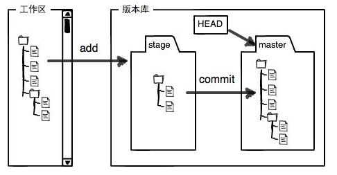

# Git分布式管理系统学习


## Git安装：

* **Ubuntu下安装：**

    * ``` sudo apt-get install git ```

* **Windows下安装：**
    * 从Git官网[下载](https://git-scm.com/downloads)安装程序，默认安装即可
    * 安装完成后，在开始菜单里找到“Git”->“Git Bash”，蹦出一个类似命令行窗口的东西，就说明Git安装成功！
    * 安装完成后，还需要最后一步设置，在命令行输入：
        ```bash
        # 因为Git是分布式版本控制系统，所以，每个机器都必须自报家门：你的名字和Email地址。
        $ git config --global user.name "Your Name"
        $ git config --global user.email "email@example.com"
        
        # 注意git config命令的--global参数，用了这个参数，表示你这台机器上所有的Git仓库都会使用这个配置，当然也可以对某个仓库指定不同的用户名和Email地址。
        ```

## Git创建版本库

>什么是版本库呢？版本库又名仓库，英文名repository，你可以简单理解成一个目录，这个目录里面的所有文件都可以被Git管理起来，每个文件的修改、删除，Git都能跟踪，以便任何时刻都可以追踪历史，或者在将来某个时刻可以“还原”。

**1. 创建版本库**
创建一个版本库非常简单，首先，选择一个合适的地方，创建一个空目录：
1. 初始化命令：<font color='red'>*git init*</font>

```bash
$ mkdir learngit
$ cd learngit
$ git init
Initialized empty Git repository in /Users/michael/learngit/.git/ 
```
瞬间Git就把仓库建好了，而且告诉你是一个空的仓库（empty Git repository），细心的读者可以发现当前目录下多了一个.git的目录，这个目录是Git来跟踪管理版本库的，没事千万不要手动修改这个目录里面的文件，不然改乱了，就把Git仓库给破坏了。

**2. 把文件添加到版本库**

>首先这里再明确一下，所有的版本控制系统，其实只能跟踪文本文件的改动，比如TXT文件，网页，所有的程序代码等等，Git也不例外。版本控制系统可以告诉你每次的改动，比如在第5行加了一个单词“Linux”，在第8行删了一个单词“Windows”。而图片、视频这些二进制文件，虽然也能由版本控制系统管理，但没法跟踪文件的变化，只能把二进制文件每次改动串起来，也就是只知道图片从100KB改成了120KB，但到底改了啥，版本控制系统不知道，也没法知道。不幸的是，Microsoft的Word格式是二进制格式，因此，版本控制系统是没法跟踪Word文件的改动的

一定要把文件放到learngit目录下（子目录也行），因为这是一个Git仓库，放到其他地方Git再厉害也找不到这个文件

文件的添加主要分为两步，如下：

1. 将文件添加到仓库: <font color='red'>*git add "filename"*</font>
2. 将文件提交到仓库: <font color='red'>*git commit -m "Document description"*</font>

```bash
# 第一步,用命令git add告诉Git，把文件添加到仓库，例如：git add readme.txt：
$ git add "文件名"

# 第二步，用命令git commit告诉Git，把文件提交到仓库:
$ git commit -m "对文件的描述或者所作的操作"

# 为什么Git添加文件需要add，commit一共两步呢？因为commit可以一次提交很多文件，所以你可以多次add不同的文件，比如:
$ git add 1.txt
$ git add 2.txt 3.txt
$ git add * # 添加所有文件
$ git commit -m "add many files!" 
```

**3. 查看仓库状态**

主要用两个命令:
1. <font color='red'>git status</font> (查看仓库当前的状态，查看哪些文件被修改过)
2. <font color='red'>git diff "filename"</font> (查看difference，查看具体被修改的内容)
3. <font color='red'>git log / git log --pretty=oneline</font> (查看仓库的修改历史记录,--pretty=oneline参数可以精简输出)

```bash
$ git status
On branch master
Changes not staged for commit:
  (use "git add <file>..." to update what will be committed)
  (use "git checkout -- <file>..." to discard changes in working directory)

	modified:   readme.txt

no changes added to commit (use "git add" and/or "git commit -a")
```
上面的命令输出告诉我们，readme.txt被修改过了，但还没有准备提交的修改

```bash
$ git diff readme.txt 
diff --git a/readme.txt b/readme.txt
index 46d49bf..9247db6 100644
--- a/readme.txt
+++ b/readme.txt
@@ -1,2 +1,2 @@
-Git is a version control system.
+Git is a distributed version control system.
 Git is free software.
```
上面的输出告诉我们文件被修改了那些内容

```bash
$ git log
commit 1094adb7b9b3807259d8cb349e7df1d4d6477073 (HEAD -> master)
Author: Michael Liao <askxuefeng@gmail.com>
Date:   Fri May 18 21:06:15 2018 +0800

    append GPL

commit e475afc93c209a690c39c13a46716e8fa000c366
Author: Michael Liao <askxuefeng@gmail.com>
Date:   Fri May 18 21:03:36 2018 +0800

    add distributed

commit eaadf4e385e865d25c48e7ca9c8395c3f7dfaef0
Author: Michael Liao <askxuefeng@gmail.com>
Date:   Fri May 18 20:59:18 2018 +0800

    wrote a readme file

$ git log --pretty=oneline # 精简输出
1094adb7b9b3807259d8cb349e7df1d4d6477073 (HEAD -> master) append GPL
e475afc93c209a690c39c13a46716e8fa000c366 add distributed
eaadf4e385e865d25c48e7ca9c8395c3f7dfaef0 wrote a readme file
```
上面输出显示从最近到最远的提交日志，我们可以看到3次提交，最近的一次是append GPL，上一次是add distributed，最早的一次是wrote a readme file.

*提示：* 需要友情提示的是，你看到的一大串类似1094adb...的是commit id（版本号），是一个SHA1计算出来的一个非常大的数字，用十六进制表示，避免冲突

## Git版本回退

> 像这样，你不断对文件进行修改，然后不断提交修改到版本库里，就好比玩RPG游戏时，每通过一关就会自动把游戏状态存盘，如果某一关没过去，你还可以选择读取前一关的状态。有些时候，在打Boss之前，你会手动存盘，以便万一打Boss失败了，可以从最近的地方重新开始。Git也是一样，每当你觉得文件修改到一定程度的时候，就可以“保存一个快照”，这个快照在Git中被称为commit。一旦你把文件改乱了，或者误删了文件，还可以从最近的一个commit恢复，然后继续工作，而不是把几个月的工作成果全部丢失。

要回退版本，首先，Git必须知道当前版本是哪个版本，在Git中，用**HEAD**表示当前版本，也就是最新的提交1094adb...（注意我的提交ID和你的肯定不一样），上一个版本就是 **HEAD^** ，上上一个版本就是 **HEAD^^** ，当然往上100个版本写100个^比较容易数不过来，所以写成 **HEAD~100**。

具体操作如下：

1. 回退到上一个版本，命令：<font color='red'>*git reset --hard HEAD^*</font>

```bash
$ git reset --hard HEAD^
HEAD is now at e475afc add distributed
```

2. 指定回到未来某个版本，命令：*git reset --hard "commit id"*(版本号)

```bash
# 先查看版本历史
$ git log --pretty=oneline # 精简输出
1094adb7b9b3807259d8cb349e7df1d4d6477073 (HEAD -> master) append GPL
e475afc93c209a690c39c13a46716e8fa000c366 add distributed
eaadf4e385e865d25c48e7ca9c8395c3f7dfaef0 wrote a readme file

# 版本号没必要写全，前几位就可以了，Git会自动去找
$ git reset --hard 1094a
HEAD is now at 83b0afe append GPL

```

3. 现在，你回退到了某个版本，关掉了电脑，第二天早上就后悔了，想恢复到新版本怎么办？找不到新版本的commit id怎么办？在Git中，总是有后悔药可以吃的。当你用$ git reset --hard HEAD^回退到add distributed版本时，再想恢复到append GPL，就必须找到append GPL的commit id。
Git提供了一个命令用来记录你的每一次命令：<font color='red'> *git reflog* </font>

```bash
$ git reflog
e475afc HEAD@{1}: reset: moving to HEAD^
1094adb (HEAD -> master) HEAD@{2}: commit: append GPL
e475afc HEAD@{3}: commit: add distributed
eaadf4e HEAD@{4}: commit (initial): wrote a readme file
```
终于舒了口气，从输出可知，append GPL的commit id是1094adb，现在，你又可以乘坐时光机回到未来了。

## 工作区和暂存区

**工作区（Working Directory）**
就是你在电脑里能看到的目录，比如我的learngit文件夹就是一个工作区：

**版本库（Repository）**

工作区有一个隐藏目录.git，这个不算工作区，而是Git的版本库。

Git的版本库里存了很多东西，其中最重要的就是称为stage（或者叫index）的暂存区，还有Git为我们自动创建的第一个分支master，以及指向master的一个指针叫HEAD



前面讲了我们把文件往Git版本库里添加的时候，是分两步执行的：

第一步是用git add把文件添加进去，实际上就是把文件修改添加到暂存区；

第二步是用git commit提交更改，实际上就是把暂存区的所有内容提交到当前分支。


## 管理修改

为什么Git比其他版本控制系统设计得优秀，因为Git跟踪并管理的是修改，而非文件

提交后，用<font color='red'>git diff HEAD -- "filename"</font>命令可以查看工作区和版本库里面最新版本的区别：

```bash
$ git diff HEAD -- readme.txt 
diff --git a/readme.txt b/readme.txt
index 76d770f..a9c5755 100644
--- a/readme.txt
+++ b/readme.txt
@@ -1,4 +1,4 @@
 Git is a distributed version control system.
 Git is free software distributed under the GPL.
 Git has a mutable index called stage.
-Git tracks changes.
+Git tracks changes of files.
```

## 撤销修改

场景1：当你改乱了工作区某个文件的内容，想直接丢弃工作区的修改时，用命令<font color='red'>git checkout -- "filename"</font>。

```bash
$ git checkout -- readme.txt
```

场景2：当你不但改乱了工作区某个文件的内容，还添加到了暂存区时，想丢弃修改，分两步，第一步用命令<font color='red'>git reset HEAD "filename"<file></font>，就回到了场景1，第二步按场景1操作。

```bash
# 把暂存区的修改撤销掉（unstage），重新放回工作区：
# git reset命令既可以回退版本，也可以把暂存区的修改回退到工作区
$ git reset HEAD readme.txt
Unstaged changes after reset:
M	readme.txt

# 丢弃工作区的修改
$ git checkout -- readme.txt

# 查看状态
$ git status
On branch master
nothing to commit, working tree clean
```

场景3：已经提交了不合适的修改到版本库时，想要撤销本次提交，参考<font color='red'>版本回退</font>一节，<font color='red'>不过前提是没有推送到远程库</font>。

## 删除文件

>在Git中，删除也是一个修改操作

我们实战一下，先添加一个新文件test.txt到Git并且提交：

```bash
$ git add test.txt

$ git commit -m "add test.txt"
[master b84166e] add test.txt
 1 file changed, 1 insertion(+)
 create mode 100644 test.txt
```

一般情况下，你通常直接在文件管理器中把没用的文件删了，或者用rm命令删了：

```bash
$ rm test.txt
```

这个时候，Git知道你删除了文件，因此，工作区和版本库就不一致了，git status命令会立刻告诉你哪些文件被删除了：

```bash
$ git status
On branch master
Changes not staged for commit:
  (use "git add/rm <file>..." to update what will be committed)
  (use "git checkout -- <file>..." to discard changes in working directory)

	deleted:    test.txt

no changes added to commit (use "git add" and/or "git commit -a")
```

现在你有两个选择，一是确实要从版本库中删除该文件，那就用命令<font color='red'>*git rm "filename"*</font>删掉，并且git commit：

小提示：先手动删除文件，然后使用git rm <file>和git add<file>效果是一样的。

```bash
$ git rm test.txt
rm 'test.txt'

$ git commit -m "remove test.txt"
[master d46f35e] remove test.txt
 1 file changed, 1 deletion(-)
 delete mode 100644 test.txt
```

另一种情况是删错了，因为版本库里还有呢，所以可以很轻松地把误删的文件恢复到最新版本：

命令：<font color='red'>git checkout -- "filename"</font>

```bash
$ git checkout -- test.txt
```
git checkout其实是用版本库里的版本替换工作区的版本，无论工作区是修改还是删除，都可以“一键还原”。注意，从来没有被添加到版本库就被删除的文件，是无法恢复的！


## 更新本地仓库

### 方法一（推荐）

> git fetch + git merge，更安全一些，因为在merge前，我们可以查看更新情况，然后再决定是否合并

1. 查看远程仓库

   **git remote -v**

2. 从远程获取最新版本到本地

   **git fetch origin master:temp**

3. 比较本地的仓库与远程仓库的区别

   **git diff temp**

4. 合并temp分支到master分支

   **git merge temp**

   ```bash
   若有冲突则需手动解决冲突的文件（git status 可以告诉我们冲突的文件），然后提交
   $ git add .
   $ git commit -m 'conflict fixed'
   ```

5. 删除分支

   **git branch -d temp**

6. 示例：

   ```bash
   # 查看远程仓库
   $ git remote -v
      
   # 从远程获取最新版本到本地
   $ git fetch origin master:temp # master:主分支，可根据情况自行设定；temp:新建的本地临时分支
      
   # 比较本地的仓库与远程仓库的区别
   $ git diff temp
      
   # 合并temp分支到master分支
   $ git merge temp
      
   # 删除分支
   $ git branch -d temp
   ```

### 方法二

> git pull：相当于是从远程获取最新版本并merge到本地，相当于git fetch 和 git merge

命令：

​	**git pull origin master**


**注：**在实际使用中，git fetch更安全一些

## 远程仓库

**1. 添加远程仓库**

要关联一个远程库，使用命令 <font color='red'>*git remote add origin git@server-name:path/repo-name.git*</font>；

关联一个远程库时必须给远程库指定一个名字，origin是默认习惯命名；

关联后，使用命令 <font color='red'>*git push -u origin master*</font> 第一次推送master分支的所有内容；

此后，每次本地提交后，只要有必要，就可以使用命令 <font color='red'>*git push origin master*</font> 推送最新修改；

**2. 删除远程仓库**

如果添加的时候地址写错了，或者就是想删除远程库，可以用 <font color='red'>*git remote rm "repository name"*</font> 命令。使用前，建议先用 <font color='red'>*git remote -v*</font> 查看远程库信息：

```bash
# 查看远程库信息
$ git remote -v
origin  git@github.com:michaelliao/learn-git.git (fetch)
origin  git@github.com:michaelliao/learn-git.git (push)

# 然后，根据名字删除，比如删除origin
$ git remote rm origin
```

**3.从远程仓库克隆**

>要克隆一个仓库，首先必须知道仓库的地址，然后使用git clone命令克隆。Git支持多种协议，包括https，但ssh协议速度最快。

从远程仓库下载：
命令：<font color='red'>*git clone "address"*</font>

```bash
$ git clone git@github.com:michaelliao/gitskills.git
Cloning into 'gitskills'...
remote: Counting objects: 3, done.
remote: Total 3 (delta 0), reused 0 (delta 0), pack-reused 3
Receiving objects: 100% (3/3), done.
```

## 分支管理

具体分析见[廖雪峰官方Git教程](https://www.liaoxuefeng.com/wiki/896043488029600/900003767775424)

### 1.创建与合并分支

具体命令：
一般都是提交后切分支

**Git鼓励大量使用分支**：

**查看分支**：<font color='red'>*git branch*</font>

```bash
$ git branch
* dev
  master
```

**创建分支**：<font color='red'>*git branch "branch name"*</font>

```bash
$ git checkout dev
Switched to a new branch 'dev'
```

**切换分支**：<font color='red'>*git checkout "brandch name" 或者 git switch "branch name"*</font>

```bash
$ git branch dev
$ git checkout dev
Switched to branch 'dev'
```

**创建+切换分支**：<font color='red'>*git checkout -b "branch name" 或者 git switch -c "branch name"*</font>

```bash
$ git checkout -b dev
Switched to a new branch 'dev'
```

**合并某分支到当前分支**：<font color='red'>*git merge "branch name"*</font>

```bash
# 把dev分支的工作成果合并到master分支上
$ git merge dev
Updating d46f35e..b17d20e
Fast-forward
 readme.txt | 1 +
 1 file changed, 1 insertion(+)
```

**删除分支**：<font color='red'>*git branch -d "branch name"*</font>

```bash
$ git branch -d dev
Deleted branch dev (was b17d20e).
```

**不合并强行删除分支**：<font color='red'>*git branch -D "branch name"*</font>

```bash
$ git branch -D feature-vulcan
Deleted branch feature-vulcan (was 287773e).
```

### 2.解决冲突

人生不如意之事十之八九，合并分支往往也不是一帆风顺的。

当Git无法自动合并分支时，就必须首先解决冲突。解决冲突后，再提交，合并完成。

解决冲突就是把Git合并失败的文件手动编辑为我们希望的内容，再提交。

用 <font color='red'>*git log --graph*</font> 命令可以看到分支合并图。

```bash
$ git log --graph --pretty=oneline --abbrev-commit
*   cf810e4 (HEAD -> master) conflict fixed
|\  
| * 14096d0 (feature1) AND simple
* | 5dc6824 & simple
|/  
* b17d20e branch test
* d46f35e (origin/master) remove test.txt
* b84166e add test.txt
* 519219b git tracks changes
* e43a48b understand how stage works
* 1094adb append GPL
* e475afc add distributed
* eaadf4e wrote a readme file
```

### 3.分支管理策略

通常，合并分支时，如果可能，Git会用Fast forward模式，但这种模式下，删除分支后，会丢掉分支信息。

如果要强制禁用Fast forward模式，Git就会在merge时生成一个新的commit，这样，从分支历史上就可以看出分支信息。

下面我们实战一下--no-ff方式的git merge：

```bash

# 请注意--no-ff参数，表示禁用Fast forward：
# 因为本次合并要创建一个新的commit，所以加上-m参数，把commit描述写进去。
$ git merge --no-ff -m "merge with no-ff" dev
Merge made by the 'recursive' strategy.
 readme.txt | 1 +
 1 file changed, 1 insertion(+)
```

在实际开发中，我们应该按照几个基本原则进行分支管理：

首先，master分支应该是非常稳定的，也就是仅用来发布新版本，平时不能在上面干活；

那在哪干活呢？干活都在dev分支上，也就是说，dev分支是不稳定的，到某个时候，比如1.0版本发布时，再把dev分支合并到master上，在master分支发布1.0版本；

你和你的小伙伴们每个人都在dev分支上干活，每个人都有自己的分支，时不时地往dev分支上合并就可以了。

所以，团队合作的分支看起来就像这样：


### 4.Bug分支

具体见[廖雪峰Git教程](https://www.liaoxuefeng.com/wiki/896043488029600/900388704535136)

**过程**：
1. 修复bug时，我们会通过创建新的bug分支进行修复，然后合并，最后删除；

2. 当手头工作没有完成时，先把工作现场 <font color='red'>*git stash* </font> 一下，然后去修复bug，修复后，再 <font color='red'>*git stash pop* </font>，回到工作现场；

3. 在master分支上修复的bug，想要合并到当前dev分支，可以用 <font color='red'>*git cherry-pick "commit id"* </font> 命令，把bug提交的修改“复制”到当前分支，避免重复劳动。

### 5.Feature分支

开发一个新feature，最好新建一个分支；

如果要丢弃一个没有被合并过的分支，可以通过 <font color='red'>*git branch -D "branch name"*</font> 强行删除。

### 6.多人协作

具体访问[廖雪峰Git教程](https://www.liaoxuefeng.com/wiki/896043488029600/900375748016320)

查看远程库信息，使用 <font color='red'>*git remote -v*</font> ；

本地新建的分支如果不推送到远程，对其他人就是不可见的；

从本地推送分支，使用 <font color='red'> *git push origin branch-name*</font> ，如果推送失败，先用git pull抓取远程的新提交；

在本地创建和远程分支对应的分支，使用 <font color='red'>*git checkout -b branch-name origin/branch-name*</font>，本地和远程分支的名称最好一致；

建立本地分支和远程分支的关联，使用 <font color='red'>*git branch --set-upstream branch-name origin/branch-name*</font>；

从远程抓取分支，使用 <font color='red'>*git pull*</font>，如果有冲突，要先处理冲突。

## 标签管理

具体见[廖雪峰Git教程](https://www.liaoxuefeng.com/wiki/896043488029600/900788941487552)


## 自定义Git

### 搭建Git服务器

1. 安装git和ssh

   ```bash
   $ sudo apt-get install git
   $ sudo apt-get install openssh-server openssh-client

2. 增加 git 用户管理服务器，设置密码之后一直按回车键即可

   ```bash
   $ sudo adduser git
   ```

   增加git 用户后在home文件下生成git文件夹:/home/git。

3. 创建ssh证书认证文件: /home/git/.ssh/authorized_keys

   ```bash
   $ sudo mkdir /home/git/.ssh
   $ sudo touch /home/git/.ssh/authorized_keys
   ```

   把需要访问git服务器的客户端公钥id_rsa.pub的内容复制到文件。

   **提示：**

   客户端电脑如何生成公钥，以windows操作系统举例：

   安装git客户端

   运行git命令行

   运行：**ssh-keygen -t rsa-c “你的邮箱地址”** 或者 "**ssh-keygen -o**"
   
   在C:\Users\xxx\.ssh文件夹下会有一个id_rsa.pub文件（xxx为登录windows的当前用户名，从文件夹进去User可能显示为中文的“用户”）
   
4. 修改：

   ```bash
   $ sudo chmod 700 /home/git
   $ sudo chmod 700 /home/git/.ssh
   $ sudo chmod 600 /home/git/authorized_keys
   $ sudo chown -R git:git /home/git
   $ sudo chown -R git:git /home/git/.ssh
   $ sudo chown -R git:git /home/git/.ssh/authorized_keys
   ```

5. 禁用shell登录：

   出于安全考虑，第二步创建的git用户不允许登录shell，这可以通过编辑`/etc/passwd`文件完成。找到类似下面的一行：

   ```bash
   # 原始内容
   git:x:1001:1001:,,,:/home/git:/bin/bash
   
   # 把以上内容修改为如下内容：
   git:x:1001:1001:,,,:/home/git:/usr/bin/git-shell
   ```

   这样，`git`用户可以正常通过ssh使用git，但无法登录shell，因为我们为`git`用户指定的`git-shell`每次一登录就自动退出。

至此，服务器搭建完毕。


### Git在服务器端建立裸仓库

```bash
# 创建仓库的目录
$ sudo mkdir /home/myRepo

# 创建仓库
$ sudo git init --bare /home/myRepo/test.git

# 修改权限为git，裸仓库没有工作区，因为服务器上的Git仓库纯粹是为了共享，所以不让用户直接登录到服务器上去改工作区，并且服务器上的Git仓库通常都以.git结尾。然后，把owner改为git
$ sudo chown -R git:git /home/myRepo/test.git
```


## Git其它使用方法


### Git给服务器远程仓库建立分支

方法如下:
* 在本地创建分支并切换到分支
	```bash
	$ git switch -c 分支名
	```
* 直接推送当前分支代码到git仓库
	```bash
	$ git push origin 分支名
	```

示例：
```bash
# 本地创建分支并切换到分支
$ git switch -c dev # 或者git checkout -b dev

# 直接推送当前分支代码到git仓库
$ git push origin dev
```


### Git拉取远程仓库分支

分两种情况：

1. 本地已经拉取了远程仓库项目，进入项目目录，执行命令：<font color='red'>**git checkout -b 本地分支名 origin/远程分支名**</font>

   ```bash
   $ git checkout -b dev origin/develop
   ```

2. 本地没有项目，执行命令：<font color='red'>**git clone -b 分支名 仓库地址**</font>
	```bash
	$ git clone -b dev git@192.168.1.128:/home/myrepo/test.git
	```


### Git hook的简单使用

> 场景：因为服务器的仓库主要是为了代码共享，多人协作，所以建立的是裸仓库，不带工作区，所以不会存实体代码文件。要想同步代码文件到服务器，可以设置钩子来进行同步，将代码或者文档存到挂载的文件夹下。

流程如下：

1. 在服务器建立一个本地仓库存储代码文件，首先建立一个挂载目录

   ```bash
   ubuntu@ubuntu-server:/home$ mkdir code # 建在哪里根据自己的情况指定
   ubuntu@ubuntu-server:/home$ cd code/   # 进入到新建文件夹
   ubuntu@ubuntu-server:/home/code$ git init   # 初始化git
   ubuntu@ubuntu-server:/home/code$ git remote add origin /home/myRepo/test.git #添加远程仓库到中央仓库,仓库位置根据自己的改
   ubuntu@ubuntu-server:/home/code$ chown -R git:git /home/code #修改服务器本地仓库的用户属组
   ```

2. 在中央仓库设置钩子

   ```bash
   ubuntu@ubuntu-server:/home$ cd myRepo/test.git/hooks  #进入远程仓库的钩子目录
   ubuntu@ubuntu-server:/home/myRepo/test.git/hooks$ sudo vim post-receive # 新建一个文件post-receive
   
   # 编写脚本，内容功能视情况而定
   #!/bin/sh
   unset GIT_DIR
   DeployPath=/home/code         #这里的目录是你自己虚拟主机的目录
   
   cd $DeployPath
   git add . -A && git stash
   git pull origin master
   
   ubuntu@ubuntu-server:/home/myRepo/test.git/hooks$ sudo chmod +x post-receive # 给文件post-receive添加可执行权限
   ```

   

