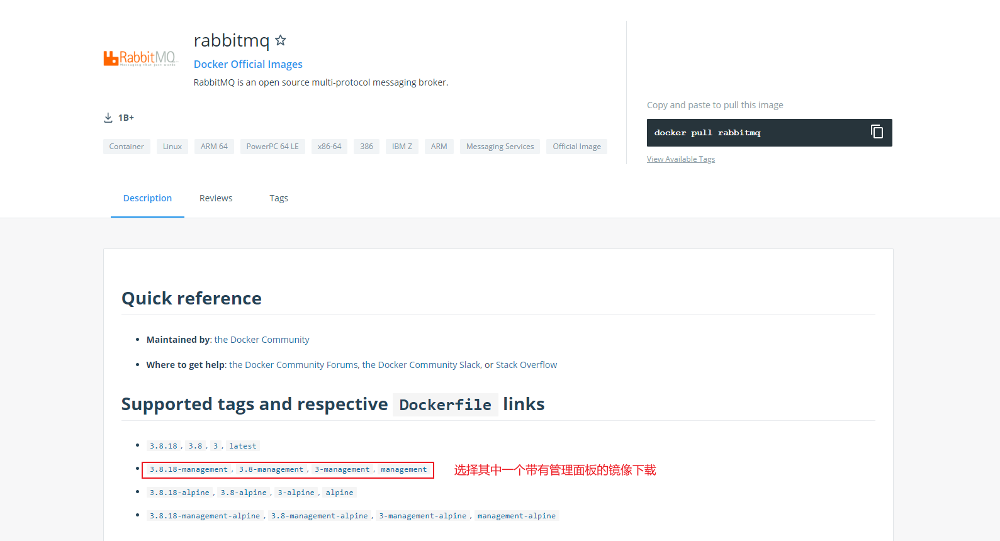
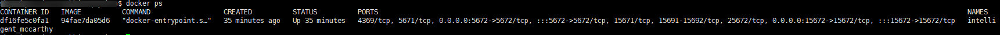
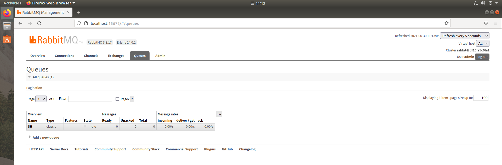
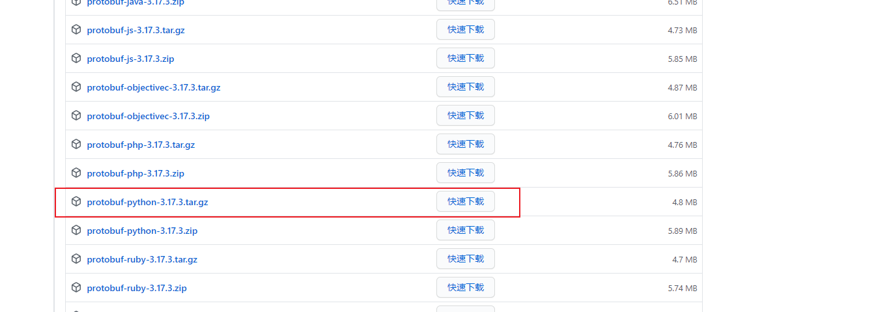
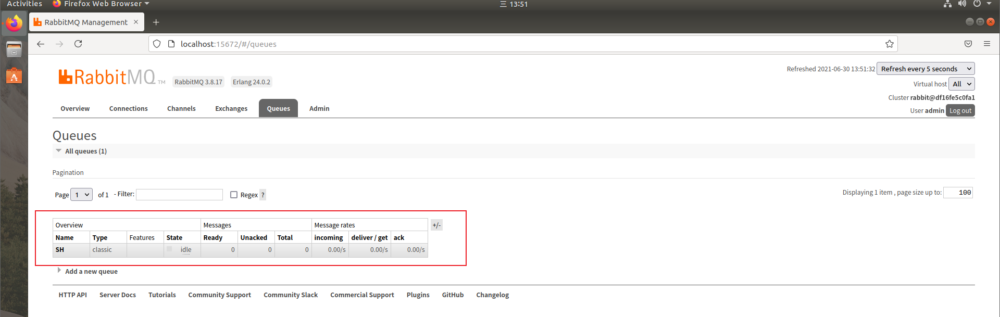
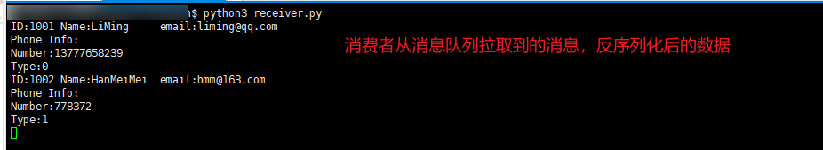
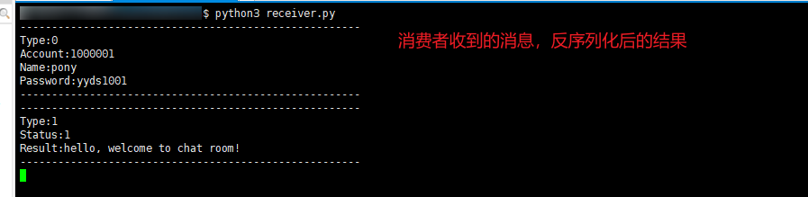

# Python使用Rabbitmq

## 一. 创建Rabbitmq环境

> 安装Rabbitmq需要Erlang语言环境，且Rabbitmq和Erlang的版本要对应

### - 安装Rabbitmq

在这里选择用Docker来安装Rabbitmq，这样可以直接拉取DockerHub上完整的镜像，免去自己安装的麻烦（针对有docker环境来说）。

1. 去DockHub上搜索Rabbitmq的镜像，可以看到完整的版本信息:

   

2. 在本地拉取镜像，如果拉取错误可以降低版本试试看：

   ```bash
   $ docker pull rabbitmq:3.8.17-management
   ```

   查看拉取的结果：

   

### - 运行Rabbitmq

1. 根据镜像创建和运行容器：

   ```bash
   $ docker run -d --name rabbitmq3.8.17 -p 5672:5672 -p 15672:15672 -v /home/xxx:/var/lib/rabbitmq -e RABBITMQ_DEFAULT_USER=admin -e RABBITMQ_DEFAULT_PASS=admin df16fe5c0fa1
   ```

   说明：

   -d 后台运行容器；

   --name 指定容器名；

   -p 指定服务运行的端口（5672：应用访问端口；15672：控制台Web端口号）；

   -v 映射目录或文件；

   --hostname  主机名（RabbitMQ的一个重要注意事项是它根据所谓的 “节点名称” 存储数据，默认为主机名），单机可不设置；

   -e 指定环境变量；（RABBITMQ_DEFAULT_USER：默认的用户名；RABBITMQ_DEFAULT_PASS：默认用户名的密码）

2. 查看正在运行的容器：**docker ps**

   

3. 可以使用浏览器打开web管理端：http://server_ip:15672




## 二. 编译安装Protobuf

### - 下载Protobuf源码

在Github上下载相应的版本源代码，[下载Protobuf源码](https://github.com/protocolbuffers/protobuf/releases)



### - 编译安装Protobuf

1. 解压，编译，安装：

```bash
# 解压源码
$ tar -zxvf protobuf-python-3.17.3.tar.gz
# 进入解压后的文件夹
$ cd protobuf-python-3.17.3/protobuf-3.17.3/
# 生成Makefile,可以夹--prefix参数来指定安装位置，如--prefix=/usr
$ ./configure
# 寻找Makefile，编译源码
$ make
# 测试编译，可选
$ make check
# 安装
$ sudo make install
```

2. 安装protobuf的python模块(如果不用python，可跳过这一步)

```bash
# 进入python文件夹
$ cd ./python
# 依次执行以下命令
$ sudo python3 setup.py build
$ sudo python3 setup.py test
$ sudo python3 setup.py install
```

3. 安装完成，验证是否成功

```bash
$ protoc --version

# 如果出现错误，可以使用sudo ldconfig更新以下动态链接库，然后再验证
$ sudo ldconfig
# 只要出现版本信息，则安装成功
$ protoc --version
```

4. 验证Python模块是否被正确安装

```bash
$ python3
Python 3.6.9 (default, Jan 26 2021, 15:33:00) 
[GCC 8.4.0] on linux
Type "help", "copyright", "credits" or "license" for more information.
>>> import google.protobuf
>>> 

# 成功导入模块，不报错即为安装成功
```

## 三. 完整的例子

### - 安装Python的Rabbitmq支持模块

> 要使用Rabbitmq，需要有一个Rabbitmq客户端来提供支持，客户端有很多，具体可以参考Rabbitmq官网。

可以通过Rabbitmq[官网(https://www.rabbitmq.com/devtools.html)](https://www.rabbitmq.com/devtools.html)来查看具体的客户端信息，根据具体情况来选择：


此处采用**pika**客户端来实现相关例子。

```bash
# 安装pika模块
$ pip3 install pika
```

### - 实现Protobuf官网的示例

> 实现Rabbitmq的**生产者-消费者模式**（最简单的模式），用**Protobuf**来序列化和反序列化消息，也可以用**json**，本例子采用Protobuf来实现。

1. 定义一个addressbook.proto文件

   ```protobuf
   syntax = "proto3";
   
   message Person {
       string name = 1;
       int32 id = 2;
       string email = 3;
   
       enum PhoneType {
           MOBILE = 0;
           HOME = 1;
           WORK = 2;
       }
   
       message PhoneNumber {
           string number = 1;
           PhoneType type = 2;
       }
   
       repeated PhoneNumber phones = 4;
   }
   
   message AddressBook {
       repeated Person people = 1;
   }
   ```

2. 编译addressbook.proto为py文件:

   ```bash
   # --python_out:编译出的py文件放置的路径，自己指定
   # addressbook.proto:要编译的proto文件
   $ protoc --python_out=./ addressbook.proto
   
   # 如果没有错误，会生成一个addressbook_pb2.py文件
   ```

   

3. 编写send.py程序（生产者）：

   ```python
   import pika
   import addressbook_pb2
   import time
   
   def serialData(id='', name='', email='', phone_num='', phone_type=0):
       """
       序列化数据
       """
       address_book = addressbook_pb2.AddressBook()
       person = address_book.people.add()
   
       person.id = id
       person.name = name
       person.email = email
   
       phone_number = person.phones.add()
       phone_number.number = phone_num
       if phone_type == 0:
           phone_number.type = addressbook_pb2.Person.MOBILE
       elif phone_type == 1:
           phone_number.type = addressbook_pb2.Person.HOME
       else:
           phone_number.type = addressbook_pb2.Person.WORK
   
   
       serializeString = address_book.SerializeToString()
       return serializeString
   
   
   def send_addressbookproto_data():
       """
       发送序列化后的数据到Rabbitmq的消息队列中
       """
       # 配置RabbitMQ账号密码
       credentials = pika.PlainCredentials("admin", "admin")
       # 连接RabbitMQ server
       connection =  pika.BlockingConnection(pika.ConnectionParameters("localhost", credentials=credentials))
       # 创建连接通道
       channel = connection.channel()
       # 声明一个名为'SH'的队列并持久化(durable=True)
       channel.queue_declare(queue='SH', durable=True)
   
       # 序列化要发送的消息，最终都为二进制数据
       message = serialData(1001, "LiMing", "liming@qq.com", "13777658239", 0)
       message2 = serialData(1002, "HanMeiMei", "hmm@163.com", "778372", 1)
       data_list = [message, message2]
       
       for info in data_list:
           # 向指定队列中发送数据
           channel.basic_publish(exchange='', routing_key='SH', body=info)
           print("[x]send: {}".format(message), type(info))
           time.sleep(1)
       channel.close()
       connection.close()
       
   
   def main():
       send_networkinfoproto_data()
   ```
   
4. 编写recv.py文件（消费者）：

   ```python
   import pika
   import addressbook_pb2
   
   
   def parse_data_from_proto(message):
       """
       解析消息并打印
       """
       address_book = addressbook_pb2.AddressBook()
       address_book.ParseFromString(message)
   
       for person in address_book.people:
           print("ID:{}\tName:{}\temail:{}".format(person.id,
               person.name, person.email))
   
           for phone_number in person.phones:
               print("Phone Info:\nNumber:{}\nType:{}".format(phone_number.number, str(phone_number.type)))
   
   
   def callback(ch, method, properties, body):
       """
       回调函数，处理body消息体
       """
       parse_data_from_proto(body)
   
   
   def main():
       """
       主函数
       """
       # 配置RabbitMQ账号密码
       credentials = pika.PlainCredentials("admin", "admin")
       # 连接RabbitMQ server
       connection =  pika.BlockingConnection(pika.ConnectionParameters("localhost", credentials=credentials))
       # 创建连接通道
       channel = connection.channel()
   
       # 从"SH"队列中取出一条消息，及时回调(auto_ack=True)，生产者会将该任务消息删除，同时该消息作为body值去调用callback方法处理
       channel.basic_consume("SH", callback, True)
        # 消费消息并处于监听状态
       channel.start_consuming()
   ```

5. 执行程序后如果成功，则管理者界面会新增一个队列，如下图:

   

6. 结果显示如下：

   


### - 在不确定消息类型的情况下解析消息示例

> Protobuf 不是一个自描述的协议，序列化后的二进制消息中应该没有必要的类型信息。所以采取往消息体中增加额外信息的方式来辅助确定消息类型。
>
> * 使用 protobuf 的enum定于消息的编号，也就是消息的类型；
> * 所有的消息都应该有一个具体的消息类；
> * 定义辅助消息Message，包含一个消息类型字段，用于辅助反序列化。

1. 建立networkinfo.proto文件

   ```protobuf
   syntax = "proto3";
   
   // 定义消息类型
   enum MsgType {
       Login_Request = 0;
       Login_Response = 1;
   }
   
   // 具体的消息类
   message LoginRequest {
       string account = 1;
       string name = 2;
       string password = 3;
   }
   
   // 具体的消息类
   message Response {
       int32 status = 1;
       string result = 2;
   }
   
   // 辅助消息类，封装其它的具体消息类，包括消息类型，之后解析都从这个大类开始
   message Message {
       MsgType type = 1;
       LoginRequest request = 2;
       Response response = 3;
   }
   ```

2. 编写send.py程序（生产者）：

```python
import pika
import networkinfo_pb2
import time


def serail_request_data(account='', name='', password=''):
    """
    序列化LoginRequest消息
    """
    resquest_info = networkinfo_pb2.Message()
    resquest_info.type = networkinfo_pb2.Login_Request

    login_request = resquest_info.request
    login_request.account = account
    login_request.name = name
    login_request.password = password

    serializeString = resquest_info.SerializeToString()
    return serializeString


def serial_response_data(status=0, result=''):
    """
    序列化Response消息
    """
    response_info = networkinfo_pb2.Message()
    response_info.type = networkinfo_pb2.Login_Response

    login_response = response_info.response
    login_response.status = status
    login_response.result = result

    serializeString = response_info.SerializeToString()
    return serializeString


def send_networkinfoproto_data():
    """
    发送数据到消息队列
    """
    # 配置RabbitMQ账号密码
    credentials = pika.PlainCredentials("admin", "admin")
    # 连接RabbitMQ server
    connection =  pika.BlockingConnection(pika.ConnectionParameters("localhost", credentials=credentials))
    # 创建连接通道
    channel = connection.channel()
     # 声明一个名为'SH'的队列并持久化(durable=True)
    channel.queue_declare(queue='SH', durable=True)

    # 序列化消息
    requestInfo = serail_request_data("1000001", "pony", "yyds1001")
    responseInfo = serial_response_data(1, "hello, welcome to chat room!")
    data_list = [requestInfo, responseInfo]
    for data in data_list:
        # 向指定队列中发送数据
        channel.basic_publish(exchange='', routing_key='SH', body=data)
        time.sleep(1)
    # 关闭通道
    channel.close()
    # 关闭连接
    connection.close()

def main():
    send_networkinfoproto_data()

```

3. 编写recv.py文件（消费者）：

```python
import pika
import networkinfo_pb2


def parse_define_data(message):
    """
    反序列化数据并打印
    """
    newinfo = networkinfo_pb2.Message()
    newinfo.ParseFromString(message)

    if newinfo.type == networkinfo_pb2.MsgType.Login_Request:
        request_info = newinfo.request
        print("------------------------------------------------------")
        print("Type:{}\nAccount:{}\nName:{}\nPassword:{}".format(newinfo.type, request_info.account,
                    request_info.name, request_info.password))
        print("------------------------------------------------------")
    else:
        response_info = newinfo.response
        print("------------------------------------------------------")
        print("Type:{}\nStatus:{}\nResult:{}".format(newinfo.type, response_info.status, response_info.result))
        print("------------------------------------------------------")


def callback(ch, method, properties, body):
    """
    回调函数，处理body消息体
    """
    parse_define_data(body)


def main():
    """
    主函数
    """
    # 配置RabbitMQ账号密码
    credentials = pika.PlainCredentials("admin", "admin")
    # 连接RabbitMQ server
    connection =  pika.BlockingConnection(pika.ConnectionParameters("localhost", credentials=credentials))
    # 创建连接通道
    channel = connection.channel()

    # 从队列中取出一条消息，及时回调(auto_ack=True)，生产者会将该任务消息删除，同时该消息作为body值去调用callback方法处理
    channel.basic_consume("SH", callback, True)
    # 消费消息并处于监听状态
    channel.start_consuming()

```

4. 执行代码，如果成功，则会打印相应结果：

   

